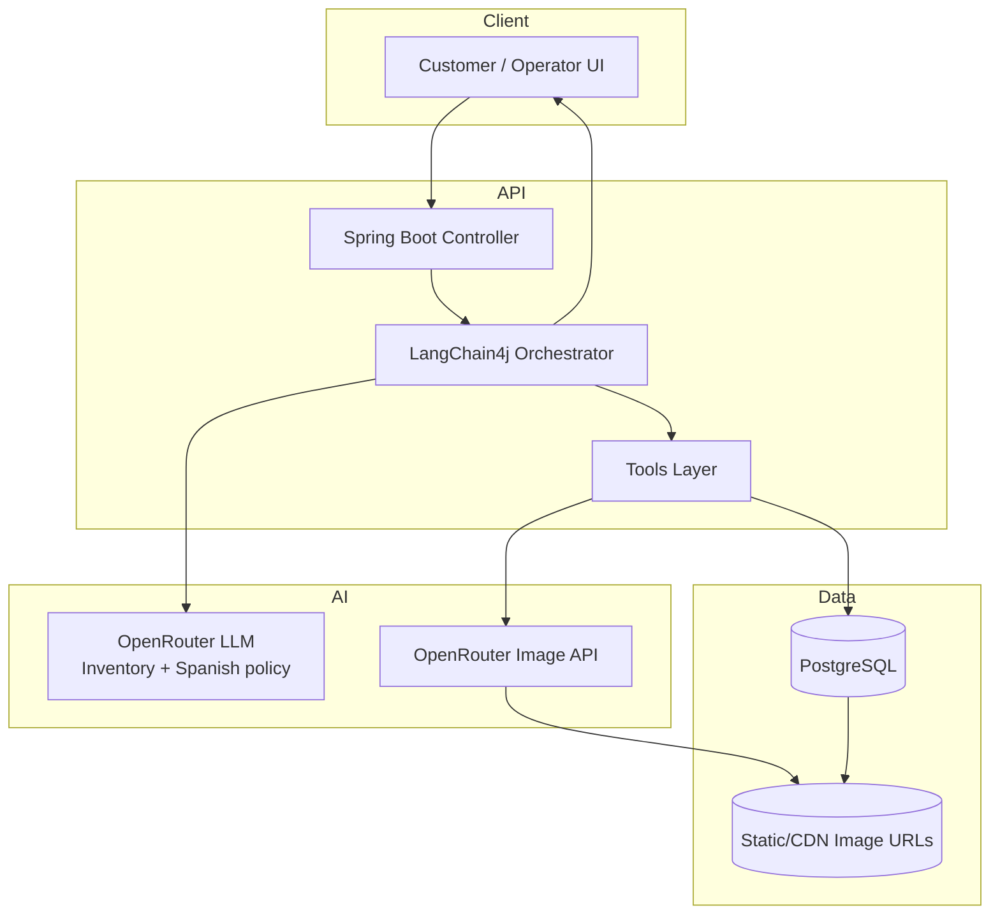
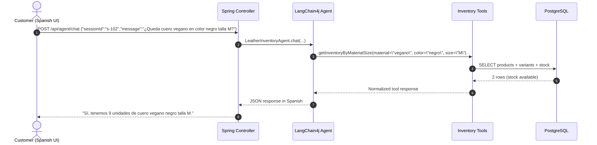
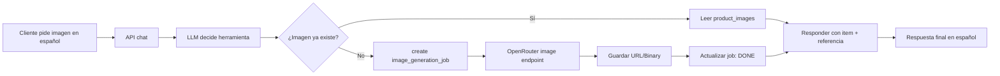

# Technical Design: Leather Store Inventory Query Agent (Java 25, Spring Boot 4.0.3, LangChain4j 1.11.0, PostgreSQL, OpenRouter)

## 1. Objective
Implement a conversational assistant with agentic capabilities for a leather store (eCommerce-style catalog) focused only on inventory visibility. The POC should:
- answer stock/product availability questions,
- return SKU and variant-level stock quickly,
- provide exact data from PostgreSQL,
- answer only in Spanish,
- escalate to human support only when inventory intent is ambiguous or unsupported.

## 2. Initial scope (POC)
- Product search, filters, and details.
- Variant-level inventory checks (size, color, SKU/variant stock).
- Out-of-stock / low-stock warnings.
- Suggested alternatives based on similar variants.
- Human handoff with query context.
- No order lookup, shipping quote, return policy, or payment flows.

---

## 3. Proposed architecture

```mermaid
flowchart LR
  U[Customer (Web / WhatsApp / API)] --> API[Spring Boot REST/Streaming API]
  API --> OR[Orchestrator Agent (LangChain4j)]
  OR -->|LLM Call| LLM[OpenRouter (OpenAI-compatible API)]
  OR -->|Tool call| DS[(Domain Services)]
  DS --> PG[(PostgreSQL)]
  DS --> Human[Handoff to human agent / ticket]
  OR --> Telemetry[Logs, traces, metrics]
```

## 4. Software components

### 4.1 Ingestion layer
- `POST /api/agent/chat`: text chat endpoint (non-streaming).
- `POST /api/agent/chat/stream`: SSE/WebSocket streaming if needed.
- JWT/Bearer or internal API key authentication by channel.

### 4.2 Orchestration layer
- Agent service in Java using **LangChain4j 1.11.0**.
- A strict system prompt requiring:
  - Do not invent stock/price.
  - Use only values returned by tools or stored product data.
  - Ask for SKU/color/size if missing and needed.
  - Always answer in Spanish, regardless of input language.
- Message handling + session memory (`sessionId`) with configurable message window.

### 4.3 Tooling layer (inventory only)
- `searchProducts(...)`
- `getProductDetailBySku(...)`
- `getStockBySku(...)`
- `getStockByVariant(...)`
- `generateProductImage(...)`
- `getProductImageGallery(...)`
- `handoffToHuman(...)`

### 4.4 Data layer
- PostgreSQL as the only required datastore (available external DB).
- Tables:
  - `products`, `product_variants`, `product_images`, `image_generation_jobs`, `agent_sessions`, `agent_messages`, `agent_handoffs`.

### 4.5 Deployment target (Render)
- Primary target: Render Web Service running a Docker container.
- External dependency: PostgreSQL from Render (or already available managed PostgreSQL).
- No additional required datastore (no Redis/vector DB required for inventory-only POC).
- Session memory and short-term context can be stored in PostgreSQL (`agent_sessions` and `agent_messages`).

### 4.6 Integrations
- **OpenRouter** for LLM:
  - OpenAI-compatible endpoint.
  - API key managed through environment secrets.
  - Model choice and rate/cost parameters per environment.
  - `response-language: es` policy enforced at system prompt and validator layer.
- OpenRouter image generation models:
  - Reuse OpenRouter key and endpoint for image creation.
  - Persist generated URLs in PostgreSQL (`product_images`) and retry on transient failures.

---

## 5. OpenRouter + LangChain4j

### 5.1 Gradle dependencies
```kotlin
plugins {
    id("org.springframework.boot") version "4.0.3"
    id("io.spring.dependency-management") version "1.1.7"
    id("java")
}

java {
    toolchain {
        languageVersion = JavaLanguageVersion.of(25)
    }
}

group = "com.example"
version = "0.0.1-SNAPSHOT"

repositories {
    mavenCentral()
}

dependencies {
    implementation("org.springframework.boot:spring-boot-starter-web")
    implementation("org.springframework.boot:spring-boot-starter-actuator")
    implementation("org.springframework.boot:spring-boot-starter-data-jpa")
    implementation("org.springframework.boot:spring-boot-starter-validation")
    implementation("dev.langchain4j:langchain4j:1.11.0")
    implementation("dev.langchain4j:langchain4j-openai:1.11.0")
    runtimeOnly("org.postgresql:postgresql")
}
```

### 5.2 OpenRouter configuration (`application.yml`)
```yaml
app:
  llm:
    provider: openrouter
    base-url: https://openrouter.ai/api/v1
    api-key: ${OPENROUTER_API_KEY}
    model: openai/gpt-4o-mini
    temperature: 0.2
    timeout-seconds: 30
    site-referrer: https://your-domain.com
    app-title: LeatherAgent
```

### 5.3 Java chat model bean
```java
@Configuration
public class LlmConfig {
    @Bean
    ChatLanguageModel chatLanguageModel(LlmProperties props) {
        return OpenAiChatModel.builder()
            .baseUrl(props.baseUrl())
            .apiKey(props.apiKey())
            .modelName(props.model())
            .temperature(props.temperature())
            .timeout(Duration.ofSeconds(props.timeoutSeconds()))
            .build();
    }
}
```

### 5.4 LangChain4j orchestration (1.11.0)
```java
@SystemMessage("""
You are an expert assistant for a leather store.
Use tools for any query that depends on SKU, size, color, variant, stock availability, or product imagery.
The assistant must respond ONLY in Spanish, with natural Spanish phrasing.
If you do not have exact evidence from tools or database, do not fabricate answers.
When unsure, respond: "No lo puedo confirmar todavía; te transfiero a soporte humano."
""")
public interface LeatherAgent {
    String chat(@MemoryId String sessionId, @UserMessage String userMessage);
}
```

```java
@Bean
LeatherAgent leatherAgent(ChatLanguageModel model, LeatherTools tools, ChatMemoryProvider memoryProvider) {
    return AiServices.builder(LeatherAgent.class)
        .chatLanguageModel(model)
        .tools(tools)
        .chatMemoryProvider(memoryProvider)
        .build();
}
```

### 5.5 OpenRouter image generation configuration (`application.yml`)
```yaml
image:
  provider: openrouter
  base-url: https://openrouter.ai/api/v1
  api-key: ${OPENROUTER_API_KEY}
  model: google/gemini-2.0-flash-preview-image
  timeout-seconds: 60
  output-format: url
```

```java
public record ProductImageRequest(String productId, String variantId, String prompt) {}

public interface ImageGenerationTools {
    @Tool("Generate a product image from a structured prompt and return image URL.")
    String generateProductImage(ProductImageRequest request);
}
```

---

## 5.1 User Stories (Inventory POC)

- As a sales agent, I want to know if a product is available before confirming sale so I can avoid selling out-of-stock inventory.
- As a customer, I want to ask for stock by SKU or color/size and get an exact remaining quantity so I can decide quickly.
- As a customer, I want to ask “Do you have this in my size?” and receive a precise answer with variant details.
- As a customer, I want to receive suggested similar items when the requested variant is out of stock so I can still complete a purchase.
- As an inventory operator, I want the assistant to use only live stock data so I can trust all responses.
- As a customer, I want to see product images from catalog or generated images for quick visual confirmation.
- As a store manager, I want all image requests and generation jobs tracked so I can audit costs and quality.
- As an agent supervisor, I want unclear queries to be handed off with context so my team can continue the conversation with zero loss.
- As a business stakeholder, I want all agent responses to stay in Spanish so customers have a consistent local experience.

## 5.2 Component diagram



## 5.3 Component responsibilities
- `Controller`: validate request, map locale/session, call agent service.
- `Orchestrator`: classify intent, decide tool use, enforce Spanish response policy.
- `Tools`: encapsulate inventory/product and image queries; keep DB and AI integrations isolated.
- `Repositories`: handle PostgreSQL reads for products, variants, images, and sessions.
- `Image Generator`: call OpenRouter image endpoint and persist `image_generation_jobs`.
- `Handoff service`: package context and notify manual support when handoff trigger conditions occur.

## 5.4 Query handling approach

- Input is always processed in three phases:
  - **Intent classification**: identify if user asks for stock check, search, image query, clarification request, or out-of-scope.
  - **Tool dispatch**: call the corresponding tool and validate required parameters.
  - **Response synthesis**: build a natural Spanish answer from tool output and persist context.

- Query-to-tool routing:
  - `¿Tienes X disponible?` / `¿Cuánto stock hay de...` => `searchProducts` -> `getStockBySku` or `getStockByVariant`.
  - `¿Me puedes mostrar fotos de...` => `getProductImageGallery` then fallback to `generateProductImage`.
  - `¿qué hay disponible?` + constraints => `searchProducts`.
  - Ambiguous + out-of-scope => `handoffToHuman`.

- Failure handling:
  - Missing SKU, size, or color: ask one focused clarification question in Spanish.
  - If product not found: respond with a brief no-stock message and up to 3 alternatives.
  - If DB/tool call fails: retry once, then handoff with trace.

### Sample queries and execution path

- `¿Tienen el bolso de viaje BAG-TRAVEL-01 en stock?`
  - Intent: stock check by SKU
  - Tool path: `getStockBySku("BAG-TRAVEL-01")`
  - Response: stock and location availability.

- `¿Me buscas botas color marrón talla 39?`
  - Intent: inventory query with filters
  - Tool path: `searchProducts("botas", "marrón", null, null)` -> `getStockByVariant("BOTOX-VEG-03-39")`
  - Response: exact units by variant.

- `¿Hay stock de cinturón en negro talla 120?`
  - Intent: stock check by category + color + size
  - Tool path: `getStockByVariant("BELT-LTBK-02-120")`
  - Response: cantidad y estado (disponible/agotado).

- `muéstrame opciones de carteras`
  - Intent: search
  - Tool path: `searchProducts("carteras", null, null, null)`
  - Response: lista con precios y stock.

- `¿Me puedes crear una imagen del bolso de viaje en estudio?`
  - Intent: image
  - Tool path: `getProductImageGallery(productId)` → if empty, `generateProductImage(...)`
  - Response: URL(s) de imagen(es) y notas de estilo.

- `¿Cuántas carteras Napa negras tamaño One Size tienes?`
  - Intent: stock check by category + color + size
  - Tool path: `searchProducts("carteras", "Negro", null, null)` → `getStockByVariant(...)` by `WAL-RUN-05-BLK`
  - Response: unidades disponibles y precio de referencia del producto.

- `Muéstrame imágenes de botas en color camel, por favor`
  - Intent: image + catalog
  - Tool path: `searchProducts("botas", "Camel", null, null)` → `getProductImageGallery(productId)`
  - Response: resultados con variantes, stock y links de imagen.

- `quiero pedir ahora`
  - Intent: order flow (out-of-scope for this POC)
  - Tool path: no tool
  - Response: transferir a agente humano con contexto.

## 5.5 Guardrails and safety controls

- Functional guardrails
  - Scope-only policy: respond only to inventory/product search and image queries; everything else goes to human.
  - Always answer in Spanish.
  - Must fetch stock from tools/DB; never infer or approximate stock.
  - SKU/variant validation required before claiming availability.
  - If user asks for unsupported actions, return a transfer message in Spanish.

- Data and model guardrails
  - Input length cap: reject messages > 1200 chars with polite truncation guidance.
  - PII redaction (optional): emails/phones in logs can be masked.
  - Tool result integrity: ignore empty/invalid tool responses and re-prompt with clarification.
  - Confidence threshold check (model score or business rule): below threshold -> escalation.

- Operational guardrails
  - Timeout hard limits:
    - LLM <= 30s
    - DB <= 5s
    - Image generation <= 60s
  - Retry policy:
    - Tool call: one retry on transient failures.
    - Image generation: max 2 retries with capped backoff.
  - Circuit-breaker style behavior:
    - If OpenRouter fails repeatedly, serve fallback “I am unable to answer now” and handoff.
    - If DB unavailable, do not serve stale data.
  - Idempotency: repeated stock query for same intent within short TTL returns stable response.

- Security guardrails
  - Rate limiting by IP/session.
  - Basic prompt-injection filtering before tool invocation.
  - CORS by allowed domains only.
  - Secrets managed in Render environment variables, never committed in config.

- Brand guardrails
  - Inventory responses must remain concise and transactional.
  - No speculative recommendations outside available inventory.
  - Product image prompts must enforce style guide:
    - no people,
    - no text/watermarks,
    - no offensive content,
    - no brand misuse.
  - Store tone: respectful, clear, short, and Spanish-only.

- Governance and audit guardrails
  - Log every tool call with correlation id and request/response status.
  - Persist `agent_handoffs` for all escalations.
  - Dashboard alert if:
    - handoff rate > 35% in 1h,
    - image generation failure rate > 10% in 1h,
    - Spanish compliance violations > 0.

## 5.6 Architecture/Deployment diagram

```mermaid
flowchart LR
  subgraph Internet
    U[Customers / Frontends]
  end

  subgraph Render
    S[Leather Agent Service (Docker)]
    H[Health & Logs /actuator]
  end

  subgraph External Services
    OR[OpenRouter Chat + Image API]
    DB[(PostgreSQL)]
    CDN[Image CDN / Object Storage]
  end

  U --> S
  S --> H
  S --> OR
  S --> DB
  OR --> CDN
  S --> CDN
  H --> U
  S -->|handoff| T[Ticket/Support Queue]
```

## 5.7 Image storage and generation design

### 5.7.1 Storage model (recommended)
- Keep the actual image bytes in object storage (S3-compatible, Cloudinary, Cloudflare R2, GCS, etc.).
- Persist only metadata and URLs in PostgreSQL:
  - `product_images.image_url`: canonical display URL.
  - `product_images.prompt`: prompt used to generate or select image.
  - `image_generation_jobs`: audit trail for every generation request.
- Use `status` in `product_images` to mark `READY`, `DEPRECATED`, or `FAILED`.
- Store multiple images per SKU/variant by grouping on `product_id` and `variant_id`.
- Keep one `image_preference` key (`"PRIMARY"`, `"DETAIL"`, `"LIFESTYLE"` ) per product if needed (can be derived from prompt).

### 5.7.2 Generation flow
1. User asks for image.
2. Agent calls `getProductImageGallery(productId, variantId)`.
3. If no usable image exists (`READY`), call `generateProductImage`.
4. Create `image_generation_jobs` row with `PENDING`.
5. Call OpenRouter image endpoint with a constrained template prompt.
6. On success:
   - Upload/copy returned URL to stable CDN domain if needed.
   - Create/update `product_images` row with `READY`.
   - Update job row to `DONE` with `result_image_url`.
7. On failure:
   - Update job to `FAILED` with `failure_reason`.
   - Return handoff response.

### 5.7.3 SQL behavior for image query
- `getProductImageGallery(productId, variantId)` should prefer:
  1) variant image with `READY`,
  2) product image with `READY`,
  3) fallback placeholder image.
- Avoid returning images in `PENDING` or `FAILED`.

### 5.7.4 OpenRouter image call example (Java + Spring)
```java
@Configuration
@ConfigurationProperties(prefix = "image")
public record ImageProperties(
    String provider,
    String baseUrl,
    String apiKey,
    String model,
    Integer timeoutSeconds,
    String outputFormat
) {}

public interface OpenRouterImageApi {
    @PostExchange(url = "/images/generations", contentType = MediaType.APPLICATION_JSON_VALUE)
    ImageGenerationResponse generate(@RequestHeader("Authorization") String auth,
                                    @RequestBody ImageGenerationRequest request);
}

public record ImageGenerationRequest(String model, String prompt, String size, int n, String format) {}

public record ImageGenerationResponse(List<ImageData> data, String id) {}
public record ImageData(String url, String b64Json) {}

@Service
public class InventoryImageGenerationService {

    private final OpenRouterImageApi openRouterImageApi;
    private final ImageProperties props;
    private final ProductImageRepository productImageRepository;
    private final ImageGenerationJobRepository jobRepository;
    private final ProductRepository productRepository;
    private final ProductVariantRepository variantRepository;

    public InventoryImageGenerationService(OpenRouterImageApi openRouterImageApi,
                                          ImageProperties props,
                                          ProductImageRepository productImageRepository,
                                          ImageGenerationJobRepository jobRepository,
                                          ProductRepository productRepository,
                                          ProductVariantRepository variantRepository) {
        this.openRouterImageApi = openRouterImageApi;
        this.props = props;
        this.productImageRepository = productImageRepository;
        this.jobRepository = jobRepository;
        this.productRepository = productRepository;
        this.variantRepository = variantRepository;
    }

    public String generateProductImage(Long productId, Long variantId, String userPrompt) {
        var product = productRepository.findById(productId).orElseThrow(() -> new IllegalArgumentException("product not found"));

        ImageGenerationJob job = jobRepository.save(new ImageGenerationJob(
                null, product, resolveVariant(variantId), userPrompt, "PENDING", null, null, OffsetDateTime.now(), OffsetDateTime.now()
        ));

        try {
            var req = new ImageGenerationRequest(
                    props.model(),
                    buildSafePrompt(product, userPrompt),
                    "1024x1024",
                    1,
                    props.outputFormat() == null ? "url" : props.outputFormat()
            );
            var response = openRouterImageApi.generate("Bearer " + props.apiKey(), req);

            String imageUrl = response.data().getFirst().url();
            ProductImage image = new ProductImage(
                null, product, resolveVariant(variantId), imageUrl, req.prompt(), "OPENROUTER", "READY", OffsetDateTime.now(), OffsetDateTime.now()
            );
            productImageRepository.save(image);

            job.setStatus("DONE");
            job.setResultImageUrl(imageUrl);
            job.setUpdatedAt(OffsetDateTime.now());
            jobRepository.save(job);
            return imageUrl;
        } catch (Exception ex) {
            job.setStatus("FAILED");
            job.setFailureReason(ex.getMessage());
            job.setUpdatedAt(OffsetDateTime.now());
            jobRepository.save(job);
            throw ex;
        }
    }

    private String buildSafePrompt(Product product, String userPrompt) {
        return "Premium leather product catalog style, no people, no text/watermark: " + userPrompt + " for " + product.name();
    }

    private ProductVariant resolveVariant(Long variantId) {
        return variantId == null ? null : variantRepository.findById(variantId).orElse(null);
    }
}
```

### 5.7.5 JPA entity model
```java
@Entity
public class ProductImage {
    @Id @GeneratedValue(strategy = GenerationType.IDENTITY)
    private Long id;
    @ManyToOne(fetch = FetchType.LAZY) private Product product;
    @ManyToOne(fetch = FetchType.LAZY) private ProductVariant variant;
    private String imageUrl;
    @Column(columnDefinition = "TEXT") private String prompt;
    private String source;
    private String status; // READY | DEPRECATED | FAILED
    private OffsetDateTime generatedAt;
    private OffsetDateTime createdAt;
}

@Entity
public class ImageGenerationJob {
    @Id @GeneratedValue(strategy = GenerationType.IDENTITY)
    private Long id;
    @ManyToOne(fetch = FetchType.LAZY) private Product product;
    @ManyToOne(fetch = FetchType.LAZY) private ProductVariant variant;
    @Column(columnDefinition = "TEXT") private String requestedPrompt;
    private String status; // PENDING | DONE | FAILED
    private String resultImageUrl;
    @Column(columnDefinition = "TEXT") private String failureReason;
    private OffsetDateTime createdAt;
    private OffsetDateTime updatedAt;
}
```

### 5.7.6 Tools integration
```java
public interface InventoryImageTools {
    @Tool("Get existing catalog images for product and variant.")
    List<String> getProductImageGallery(String sku, String variantSku);

    @Tool("Generate a product image with safe templates and return URL.")
    String generateProductImage(String sku, String variantSku, String prompt);
}
```

### 5.7.7 Cost and control guardrails for generation
- Limit one generation request per product per 10 minutes per session.
- Require explicit user intent ("genera imagen" or "muéstrame más imágenes") before generating.
- Default to returning existing image first (never auto-regenerate if one `READY` exists).
- Enforce style templates so image generation does not drift from brand tone.

## 6. PostgreSQL data model

### 6.1 Minimum schema
```sql
CREATE TABLE products (
  id BIGSERIAL PRIMARY KEY,
  sku VARCHAR(50) UNIQUE NOT NULL,
  name VARCHAR(200) NOT NULL,
  category VARCHAR(100),
  material VARCHAR(120),
  color VARCHAR(80),
  price NUMERIC(10,2) NOT NULL,
  currency VARCHAR(3) NOT NULL DEFAULT 'USD',
  active BOOLEAN DEFAULT true,
  created_at TIMESTAMP DEFAULT NOW()
);

CREATE TABLE product_variants (
  id BIGSERIAL PRIMARY KEY,
  product_id BIGINT NOT NULL REFERENCES products(id) ON DELETE CASCADE,
  size VARCHAR(20),
  color VARCHAR(80),
  sku_variant VARCHAR(80) UNIQUE NOT NULL,
  stock INTEGER NOT NULL DEFAULT 0,
  created_at TIMESTAMP DEFAULT NOW()
);

CREATE TABLE product_images (
  id BIGSERIAL PRIMARY KEY,
  product_id BIGINT NOT NULL REFERENCES products(id) ON DELETE CASCADE,
  variant_id BIGINT REFERENCES product_variants(id) ON DELETE SET NULL,
  image_url VARCHAR(500) NOT NULL,
  prompt TEXT NOT NULL,
  source VARCHAR(50) NOT NULL DEFAULT 'OPENROUTER',
  status VARCHAR(30) NOT NULL DEFAULT 'READY',
  generated_at TIMESTAMP DEFAULT NOW(),
  created_at TIMESTAMP DEFAULT NOW()
);

CREATE TABLE image_generation_jobs (
  id BIGSERIAL PRIMARY KEY,
  product_id BIGINT NOT NULL REFERENCES products(id) ON DELETE CASCADE,
  variant_id BIGINT REFERENCES product_variants(id) ON DELETE SET NULL,
  requested_prompt TEXT NOT NULL,
  status VARCHAR(30) NOT NULL DEFAULT 'PENDING',
  result_image_url VARCHAR(500),
  failure_reason TEXT,
  created_at TIMESTAMP DEFAULT NOW(),
  updated_at TIMESTAMP DEFAULT NOW()
);

CREATE TABLE agent_sessions (
  session_id VARCHAR(100) PRIMARY KEY,
  created_at TIMESTAMP DEFAULT NOW(),
  last_active_at TIMESTAMP DEFAULT NOW(),
  metadata JSONB
);

CREATE TABLE agent_messages (
  id BIGSERIAL PRIMARY KEY,
  session_id VARCHAR(100) REFERENCES agent_sessions(session_id) ON DELETE CASCADE,
  role VARCHAR(16) NOT NULL,
  content TEXT NOT NULL,
  created_at TIMESTAMP DEFAULT NOW()
);

CREATE TABLE agent_handoffs (
  id BIGSERIAL PRIMARY KEY,
  session_id VARCHAR(100) REFERENCES agent_sessions(session_id) ON DELETE CASCADE,
  reason TEXT NOT NULL,
  created_at TIMESTAMP DEFAULT NOW()
);
```

### 6.2 Suggested indexes
```sql
CREATE INDEX idx_products_category ON products(category);
CREATE INDEX idx_products_material ON products(material);
CREATE INDEX idx_variants_sku ON product_variants(sku_variant);
CREATE INDEX idx_variants_product ON product_variants(product_id);
CREATE INDEX idx_product_images_product ON product_images(product_id);
CREATE INDEX idx_product_images_variant ON product_images(variant_id);
CREATE INDEX idx_image_generation_jobs_product_status ON image_generation_jobs(product_id, status);
CREATE INDEX idx_agent_messages_session ON agent_messages(session_id, created_at);
```

---

## 7. Test data

### 7.1 Initial product seed
```sql
INSERT INTO products (sku, name, category, material, color, price, currency) VALUES
('BAG-TRAVEL-01', 'Brown leather travel bag', 'BAG', 'Cow leather', 'Brown', 179.00, 'USD'),
('BELT-LTBK-02', 'Black executive belt', 'BELT', 'Genuine leather', 'Black', 49.00, 'USD'),
('BOTOX-VEG-03', 'Classic leather boots', 'FOOTWEAR', 'Vegetable-tanned leather', 'Brown', 159.00, 'USD'),
('WAL-NAP-04', 'Napa wallet', 'WALLET', 'Napa leather', 'Tan', 89.00, 'USD'),
('WAL-RUN-05', 'Slim leather wallet', 'WALLET', 'Suede leather', 'Black', 99.00, 'USD'),
('BOOTS-SUV-06', 'Brown suede boots', 'FOOTWEAR', 'Suede leather', 'Camel', 169.00, 'USD'),
('BELT-BRA-07', 'Braided leather belt', 'BELT', 'Full grain leather', 'Tan', 59.00, 'USD'),
('KEYR-MIN-08', 'Leather key organizer', 'ACCESSORY', 'Cow leather', 'Tan', 34.00, 'USD');

INSERT INTO product_variants (product_id, size, color, sku_variant, stock) VALUES
(1, 'One Size', 'Brown', 'BAG-TRAVEL-01-BRN', 12),
(2, '110', 'Black', 'BELT-LTBK-02-110', 25),
(2, '120', 'Black', 'BELT-LTBK-02-120', 17),
(3, '39', 'Brown', 'BOTOX-VEG-03-39', 8),
(3, '40', 'Brown', 'BOTOX-VEG-03-40', 6),
(4, 'One Size', 'Tan', 'WAL-NAP-04-TAN', 14),
(4, 'One Size', 'Dark Brown', 'WAL-NAP-04-DBR', 9),
(5, 'One Size', 'Black', 'WAL-RUN-05-BLK', 18),
(6, '38', 'Camel', 'BOOTS-SUV-06-38', 11),
(6, '39', 'Camel', 'BOOTS-SUV-06-39', 9),
(6, '40', 'Camel', 'BOOTS-SUV-06-40', 6),
(6, '41', 'Camel', 'BOOTS-SUV-06-41', 4),
(7, '110', 'Tan', 'BELT-BRA-07-110', 16),
(7, '120', 'Tan', 'BELT-BRA-07-120', 13),
(7, '130', 'Tan', 'BELT-BRA-07-130', 9),
(8, 'One Size', 'Tan', 'KEYR-MIN-08-TAN', 42);

INSERT INTO product_images (product_id, variant_id, image_url, prompt, source) VALUES
(1, NULL, 'https://cdn.example.com/images/bag-travel-01-main.jpg', 'Brown leather travel bag, premium product shot, clean studio background, soft shadows, high detail', 'SEED'),
(2, NULL, 'https://cdn.example.com/images/belt-ltbk-02-main.jpg', 'Black executive leather belt, premium product shot, clean studio background', 'SEED'),
(3, NULL, 'https://cdn.example.com/images/boots-veg-03-main.jpg', 'Classic brown leather boots on neutral background with premium texture detail', 'SEED'),
(4, NULL, 'https://cdn.example.com/images/wallet-nap-04-main.jpg', 'Tan napa wallet, premium product shot, studio background', 'SEED'),
(5, NULL, 'https://cdn.example.com/images/wallet-runslim-05-main.jpg', 'Black suede slim wallet, premium product shot, 4k studio, soft shadow', 'SEED'),
(6, NULL, 'https://cdn.example.com/images/boots-suv-06-main.jpg', 'Camel suede boots with detailed stitching, clean white backdrop, premium product style', 'SEED'),
(7, NULL, 'https://cdn.example.com/images/belt-bra-07-main.jpg', 'Braided tan leather belt, close-up texture, catalog studio render', 'SEED'),
(8, NULL, 'https://cdn.example.com/images/keyring-min-08-main.jpg', 'Tan leather key organizer, compact product shot with sharp details', 'SEED');

INSERT INTO image_generation_jobs (product_id, variant_id, requested_prompt, status, result_image_url) VALUES
(1, NULL, 'Photorealistic brown leather travel bag, premium studio photo, high detail', 'DONE', 'https://cdn.example.com/images/bag-travel-01-main.jpg'),
(2, NULL, 'Black leather belt product image, premium quality, neutral background', 'DONE', 'https://cdn.example.com/images/belt-ltbk-02-main.jpg'),
(3, NULL, 'Close-up suede texture and stitching of classic brown boots, studio background', 'DONE', 'https://cdn.example.com/images/boots-veg-03-main.jpg'),
(4, NULL, 'Tan napa wallet front view, clean studio composition', 'DONE', 'https://cdn.example.com/images/wallet-nap-04-main.jpg'),
(5, NULL, 'Black suede slim wallet in catalog style on white background', 'DONE', 'https://cdn.example.com/images/wallet-runslim-05-main.jpg'),
(6, NULL, 'Camel suede boots with detail close-up, premium leather e-commerce style', 'PENDING', NULL),
(7, NULL, 'Braided tan leather belt with visible weaving pattern, neutral background', 'PENDING', NULL),
(8, NULL, 'Compact tan leather key organizer for catalog landing page', 'DONE', 'https://cdn.example.com/images/keyring-min-08-main.jpg');
```

### 7.2 Session/trace seed data (optional)
```sql
INSERT INTO agent_sessions (session_id, metadata)
VALUES
('sess_demo_001', '{"channel":"web","locale":"en-US","device":"desktop"}'),
('sess_demo_002', '{"channel":"whatsapp","locale":"en-US","campaign":"reels"}');
```

---

## 8. Agent request flow
1. Customer sends message with `sessionId`.
2. REST endpoint calls `LeatherAgent.chat(sessionId, message)`.
3. LLM chooses direct response or tool call.
4. Tool queries PostgreSQL for products/variants stock.
5. Tool output returns to model for final response rendering.
6. If image is requested, `getProductImageGallery` reads from `product_images`; if not available, `generateProductImage` is invoked and saved.
7. Message is persisted in `agent_messages`.
8. If confidence is low, trigger human handoff and persist trace context in `agent_handoffs`.

## 8.1 End-to-end sample flows

### 8.1.1 Inventory-only query (POC: no orders)



Request (from frontend):

```bash
curl -X POST http://localhost:8080/api/agent/chat \
  -H "Content-Type: application/json" \
  -d '{"sessionId":"s-102","message":"¿Queda cuero vegano en color negro talla M?"}'
```

Response:

```json
{
  "responseText": "Sí, tenemos cuero vegano en color negro talla M con disponibilidad 9 unidades en total.",
  "usedTools": ["getInventoryByMaterialSize"],
  "isHumanHandoff": false,
  "items": [
    {
      "sku": "BAG-VEG-LEATHER-01",
      "name": "Bolso ejecutivo vegano",
      "size": "M",
      "stockAvailable": 9
    }
  ]
}
```

### 8.1.2 Inventory + image request with storage of generated binary



End-to-end request:

```bash
curl -X POST http://localhost:8080/api/agent/chat \
  -H "Content-Type: application/json" \
  -d '{"sessionId":"s-103","message":"Muéstrame una imagen del bolso ejecutivo vegano negro talla M"}'
```

Representative response:

```json
{
  "responseText": "Aquí tienes opciones en la tienda. El inventario disponible es de 9 unidades.",
  "usedTools": ["getInventoryByMaterialSize", "generateProductImage"],
  "isHumanHandoff": false,
  "items": [
    {
      "sku": "BAG-VEG-LEATHER-01",
      "image": {
        "imageRefType": "POSTGRES_BYTEA",
        "imageMime": "image/jpeg",
        "imageSizeBytes": 145820,
        "sha256": "d3b0b8ca...",
        "binary": "Qk1WAA... [base64 trunco]",
        "status": "READY"
      }
    }
  ]
}
```

Notes:
- In this POC, `POSTGRES_BYTEA` allows the binary image to live inside Postgres (`bytea`).
- For later scale, the same flow can switch to object storage (`S3`) and return `POSTGRES_BYTEA` -> `S3` with `imageRefType: "SIGNED_URL"`.
- All prompts and answers continue to be validated in Spanish before sending to client.

---

## 9. Security, quality, and operations
- Secret values (`OPENROUTER_API_KEY`, `DB_PASSWORD`) via Secret Manager.
- Strict timeouts for LLM (<=30s) and DB (<=5s).
- CORS and rate limiting by IP/session.
- Input sanitization and prompt-injection defenses.
- Audit includes:
  - optional anonymized user message text,
  - invoked tool(s),
  - response latency,
  - final outcome (`AUTO_RESOLVED` / `HANDOFF`).
- Language guardrail:
  - All responses are validated to ensure they are in Spanish.
  - If non-Spanish text is detected before send, replace with a safe Spanish fallback and retry once.

---

## 10. MVP KPIs (Inventory POC)
- Percentage of stock queries resolved automatically.
- Chat endpoint p95 latency.
- Percentage of responses requiring tool invocation.
- Inventory accuracy rate vs DB ground truth.
- Human handoff rate by query pattern.
- Image request success rate.
- Image generation success rate and p95 generation time.
- Spanish-only response compliance rate.

---

## 10.1 Render deployment notes (Docker + PostgreSQL only)
- Repository structure (recommended):
  - `Dockerfile` (Spring Boot packaged app).
  - `render.yaml` (optional, Infrastructure as Code on Render).
  - No sidecar services required.
- Docker guidance:
  - Multi-stage build.
  - Build app jar with Gradle + JDK 25.
  - Runtime stage on slim JRE, expose `8080`.
- Render env vars:
  - `OPENROUTER_API_KEY`
  - `OPENROUTER_BASE_URL`
  - `OPENROUTER_MODEL`
  - `IMAGE_GENERATION_MODEL`
  - `SPRING_DATASOURCE_URL`
  - `SPRING_DATASOURCE_USERNAME`
  - `SPRING_DATASOURCE_PASSWORD`
  - `JAVA_TOOL_OPTIONS` (optional, e.g. `-XX:+UseZGC`)
- `application.yml` profile:
  - Use `${SPRING_DATASOURCE_URL}` and `${OPENROUTER_API_KEY}` placeholders.
  - `server.port: ${PORT:8080}`.
- `render.yaml` guidance:
  - `services.type: web`, `env: docker`, `healthCheckPath: /actuator/health`, `autoDeploy: true`.
- Observability:
  - Keep `/actuator/health` and logs enabled.
  - Track p95 latency and tool errors.
  - Track image generation failures by reason (`TIMEOUT`, `NO_CONTENT`, `LOW_CONFIDENCE_IMAGE`).

---

## 11. Implementation roadmap
1. Define internal API contracts for catalog and stock.
2. Implement PostgreSQL schema and migration scripts.
3. Add `product_images` and `image_generation_jobs` entities + repositories.
4. Implement tools (`getProductImageGallery`, `generateProductImage`) and unit tests.
5. Connect to OpenRouter and validate chat + image generation latency/format.
6. Deploy container on Render connected to PostgreSQL.
7. Add confidence gating + handoff logic.

### Image generation implementation pattern
- Add a dedicated non-blocking service called `InventoryImageGenerationService`:
  - create job in `image_generation_jobs` with `PENDING`,
  - call OpenRouter image endpoint,
  - on success: save URL in `product_images` and set job to `DONE`,
  - on failure: set job to `FAILED` with reason text and keep request data for retry.
- Allow a max retry count for `FAILED` jobs (e.g., 3 attempts) with backoff.
- Use a style profile per project (e.g., `studio`, `catalog`, `lifestyle`) and inject it in prompts.

### Deployment checklist for Render
- Docker image builds successfully in CI and Render.
- Health endpoint returns 200 after startup.
- App connects to Postgres on boot.
- OpenRouter call succeeds in staging.
- Tool calls respect timeout.
- Monitoring for cold starts and p95 latency is in place.

---

## 12. Compatibility notes
- Java 25 improves concurrency and language capabilities.
- Spring Boot 4.0.3 aligns with Jakarta conventions and modern Spring stack.
- LangChain4j 1.11.0 supports declarative agent + tool orchestration.
- OpenRouter centralizes multiple models through one OpenAI-compatible endpoint.

## 13. Technical specifications (for implementation)

### 13.1 Core platform
- Runtime: Java 25 (toolchain enforces this).
- Framework: Spring Boot 4.0.3.
- AI orchestration: LangChain4j 1.11.0.
- LLM provider: OpenRouter (chat + image endpoints).
- Build system: Gradle Groovy DSL.
- Deployment target: Render Web Service (Docker).
- Database: PostgreSQL (single database for catalog, inventory, sessions, images, handoffs).

### 13.2 Package and component contract
- API package base: `com.example.leather`
- Core components:
  - `agent`: LangChain4j tools and orchestrator bindings.
  - `config`: app/image configuration properties and model wiring.
  - `service`: business operations (image generation, stock lookup orchestration).
  - `infrastructure`: OpenRouter HTTP clients.
  - `repository`: JPA repositories.
  - `model`: JPA entities for `products`, `product_variants`, `product_images`, `image_generation_jobs`, and telemetry tables.

### 13.3 API surface (POC)
- `POST /api/agent/chat`
  - Request:
    - `sessionId: string`
    - `message: string`
  - Response:
    - `responseText: string`
    - `usedTools: array`
    - `isHumanHandoff: boolean`
- Optional future streaming endpoint:
  - `POST /api/agent/chat/stream`

### 13.4 Persistence and migration specs
- Recommended migration tool: Flyway or Liquibase.
- All schema statements in this doc under:
  - `products`, `product_variants`, `product_images`, `image_generation_jobs`, `agent_sessions`, `agent_messages`, `agent_handoffs`.
- Indexes included in section 6.2 for retrieval speed.
- Seed data available in section 7.

### 13.5 Observability and operations specs
- Mandatory:
  - `/actuator/health`
  - Request/latency logs
  - Tool invocation logs with correlation id.
- Optional:
  - `/actuator/prometheus`
  - Dashboard for handoff/inference/tool-failure rates.

### 13.6 Security and compliance specs
- API auth:
  - API key or JWT for internal channels.
  - CORS whitelist by frontend domain.
- Secret handling:
  - OpenRouter key and DB credentials only in environment variables.
- Data handling:
  - Spanish-only response policy.
  - No speculative stock claims.
  - No order/shipping/purchase logic in this POC.

## 14. Local development setup

### 14.1 Prerequisites
- Java 25 JDK
- PostgreSQL 14+ (local or Docker)
- Gradle (or `./gradlew`)
- Network access to OpenRouter API for runtime (mock/local stubs optional for offline development)

### 14.2 Clone + configure environment
1. Open terminal in project root:

```bash
cd /Users/joseadrianalemanrojas/personal/generic-rag-poc
```

2. Create `.env` (for local run):

```bash
export OPENROUTER_API_KEY=<YOUR_KEY>
export OPENROUTER_BASE_URL=https://openrouter.ai/api/v1
export OPENROUTER_MODEL=openai/gpt-4o-mini
export IMAGE_GENERATION_MODEL=google/gemini-2.0-flash-preview-image
export SPRING_DATASOURCE_URL=jdbc:postgresql://localhost:5432/leather_inventory
export SPRING_DATASOURCE_USERNAME=leather
export SPRING_DATASOURCE_PASSWORD=<DB_PASSWORD>
export PORT=8080
```

3. Source environment:

```bash
source .env
```

### 14.3 PostgreSQL local setup (simple)

Option A: local installed Postgres:
1. Create DB and user:

```sql
CREATE DATABASE leather_inventory;
CREATE USER leather WITH PASSWORD 'change_me';
GRANT ALL PRIVILEGES ON DATABASE leather_inventory TO leather;
```

2. Run schema and seed SQL from section 6 and 7.

Option B: Docker:

```bash
docker run --name leather-postgres \
  -e POSTGRES_DB=leather_inventory \
  -e POSTGRES_USER=leather \
  -e POSTGRES_PASSWORD=change_me \
  -p 5432:5432 \
  -d postgres:16
```

### 14.4 Build and run

```bash
./gradlew clean build
./gradlew bootRun
```

### 14.5 Health and smoke checks

```bash
curl http://localhost:8080/actuator/health
curl -X POST http://localhost:8080/api/agent/chat \
  -H "Content-Type: application/json" \
  -d '{"sessionId":"local-1","message":"¿Tienen stock del bolso BAG-TRAVEL-01?"}'
```

### 14.6 Local development flow checklist
- Confirm Java and Gradle versions are loaded correctly.
- Confirm DB connection and schema exists.
- Confirm at least 1 seeded SKU and variant loads.
- Send 5+ Spanish stock queries manually and verify tool usage in logs.
- Send image query and confirm image URL return from `product_images`.
- Verify fallback handoff for out-of-scope query.

### 14.7 Common local issues
- Gradle cannot resolve Java toolchain 25:
  - Ensure your IDE and terminal `JAVA_HOME` point to JDK 25.
- OpenRouter timeout:
  - Verify model availability and key scope.
- DB connection rejected:
  - Confirm `SPRING_DATASOURCE_*` and DB is listening on expected host/port.
- Image URLs are empty:
  - Confirm `product_images` has `READY` entries and `status` handling is respected.

## 15. Implementation plan with iterations

### Iteration 1 — Foundation (Week 1)
- Scope: platform + data model + Spanish-only query loop.
- Deliverables:
- Deliverables:
  - Create Spring Boot 4.0.3 skeleton with Java 25 and Gradle Groovy DSL (`build.gradle`, `settings.gradle`, `Dockerfile` baseline).
  - Add Postgres schema and seed data from section 7 (`inventory_catalog`, `agent_sessions`, `agent_messages`).
  - Implement domain entities and repositories for `products`, `product_variants`, `product_images`.
  - Wire datasource + JPA + Flyway baseline and health endpoints.
  - Implement `/api/agent/chat` controller contract and request/response DTOs.
  - Add response language guardrail (`SpanishLanguageValidator`, fallback translation policy for non-Spanish).
- Technical details:
  - Classes: `LeatherInventoryAgentApplication`, `GlobalExceptionHandler`, `AgentController`, `ChatRequest`, `ChatResponse`, `LanguageGuard`.
  - DB: create migration `V1__initial_schema.sql` with indexes from section 6.2.
  - Config: `application.yml` profiles (`local`, `render`) and datasource pooling (`Hikari`).
  - Validation: `jakarta.validation` for `sessionId` and `message`, max message size guardrail.
- Exit criteria:
  - 10+ inventory queries in Spanish answered with tool output.
  - DB access stable in local environment.
  - `/actuator/health` healthy.

### Iteration 2 — Agent and tool orchestration (Week 1–2)
- Scope: LangChain4j 1.11.0 + RAG/tool-calling path.
- Deliverables:
- Deliverables:
  - Implement query router and tool classes for inventory lookup.
  - Add tool methods for stock queries by SKU, material, color, and size.
  - Add handoff logic for low confidence and unsupported intents.
  - Add structured output objects: `usedTools`, `isHumanHandoff`, `items`, `reason`.
- Technical details:
  - LangChain4j wiring in `LlmConfig` with `ChatLanguageModel` + `ChatMemoryProvider`.
  - Agent class: `LeatherInventoryAgent` with tool binding annotations compatible with 1.11.0.
  - Query parser rules for inventory intents and slot extraction (`sku`, `material`, `color`, `size`).
  - Repositories: `ProductRepository`, `ProductVariantRepository`.
  - Add in-memory/DB-backed conversation cache per `sessionId`.
  - Add deterministic tool selection matrix in `QueryRouter`.
- Exit criteria:
  - End-to-end Spanish conversations for inventory-only questions.
  - At least 2 handoff scenarios are correctly triggered and logged.

### Iteration 3 — Image generation and storage path (Week 2)
- Scope: item visual support for POC.
- Deliverables:
- Deliverables:
  - Implement `generateProductImage` tool and `InventoryImageGenerationService`.
  - Add `image_generation_jobs` + lifecycle (`PENDING`, `DONE`, `FAILED`, `TIMEOUT`).
  - Add image storage strategy (initially `POSTGRES_BYTEA`) and retrieval API.
  - Validate image references in response and enforce no image generation without explicit intent.
- Technical details:
  - New classes/services: `InventoryImageTools`, `OpenRouterImageClient`, `ImageProperties`, `ImageGenerationJob`, `ProductImage`.
  - Add `InventoryImageGenerationService` with transaction boundaries, retry policy, idempotency key on `(sku, variant_sku, prompt_hash)`.
  - Add OpenRouter image endpoint config via `LlmProperties.imageGeneration` section.
  - Add asynchronous worker option (`@Async`) or scheduled poller depending on Render constraints.
  - Guardrail checks: image rate limiter, template strict prompts, checksum validation (`sha256`) and MIME validation.
- Data/Model:
  - Extend table `product_images` with `image_ref_type`, `image_data` (`bytea`), `binary_metadata`.
  - Job trace table field: `provider_job_id`, `error_code`, `attempt_count`.
- Exit criteria:
  - Image request in Spanish returns either stored binary reference or status fallback.
  - `OPENROUTER` errors handled gracefully and retried according to guardrails.

### Iteration 4 — Render hardening and operations (Week 3)
- Scope: deployment + reliability + guardrails.
- Deliverables:
  - Add Dockerfile and render deployment configuration.
  - Add monitoring logs for tool invocations, latency, and failures.
  - Add cost and abuse guardrails for generation.
  - Add smoke tests for inventory and image scenarios.
- Technical details:
  - Multi-stage Docker build with BuildKit and JDK 25 toolchain.
  - `render.yaml` service config with env vars, `healthCheckPath`, restart policy.
  - Actuator endpoints: `/actuator/health`, optional `/actuator/prometheus`.
  - Structured logs with `traceId`, `sessionId`, `toolName`, `duration_ms`, `llm_tokens_est`.
  - Add `RateLimitingFilter` (per session + IP), `RetryTemplate`/`Resilience4J` for OpenRouter calls.
  - Add metrics counters: `chat.requests.total`, `chat.requests.failed`, `tools.image.generated`.
- Exit criteria:
  - Render deployment runs end-to-end with Postgres service only.
  - P95 latency and tool error metrics visible.

### Iteration 5 — Validation and future-ready baseline (Week 3)
- Scope: polish + handoff-ready baseline.
- Deliverables:
  - Validate all user stories in section 5.1.
  - Document migration decision point to object storage (S3/CDN) from `POSTGRES_BYTEA`.
  - Finalize operational runbook and local development guide.
- Technical details:
  - Acceptance tests for section 5.1 user stories using Spanish prompt matrix (10–20 cases).
  - Add data quality checks: stale stock detection, negative stock prevention, duplicate SKU constraints.
  - Runbook sections: incident taxonomy, rollback path, OpenRouter fail-open strategy.
  - Add ADR for image storage migration decision, with dual-read strategy:
    - Read path supports both `bytea` and `SIGNED_URL`.
    - Write path toggled by feature flag.
  - Define API compatibility contract with front-end (item ordering, nullability, translation behavior).
- Exit criteria:
  - No functional blockers for inventory-only POC.
  - Business owner accepts responses and Spanish policy behavior.

### Suggested cadence and dependencies
- 1–2 engineering days per iteration for a 1–2 person team (backend-first).
- Every iteration ends with a demo script and a checkpoint:
  - Functional acceptance
  - Regression checklist
  - Decision notes for next phase.
- Dependencies:
  - OpenRouter key provisioning before Iteration 1.
- Delivery target:
  - End of Iteration 3: Inventory + image POC in staging.
  - End of Iteration 4: Render-ready deployment.

## 16. Sample code (POC)

### 16.1 Agent controller and DTOs

```java
// src/main/java/com/example/leather/api/AgentController.java
@RestController
@RequestMapping("/api/agent")
public class AgentController {
    private final LeatherInventoryAgent agent;

    public AgentController(LeatherInventoryAgent agent) {
        this.agent = agent;
    }

    @PostMapping("/chat")
    public ChatResponse chat(@Valid @RequestBody ChatRequest request) {
        return agent.chat(request.sessionId(), request.message());
    }
}

public record ChatRequest(@NotBlank String sessionId, @NotBlank String message) {}

public record ChatItem(
        String sku,
        String productName,
        String color,
        String size,
        Integer stockAvailable,
        String imageRefType,
        String imageUrlOrRef,
        Integer imageBytes
) {}

public record ChatResponse(String responseText, List<String> usedTools, boolean isHumanHandoff, List<ChatItem> items) {}
```

### 16.2 Query intent routing + tool-based inventory lookup

```java
// src/main/java/com/example/leather/agent/LeatherInventoryAgent.java
@Component
public class LeatherInventoryAgent {
    private final InventoryTools inventoryTools;
    private final LanguageGuard languageGuard;
    private final QueryRouter queryRouter;

    public LeatherInventoryAgent(InventoryTools inventoryTools, LanguageGuard languageGuard, QueryRouter queryRouter) {
        this.inventoryTools = inventoryTools;
        this.languageGuard = languageGuard;
        this.queryRouter = queryRouter;
    }

    public ChatResponse chat(String sessionId, String userMessage) {
        if (!languageGuard.isSpanishLike(userMessage)) {
            return fallbackSpanish();
        }

        InventoryIntent intent = queryRouter.classify(userMessage);
        var tool = queryRouter.resolveTool(intent);

        return switch (tool) {
            case STOCK_BY_MATERIAL -> inventoryTools.getInventoryByMaterialSize(intent.sku(), intent.material(), intent.color(), intent.size());
            case STOCK_BY_SKU -> inventoryTools.getStockBySku(intent.sku());
            case IMAGE_REQUEST -> inventoryTools.getInventoryAndImage(intent.sku(), intent.size(), intent.color(), intent.material());
            default -> fallbackHumanHandoff();
        };
    }

    private ChatResponse fallbackSpanish() {
        return new ChatResponse("Solo puedo ayudarte con consultas de inventario en español sobre stock e imágenes. Repite tu consulta en español.", List.of(), true, List.of());
    }

    private ChatResponse fallbackHumanHandoff() { /* implementation in section 8 */ ... }
}
```

### 16.3 JPA repository query for stock

```java
// src/main/java/com/example/leather/repository/ProductVariantRepository.java
@Repository
public interface ProductVariantRepository extends JpaRepository<ProductVariant, Long> {
    @Query("""
        SELECT v FROM ProductVariant v
        JOIN FETCH v.product p
        WHERE (:sku IS NULL OR p.sku = :sku)
          AND (:size IS NULL OR v.size = :size)
          AND (:color IS NULL OR LOWER(v.color) = LOWER(:color))
          AND (:material IS NULL OR LOWER(p.material) = LOWER(:material))
          AND v.stockQuantity > 0
        ORDER BY v.stockQuantity DESC
    """)
    List<ProductVariant> searchStock(@Param("sku") String sku,
                                    @Param("size") String size,
                                    @Param("color") String color,
                                    @Param("material") String material);
}
```

### 16.4 OpenRouter image client sample

```java
// src/main/java/com/example/leather/infrastructure/OpenRouterImageClient.java
@Component
public class OpenRouterImageClient {
    private final WebClient webClient;

    public OpenRouterImageClient(WebClient.Builder builder, @Value("${openrouter.base-url}") String baseUrl,
                                @Value("${openrouter.api-key}") String apiKey) {
        this.webClient = builder.baseUrl(baseUrl)
                .defaultHeader(HttpHeaders.AUTHORIZATION, "Bearer " + apiKey)
                .build();
    }

    public Mono<ImageGenerationResult> generate(String prompt, String model) {
        Map<String, Object> body = Map.of(
            "model", model,
            "prompt", prompt,
            "response_format", "base64"
        );

        return webClient.post()
            .uri("/images/generations")
            .bodyValue(body)
            .retrieve()
            .bodyToMono(ImageGenerationResult.class)
            .timeout(Duration.ofSeconds(30));
    }
}
```

### 16.5 Service pattern for image jobs and storage

```java
// src/main/java/com/example/leather/service/InventoryImageGenerationService.java
@Service
public class InventoryImageGenerationService {
    public ProductImage generateOrReuse(String sku, String variantSku, String prompt) {
        Optional<ProductImage> existing = repository.findReadyBySkuAndVariant(sku, variantSku);
        if (existing.isPresent()) return existing.get();

        ImageGenerationJob job = createJob(sku, variantSku, prompt);
        try {
            ImageGenerationResult result = imageClient.generate(prompt, imageProps.model()).block();
            return persistImage(job, result);
        } catch (Exception e) {
            job.markFailed("OPENROUTER_ERROR", e.getMessage());
            throw new ResponseStatusException(HttpStatus.BAD_GATEWAY, "No se pudo generar la imagen ahora.");
        }
    }
}
```

### 16.6 SQL seed + migration snippet

```sql
-- V2__seed_inventory_data.sql
INSERT INTO products (sku, name, description, material, brand) VALUES
('BAG-TRAVEL-01', 'Bolso de viaje cuero italiano', 'Bolso de hombro con doble forro', 'cuero', 'SYJ'),
('BAG-VEG-01', 'Bolso ejecutivo vegano', 'Cuero ecológico de aspecto premium', 'vegano', 'SYJ');

INSERT INTO product_variants (product_id, size, color, stock_quantity, base_price_usd) VALUES
(1, 'M', 'negro', 9, 120.00),
(2, 'L', 'café', 4, 95.00);
```

### 16.7 `application.yml` extract for OpenRouter + LLM

```yaml
openrouter:
  base-url: ${OPENROUTER_BASE_URL:https://openrouter.ai/api/v1}
  api-key: ${OPENROUTER_API_KEY}
  chat:
    model: ${OPENROUTER_MODEL:openai/gpt-4o-mini}
    timeout-seconds: 30
  image:
    model: ${IMAGE_GENERATION_MODEL:google/gemini-2.0-flash-preview-image}
    timeout-seconds: 30
```

### 16.8 Example end-to-end integration test (language + stock)

```java
// src/test/java/com/example/leather/agent/LeatherInventoryAgentTest.java
@SpringBootTest
class LeatherInventoryAgentTest {
    @Autowired private TestRestTemplate rest;

    @Test
    void stock_query_returnsSpanish_text_and_no_order_flow() {
        var body = Map.of("sessionId", "s-1", "message", "¿Hay stock de cuero negro talla M?");
        ResponseEntity<ChatResponse> response = rest.postForEntity("/api/agent/chat", body, ChatResponse.class);

        assertThat(response.getStatusCode()).isEqualTo(HttpStatus.OK);
        assertThat(response.getBody().responseText()).contains("stock");
        assertThat(response.getBody().usedTools()).contains("getInventoryByMaterialSize");
        assertThat(response.getBody().isHumanHandoff()).isFalse();
    }
}
```

### 16.9 Safe prompt template for image generation

```text
Genera una imagen de catálogo profesional para un producto de cuero de tienda de lujo.
Usa iluminación de estudio suave, fondo neutro, encuadre frontal y lateral.
No agregar texto externo en la imagen. Mantén proporciones realistas del producto.
Producto: {sku}
Color: {color}
Talla/variante: {size}
Estilo: limpio, premium, coherente con una marca artesanal premium.
```
