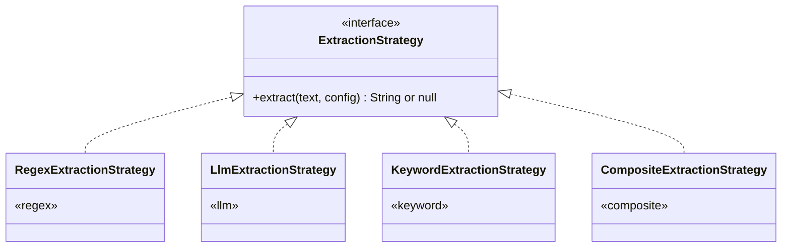
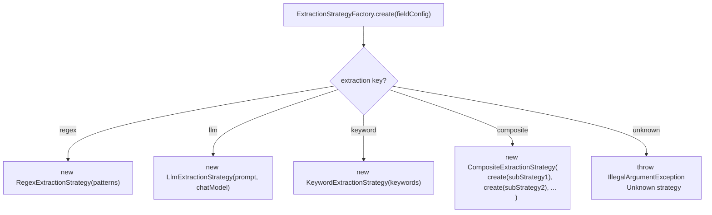

# Extraction Strategies — Detailed Design

> Parent: [technical-design.md](./technical-design.md) · Related: [ingestion-pipeline.md](./ingestion-pipeline.md), [domain-configuration-guide.md](./domain-configuration-guide.md)

---

## 1. Overview

Extraction strategies are the pluggable units that populate metadata fields during ingestion.
Each metadata field in a domain YAML declares an `extraction` type that maps to a strategy
implementation. The engine resolves the strategy via `ExtractionStrategyFactory` and executes it
against the document text.



All strategies follow the same contract: take document text and field configuration,
return an extracted string value or null. The engine handles type coercion, truncation,
and null-skipping.

---

## 2. Regex Strategy

**YAML key:** `regex`

Applies a list of regex patterns in order against the document text.
Returns the first capture group of the first matching pattern.

### YAML configuration

```yaml
- key: cert_issue_date
  type: string
  extraction: regex
  patterns:
    - "(?:issued|awarded|granted|date)[:\\s]*(\\d{4}-\\d{2}-\\d{2})"
    - "(?:issued|awarded|granted|date)[:\\s]*(\\w+ \\d{1,2},? \\d{4})"
```

### Execution flow

```text
Input text: "...Certificate issued: 2024-03-15. Valid until..."

Pattern 1: "(?:issued|awarded|granted|date)[:\\s]*(\d{4}-\d{2}-\d{2})"
  → match found at "issued: 2024-03-15"
  → capture group 1 = "2024-03-15"
  → return "2024-03-15"

Pattern 2: (not tried — pattern 1 matched)
```

### When to use

- Dates (ISO-8601, verbose formats)
- IDs and codes (case numbers, credential IDs, docket numbers)
- Monetary values (`$1,200,000`)
- Statute references (`42 U.S.C. § 1983`)
- Any field with a predictable textual structure

### Implementation notes

- Patterns are compiled once at domain load time and reused across documents
- Matching is case-insensitive by default
- Only the first capture group `(...)` is returned; named groups are not supported
- If no pattern matches, returns null (field is omitted from metadata)

---

## 3. LLM Strategy

**YAML key:** `llm`

Sends a prompt along with the document text to the ChatModel.
Returns the LLM's response as the extracted value.

### YAML configuration

```yaml
- key: candidate_name
  type: string
  extraction: llm
  prompt: "Extract the full name of the candidate. Return only the name, nothing else."
  # model: "gpt-4o"           # optional — overrides domain.models.extraction
```

### Model resolution

The LLM strategy uses the model resolved by the `ExtractionStrategyFactory`:

```text
1. Field-level 'model' key       → if present, use this model
2. Domain-level 'models.extraction' → domain default for extraction
3. App-level 'app.models.default-model' → global fallback

Different fields in the same doc_type can use different models:
  - candidate_name:         model not set → domain default "gpt-4o-mini"
  - holding_summary:        model: "deepseek-r1" → override, needs reasoning
```

See [domain-configuration-guide.md § Model Configuration](./domain-configuration-guide.md#7-model-configuration) for full details.

### Execution flow

```text
Build LLM input:
  System message: "Extract the full name of the candidate. Return only the name, nothing else."
  User message: "<first 8000 characters of document text>"

Call ChatModel.chat(input)       ← model resolved per field
  → LLM response: "Maria Lopez"
  → trim whitespace
  → return "Maria Lopez"
```

### When to use

- Names (person, company, institution)
- Summaries and classifications that require understanding
- Lists (skills, roles, languages) that need interpretation
- Any field where the value is not in a predictable textual pattern

### Implementation notes

- Document text is truncated to `app.ingest.llm-enrichment.max-chars` (default 8000)
- Prompts should be constrained: "Return only X, nothing else" reduces hallucination
- LLM calls have a timeout (`app.ingest.file-timeout-seconds`)
- On timeout or error, returns null (field is omitted; warning logged)

### LLM field batching

When multiple fields in a doc_type use `llm` extraction, the engine can batch them
into a single LLM call to reduce latency and cost:

```text
Individual prompts from YAML:
  candidate_name: "Extract the full name of the candidate."
  candidate_top_skills: "List the top 8 technical skills, comma-separated."
  candidate_years_experience: "Estimate total years. Return only a number."

Batched prompt (auto-generated by engine):
  "Extract the following fields from this document. Return valid JSON.
   1. candidate_name: Extract the full name of the candidate.
   2. candidate_top_skills: List the top 8 technical skills, comma-separated.
   3. candidate_years_experience: Estimate total years. Return only a number."

LLM response:
  {"candidate_name":"Maria Lopez","candidate_top_skills":"Java, Spring Boot, ...","candidate_years_experience":"7"}

Engine parses JSON → populates each field individually.
```

Batching is enabled by default (`app.ingest.llm-enrichment.batch-fields: true`)
and can be disabled for domains where independent prompts produce better results.

---

## 4. Keyword Strategy

**YAML key:** `keyword`

Scans document text for keyword lists mapped to category labels.
Returns the first matching category.

### YAML configuration

```yaml
- key: employment_status
  type: string
  extraction: keyword
  keywords:
    open_to_work: ["open to", "seeking", "looking for", "available"]
    employed: ["currently at", "present", "current role"]
```

### Execution flow

```text
Input text (lowercased): "...currently seeking new opportunities in backend..."

Category "open_to_work":
  "open to"     → not found
  "seeking"     → FOUND at position 14
  → return "open_to_work"

Category "employed": (not checked — first match wins)
```

### When to use

- Enum-like fields (status, level, mode, classification)
- Binary detection (has/doesn't have a characteristic)
- Fields where exact keyword presence determines the value
- Fast, zero-cost alternative to LLM for simple categorization

### Implementation notes

- Text is lowercased before matching
- Keywords are matched as substrings (not word-boundary)
- Categories are evaluated in YAML declaration order; first match wins
- If no keyword matches any category, returns null
- Multi-word keywords ("open to") are supported

---

## 5. Composite Strategy

**YAML key:** `composite`

Chains multiple sub-strategies in order. Tries each one; returns the first non-null result.

### YAML configuration

```yaml
- key: candidate_location
  type: string
  extraction: composite
  strategies:
    - type: regex
      patterns:
        - "(?:located in|based in|from)\\s+([A-Z][a-zA-Z\\s,.-]{2,40})"
        - "(?:address|location)[:\\s]+([A-Z][a-zA-Z\\s,.-]{2,40})"
    - type: llm
      prompt: "Extract the candidate's city and state/country. Return only the location."
```

### Execution flow

```text
Sub-strategy 1 (regex):
  Pattern: "(?:based in)\\s+([A-Z][a-zA-Z\\s,.-]+)"
  Text: "...Based in Denver, CO..."
  → match: "Denver, CO"
  → return "Denver, CO" ✓

Sub-strategy 2 (llm): NOT executed (strategy 1 succeeded)
```

```text
Sub-strategy 1 (regex):
  No pattern matched → null

Sub-strategy 2 (llm):
  Prompt: "Extract the candidate's city and state/country."
  LLM response: "San Francisco, CA"
  → return "San Francisco, CA" ✓
```

### When to use

- Fields where a cheap strategy (regex) works most of the time but LLM is needed as fallback
- Fields extractable by multiple methods with different reliability/cost tradeoffs
- Location-like fields, date-like fields where format varies across documents

### Implementation notes

- Sub-strategies cannot be `composite` (no recursive nesting)
- Minimum 2 sub-strategies required (enforced by JSON Schema)
- Order matters: put cheap strategies (regex, keyword) before expensive ones (LLM)
- If all sub-strategies return null, the composite returns null

---

## 6. Strategy Resolution

The `ExtractionStrategyFactory` maps YAML extraction keys to strategy instances:



---

## 7. Adding a Custom Strategy

To add a new extraction strategy (e.g. NER-based entity extraction):

**Step 1:** Implement the `ExtractionStrategy` interface:

```java
public class NerExtractionStrategy implements ExtractionStrategy {

    private final String entityType;
    private final NerModel nerModel;

    public NerExtractionStrategy(String entityType, NerModel nerModel) {
        this.entityType = entityType;
        this.nerModel = nerModel;
    }

    @Override
    public String extract(String text, Map<String, Object> config) {
        List<NerEntity> entities = nerModel.recognize(text);
        return entities.stream()
                .filter(e -> e.type().equals(entityType))
                .map(NerEntity::value)
                .findFirst()
                .orElse(null);
    }
}
```

**Step 2:** Register in `ExtractionStrategyFactory`:

```java
case "ner" -> new NerExtractionStrategy(
    (String) fieldConfig.get("entity-type"),
    nerModel
);
```

**Step 3:** Use in any domain YAML:

```yaml
- key: parties_plaintiff
  type: string
  extraction: ner
  entity-type: PERSON
```

No changes to the engine, loader, or any existing strategy.

---

## 8. Strategy Selection Guide

| Field characteristic | Recommended strategy | Rationale |
|---|---|---|
| Predictable format (dates, IDs, amounts) | `regex` | Fast, deterministic, no LLM cost |
| Enum with known values (status, level) | `keyword` | Fast, zero cost, exhaustive matching |
| Requires understanding (names, summaries) | `llm` | Only LLM can interpret unstructured text |
| Usually structured but sometimes free-form | `composite` (regex → llm) | Cheap when structured; LLM fallback for edge cases |
| Multiple LLM fields on same doc_type | `llm` with batching | Single LLM call for all fields reduces latency 3-5x |
