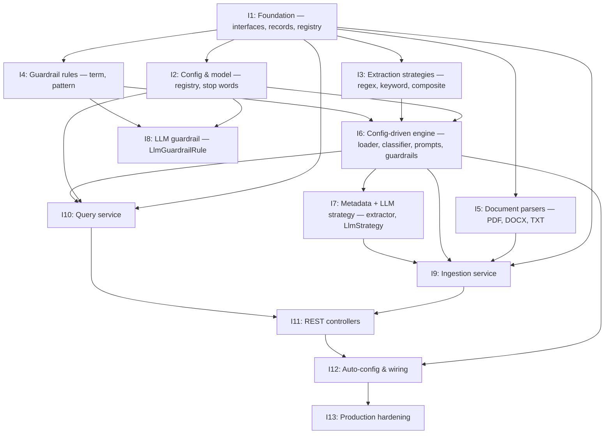

# Implementation Plan — Generic Multi-Domain RAG

> Parent: [technical-design.md](./technical-design.md) · Code reference: [framework-code.md](./framework-code.md)

This document breaks the proposed framework into **testable iterations** with **quality gates**. Each iteration produces a shippable slice that can be verified by tests and keeps the codebase in a working state.

**Leather inventory agent (separate product spec):** The **[Leather store inventory + Agentic chat](./leather-inventory-agent/diseno-agente-consultas-leather-openrouter.md)** design (CSV/XLSX ingest, **pgvector**, **RAG-first search** via `searchCatalogRag`, relational tools for **exact stock**, TOON, BFF embed widget, Spring Boot **4.0.4**, LangChain4j **1.12.2** + **agentic 1.12.2-beta22**) is tracked in **[§ 18 Leather inventory agent POC](#18-leather-inventory-agent-poc)** below. After core build, add the **demo kit** ([design §19](./leather-inventory-agent/diseno-agente-consultas-leather-openrouter.md#19-demo-kit-and-samples-product-showcase), **[§ 18.8](#188-demo-kit-and-samples)** here) — **live PostgreSQL + pgvector** and **live OpenRouter** for the showcase; no mocked LLM/DB on that path. Reuse **patterns** from generic iterations **9** (ingest/embed/store) and **10** (retrieve) for vector pipelines; leather-specific iterations are defined in the leather doc **§ 15**.

**Iteration docs:** Each iteration has a dedicated document under [iterations/](./iterations/) that contains the **goal**, **deliverables**, **acceptance criteria**, **tests to add**, **quality gates**, and **code** for that iteration. Use the iteration doc as the single source for implementing that slice. The table below links to each.

### Required capabilities — tracking table

The following capabilities are **required** and are tracked by iteration. Each row is a requirement; the iteration that delivers it is responsible for acceptance criteria and tests.

| # | Required capability | Description | Delivered in iteration | Acceptance criteria / tests |
|---|---------------------|-------------|------------------------|-----------------------------|
| R1 | **Ingestion ledger** | Persist a record per file (domain, source, status, reason, next_steps, optional llm_reasoning) so ingestion outcomes can be queried. | **9** — Ingestion service | Service writes ledger entry on every outcome (ingested, rejected, skipped, failed). Configurable via `app.ingestion.ledger.enabled`. See [§ 11](#11-iteration-9--ingestion-service), [iteration-09](./iterations/iteration-09-ingestion-service.md). |
| R2 | **Dashboard / ledger endpoint** | GET endpoint to see what was ingested and what wasn’t, with reason. Supports dashboard or report consumers. | **11** — REST controllers | GET `/api/v1/{domainId}/ingestion/ledger` with query params `status`, `since`, `limit`, `offset`. Response: entries (source, status, reason, doc_type, next_steps, llm_reasoning, created_at). See [§ 13](#13-iteration-11--rest-controllers), [iteration-11](./iterations/iteration-11-rest-controllers.md). |
| R3 | **Store LLM reasoning** | When flag on, store the LLM’s reasoning (e.g. for classification or extraction) so decisions can be tracked. | **9** (persist in ledger), **11** (expose in API) | `app.ingest.store-llm-reasoning` (default false). When on, ledger entry includes `llm_reasoning` when an LLM was used. GET ledger returns it. See [technical-design § 23.5](./technical-design.md#235-storing-llm-reasoning-track-how-decisions-are-taken). |
| R4 | **LLM classification fallback** | Optional path: when fallback rule would apply, call LLM to suggest doc_type (flag on/off). | **6** — Config-driven engine | `app.ingest.classification.llm-fallback-enabled` or domain `classification.llm-fallback-enabled`. When on and fallback rule matches, call LLM; return doc_type (and reasoning when R3 is on). See [§ 8](#8-iteration-6--config-driven-engine-yaml-loader--classifier-prompts-guardrails), [iteration-06](./iterations/iteration-06-config-driven-engine.md). |
| R5 | **Preflight (classify-only) endpoint** | POST endpoint to classify a file without ingesting; returns suggested_doc_type and next_steps. | **11** — REST controllers | POST `/api/v1/{domainId}/ingest/preflight` (multipart file). Returns suggested_doc_type, next_steps (and optional reasoning when R3 on). See [technical-design § 23.2](./technical-design.md#232-classification-help-flow-preflight--classify-only). |
| R6 | **Virtual threads for ingestion** | Ingestion runs on virtual threads (per file, configurable). | **9** — Ingestion service | Batch/folder ingest use virtual threads; `app.ingest.virtual-threads-enabled` (default true). See [§ 11](#11-iteration-9--ingestion-service). |
| R7 | **Hash-based skip (repeat runs)** | Track content hash; skip full pipeline when same source has same hash to save resources. | **9** — Ingestion service | After parse, compute content_hash; if stored record has same hash for (domain_id, source), skip extract/embed/store; record skip. See [§ 11.2.1](#1121-running-ingestion-multiple-times-tracking--hash-based-skip). |

| Iteration | Document |
|-----------|----------|
| Quality gates (all) | [iteration-00-quality-gates.md](./iterations/iteration-00-quality-gates.md) |
| 1 — Foundation | [iteration-01-foundation.md](./iterations/iteration-01-foundation.md) |
| 2 — Config & model registry | [iteration-02-config-model-registry.md](./iterations/iteration-02-config-model-registry.md) |
| 3 — Extraction strategies | [iteration-03-extraction-strategies.md](./iterations/iteration-03-extraction-strategies.md) |
| 4 — Guardrail rules | [iteration-04-guardrail-rules.md](./iterations/iteration-04-guardrail-rules.md) |
| 5 — Document parsers | [iteration-05-document-parsers.md](./iterations/iteration-05-document-parsers.md) |
| 6 — Config-driven engine | [iteration-06-config-driven-engine.md](./iterations/iteration-06-config-driven-engine.md) |
| 7 — Config-driven metadata + LLM | [iteration-07-config-driven-metadata-llm.md](./iterations/iteration-07-config-driven-metadata-llm.md) |
| 8 — LLM guardrail | [iteration-08-llm-guardrail.md](./iterations/iteration-08-llm-guardrail.md) |
| 9 — Ingestion service | [iteration-09-ingestion-service.md](./iterations/iteration-09-ingestion-service.md) |
| 10 — Query service | [iteration-10-query-service.md](./iterations/iteration-10-query-service.md) |
| 11 — REST controllers | [iteration-11-rest-controllers.md](./iterations/iteration-11-rest-controllers.md) |
| 12 — Auto-configuration & wiring | [iteration-12-auto-configuration-wiring.md](./iterations/iteration-12-auto-configuration-wiring.md) |
| 13 — Production hardening | [iteration-13-production-hardening.md](./iterations/iteration-13-production-hardening.md) |

**Custom algorithms vs LLM:** The design prefers **custom algorithms** (regex, keyword, composite, deterministic guardrails) where they preserve quality, and uses the **LLM** only for answer generation, free-form summarization, and nuanced guardrails. When implementing extraction and guardrails, favor regex/keyword/composite first so most flows avoid LLM calls. See [technical-design.md § 21 Custom algorithms vs LLM](./technical-design.md#21-custom-algorithms-vs-llm).

**Prefer configurable tools over hardcoding (guardrails excluded):** For all areas **except guardrails**, prefer configurable tools and algorithms instead of hardcoded setup: stop words from YAML or resource files (not in code); extraction strategies and patterns from domain YAML; classification rules from YAML; model definitions from `application.yml`; parser selection via registry/config; prompts from domain YAML. Guardrails remain as designed (YAML-defined rules); the preference for config/tools applies to stop words, extraction, classification, models, parsers, and prompts.

**Dev vs prod:** The app supports **production** and **development** environment setups via Spring profiles. **All LLM and embedding API access is via OpenRouter** (no direct OpenAI or other provider clients); prod uses benchmark-grade models through OpenRouter, dev uses free/low-cost or in-process embeddings. **Languages:** The platform supports **English (en)** and **Spanish (es)** for query-term extraction (language-specific stop words), optional answer language, and prompt localization. See [§ 16 Environment setup (dev vs prod)](#16-environment-setup-dev-vs-prod), [model-recommendations.md](./model-recommendations.md), and [technical-design.md § 22 Supported languages](./technical-design.md#22-supported-languages-english-and-spanish).

---

## Table of Contents

1. [Quality Gates](#1-quality-gates)
2. [Required capabilities — tracking table](#required-capabilities--tracking-table) (R1–R7)
3. [Iteration Dependencies](#2-iteration-dependencies)
4. [Iteration 1 — Foundation (interfaces, records, registry)](#3-iteration-1--foundation-interfaces-records-registry)
5. [Iteration 2 — Config & model registry](#4-iteration-2--config--model-registry)
6. [Iteration 3 — Extraction strategies (no LLM)](#5-iteration-3--extraction-strategies-no-llm)
7. [Iteration 4 — Guardrail rules (deterministic)](#6-iteration-4--guardrail-rules-deterministic)
8. [Iteration 5 — Document parsers](#7-iteration-5--document-parsers)
9. [Iteration 6 — Config-driven engine (YAML loader + classifier, prompts, guardrails)](#8-iteration-6--config-driven-engine-yaml-loader--classifier-prompts-guardrails)
10. [Iteration 7 — Config-driven metadata + LLM strategy](#9-iteration-7--config-driven-metadata--llm-strategy)
11. [Iteration 8 — LLM guardrail rule](#10-iteration-8--llm-guardrail-rule)
12. [Iteration 9 — Ingestion service](#11-iteration-9--ingestion-service)
13. [Iteration 10 — Query service](#12-iteration-10--query-service)
14. [Iteration 11 — REST controllers](#13-iteration-11--rest-controllers)
15. [Iteration 12 — Auto-configuration & wiring](#14-iteration-12--auto-configuration--wiring)
16. [Iteration 13 — Production hardening](#15-iteration-13--production-hardening)
17. [Environment setup (dev vs prod)](#16-environment-setup-dev-vs-prod)
18. [Optional iterations](#17-optional-iterations)
19. [Leather inventory agent POC](#18-leather-inventory-agent-poc)

---

## 1. Quality Gates

**Full detail (and single source for gates):** [iteration-00-quality-gates.md](./iterations/iteration-00-quality-gates.md).

These gates apply to **every iteration** before merge. They keep the codebase buildable, tested, and maintainable.

### 1.1 Build & test

| Gate | Requirement | How to verify |
|------|--------------|----------------|
| **Compile** | No compilation errors | `./gradlew compileJava compileTestJava` |
| **Unit tests** | All tests pass | `./gradlew test` |
| **No flaky tests** | Tests are deterministic; no external calls in unit tests | Review: no network, no real DB in unit tests |
| **Coverage (new code)** | ≥ 80% line coverage for code added in the iteration | `./gradlew test jacocoTestReport` (if JaCoCo applied); or team rule: new classes have tests |

### 1.2 Code quality

| Gate | Requirement | How to verify |
|------|--------------|----------------|
| **Checkstyle, SpotBugs, PMD** | Must run on every code change; no violations (see § 1.5) | **Maven:** `mvn checkstyle:check spotbugs:check pmd:check` or `mvn verify` · **Gradle:** `./gradlew checkstyleMain checkstyleTest` (+ SpotBugs/PMD if configured) or `./gradlew check` |
| **Meaningful assertions** | Tests assert behavior, not only “no exception” | Review: every test has at least one assertion on outcome |
| **No PII in logs** | No names, emails, phones in log messages | Review + grep for sensitive patterns |
| **Specific exceptions** | Catch specific exception types; no empty catch blocks | Code review |

### 1.5 Static analysis (Checkstyle, SpotBugs, PMD, Sonar)

**Checkstyle, SpotBugs, and PMD must be run on every code change.** Before submitting or pushing, run `mvn verify` (Maven; Checkstyle, SpotBugs, PMD bound to verify) or `./gradlew check` / `./gradlew build` (Gradle; bind plugins to `check`). Fix any Checkstyle (line length 100, Javadoc where required), SpotBugs, or PMD violations before considering the change done. **Sonar:** In CI, run with `-Dsonar.skip=false` and `sonar.host.url` set; locally Sonar is skipped by default. Full detail: [iteration-00-quality-gates.md § 1.5](./iterations/iteration-00-quality-gates.md#15-static-analysis-checkstyle-spotbugs-pmd-sonar).

### 1.3 Definition of Done (per iteration)

- [ ] All deliverables for the iteration implemented and referenced in this plan
- [ ] Unit tests (and integration tests where specified) added and passing
- [ ] No hardcoded secrets or PII in new code
- [ ] **Checkstyle, SpotBugs, PMD** run and **no violations** (fix before merge); see § 1.5
- [ ] Build green: `./gradlew clean build` or `mvn clean verify` (including tests and static analysis)
- [ ] PR description links to this plan and lists the iteration number

### 1.4 Optional (recommended)

- **Integration tests** for critical paths (e.g. load YAML → classify, or ingest one file) using test profiles and in-memory or Testcontainers DB
- **JaCoCo** coverage report; fail build below 80% on new code
- **Conventional commits** for each commit (`feat:`, `fix:`, `test:`, `chore:`)
- **Domain YAML authoring:** Prefer regex/keyword/composite for structured metadata; use LLM only where § 21 indicates (summaries, variable phrasing, nuanced guardrails)
- **Config over hardcoding:** Where a configurable alternative exists (stop words, extraction patterns, classification rules, model defs, prompts, parser selection), implement it via config/YAML/resource files rather than hardcoding in code; guardrails are excluded from this preference and remain YAML-defined as designed

---

## 2. Iteration Dependencies

Iterations are ordered so that each builds on the previous. Parallel work is possible only where the diagram shows no dependency.

---

## 3. Iteration 1 — Foundation (interfaces, records, registry)

**Goal:** Define all domain abstractions and the registry. No YAML, no LLM, no I/O — pure interfaces and in-memory registry so later iterations can depend on them.

### 3.1 Deliverables (framework-code.md)

| # | Component | Reference |
|---|-----------|-----------|
| 1 | `RagDomain` | § 1.1 |
| 2 | `DomainModelConfig` | § 1.2 |
| 3 | `DocumentClassifier` | § 1.3 |
| 4 | `ExtractionStrategy` | § 1.4 |
| 5 | `MetadataExtractor` | § 1.5 |
| 6 | `MetadataExtractorRegistry` | § 1.6 |
| 7 | `GuardrailEvaluator`, `GuardrailDecision` | § 1.7 |
| 8 | `GuardrailRule` | § 1.8 |
| 9 | `PromptTemplateProvider` | § 1.9 |
| 10 | `DomainRegistry` | § 1.10 |

### 3.2 Acceptance criteria

- All interfaces and records compile.
- `DomainRegistry`: `register(domain)`, `get(id)` returns optional, `get(id)` for unknown returns empty.
- No external dependencies (no Spring, no LangChain4j) in this package if desired; otherwise minimal.

### 3.3 Tests to add

- `DomainRegistryTest`: register a stub `RagDomain`, get by id returns it; get unknown returns empty; get after register two, get first by id.
- `DomainModelConfigTest`: `resolveExtractionModel(fieldOverride)` returns field override when non-blank, else extraction model id.
- Optional: stub implementation of `RagDomain` (e.g. `StubRagDomain`) for use in later iterations.

### 3.4 Quality gates

- `./gradlew test` passes.
- New code in `feature/domain/` covered by tests (registry + record behavior).

---

## 4. Iteration 2 — Config & model registry

**Goal:** Load model definitions from `application.yml` (and profile-specific `application-{profile}.yml`) and provide a `ModelRegistry` that resolves a model id to a `ChatModel`. Add general stop words (config or resource file). Config should support both prod and dev profiles (Iteration 12 adds the profile files). **Prefer:** No hardcoded model URLs or stop-word lists in code — use config/resource files or YAML only.

### 4.1 Deliverables (framework-code.md)

| # | Component | Reference |
|---|-----------|-----------|
| 1 | `ModelDefinitionProperties` | § 2.1 |
| 2 | `ModelRegistry` | § 2.2 |
| 3 | `application.yml` — model config snippet | § 2.3 |
| 4 | `StopWordsConfig` (general stop words bean) | § 2.4 |

### 4.2 Acceptance criteria

- `ModelRegistry.resolve(modelId)` returns a `ChatModel` for a configured id; unknown id throws or returns optional (align with framework-code).
- General stop words load from `app.query.general-stop-words` (list) or `app.query.general-stop-words-file` (classpath file); fallback to default English set when both empty. **Language support (en, es):** support per-locale files (e.g. `general-stop-words-file-es`) and a provider or bean that returns the correct set for the request language.
- Bean `Set<String> generalStopWords` (or locale-aware provider) available for injection; supported languages: **en**, **es**.

### 4.3 Tests to add

- `ModelRegistryTest`: with `@TestConfiguration` and a test `application.yml` (or `@ConfigurationProperties` test), resolve known id returns non-null; resolve unknown behaves as designed.
- `StopWordsConfigTest`: with test profile YAML, verify loaded set contains expected words; with classpath file, verify file wins over list; with empty config, verify default set.
- Use mock or stub `ChatModel` where needed (e.g. LangChain4j test utilities or simple impl).

### 4.4 Quality gates

- All tests pass; no real API keys in tests.

---

## 5. Iteration 3 — Extraction strategies (no LLM)

**Goal:** Implement regex, keyword, and composite extraction strategies and the factory. Composite may chain regex + keyword only (LLM sub-strategy in Iteration 7). These **custom algorithms** cover most structured metadata (dates, IDs, categories) without LLM; see [technical-design.md § 21](./technical-design.md#21-custom-algorithms-vs-llm). **Prefer:** Strategies and patterns (regex, keyword maps) come from domain YAML/config — no hardcoded patterns or category maps in code.

### 5.1 Deliverables (framework-code.md)

| # | Component | Reference |
|---|-----------|-----------|
| 1 | `ExtractionStrategyFactory` | § 4.1 (regex, keyword, composite only) |
| 2 | `RegexExtractionStrategy` | § 4.2 |
| 3 | `KeywordExtractionStrategy` | § 4.4 |
| 4 | `CompositeExtractionStrategy` | § 4.5 (without LLM sub-call, or with mock) |

### 5.2 Acceptance criteria

- Factory creates strategy from a map/key (e.g. `extraction: regex`, `patterns: [...]`); regex returns first capture; keyword returns first matching category; composite tries strategies in order until one returns non-null.
- No real LLM calls; composite’s LLM step can be skipped or mocked.

### 5.3 Tests to add

- `RegexExtractionStrategyTest`: text containing a date pattern returns captured group; no match returns null; multiple patterns, first match wins.
- `KeywordExtractionStrategyTest`: text with keyword from category A returns A; multiple categories, first match wins; no keyword returns null.
- `CompositeExtractionStrategyTest`: first strategy returns value → that value; first null, second returns value → second’s value; all null → null.
- `ExtractionStrategyFactoryTest`: create regex/keyword/composite from config maps; unknown strategy type throws or returns empty optional.

### 5.4 Quality gates

- `./gradlew test`; no network; tests are deterministic.

**Design note:** When authoring domain YAML, prefer regex/keyword (or composite with these first) for structured fields so ingestion stays high-quality and low-cost; use LLM only for summaries or highly variable fields (§ 21).

---

## 6. Iteration 4 — Guardrail rules (deterministic)

**Goal:** Implement term-block and pattern-block guardrail rules and the guardrail rule factory. No LLM. These **custom algorithms** handle most guardrail needs (blocklist terms, prompt-injection patterns); llm-block is added in Iteration 8 for nuanced intent. See [technical-design.md § 21](./technical-design.md#21-custom-algorithms-vs-llm).

### 6.1 Deliverables (framework-code.md)

| # | Component | Reference |
|---|-----------|-----------|
| 1 | `GuardrailRuleFactory` | § 5.1 (term-block, pattern-block only) |
| 2 | `TermBlockGuardrailRule` | § 5.2 |
| 3 | `PatternBlockGuardrailRule` | § 5.3 |

### 6.2 Acceptance criteria

- Term-block: if query contains configured term (and optional intent), rule blocks with message.
- Pattern-block: if query matches configured regex, rule blocks.
- Factory builds rule from YAML-like map (`type`, `terms`, `pattern`, etc.).
- Evaluator (or single-rule evaluation) returns `GuardrailDecision` (blocked / passed).

### 6.3 Tests to add

- `TermBlockGuardrailRuleTest`: query containing term → blocked; query without term → passed; optional intent matching.
- `PatternBlockGuardrailRuleTest`: query matching pattern → blocked; no match → passed.
- `GuardrailRuleFactoryTest`: create term-block and pattern-block from config; unknown type throws or returns empty.

### 6.4 Quality gates

- All tests pass; no external calls.

---

## 7. Iteration 5 — Document parsers

**Goal:** Parse PDF, DOCX, and plain text into raw text. Registry selects parser by filename. **Prefer:** Parser selection and supported types driven by registry/config (e.g. which parsers are registered, which file types a domain supports from YAML) — no hardcoded parser list or extensions in code.

### 7.1 Deliverables (framework-code.md)

| # | Component | Reference |
|---|-----------|-----------|
| 1 | `DocumentParser` | § 6.1 |
| 2 | `DocumentParserRegistry` | § 6.2 |
| 3 | `PdfDocumentParser` | § 6.3 |
| 4 | `DocxDocumentParser` | § 6.4 |
| 5 | `PlainTextParser` | § 6.5 |

### 7.2 Acceptance criteria

- Registry tries parsers in order; first that `supports(filename)` wins; `parse(filename, bytes)` returns extracted text or throws.
- PDF: PDFBox-based extraction; DOCX: POI-based; TXT: UTF-8. Empty or unparseable can return null or throw as per design.

### 7.3 Tests to add

- `PdfDocumentParserTest`: parse a small test PDF from `src/test/resources`; expect non-empty text; unsupported extension returns false from `supports`.
- `DocxDocumentParserTest`: parse a small test DOCX; expect non-empty text.
- `PlainTextParserTest`: parse UTF-8 bytes; expect same string; supports `.txt`/`.md`.
- `DocumentParserRegistryTest`: register PDF, DOCX, TXT; for `file.pdf` get PDF parser and parse; for `file.xyz` no parser or fallback behavior.

### 7.4 Quality gates

- Tests use only test resources; no network; build passes with optional `poi-ooxml` and PDFBox.

---

## 8. Iteration 6 — Config-driven engine (YAML loader + classifier, prompts, guardrails)

**Goal:** Load domain YAML from a path, build a `ConfigDrivenRagDomain` with classifier, prompt provider, and guardrail evaluator. No metadata extraction yet (no LLM, no extractors). Classifier and deterministic guardrails are **custom-algorithm** steps per § 21 (no LLM required for quality). **Prefer:** All classifier rules, prompts, and guardrail rule definitions loaded from domain YAML — no hardcoded rules or prompt templates in code.

### 8.1 Deliverables (framework-code.md)

| # | Component | Reference |
|---|-----------|-----------|
| 1 | `DomainDefinitionLoader` | § 3.1 (minimal: load YAML, build domain with classifier, prompts, guardrails) |
| 2 | `ConfigDrivenRagDomain` | § 3.2 (wired to classifier, guardrails, prompts; extractors can be empty or stub) |
| 3 | `ConfigDrivenDocumentClassifier` | § 3.3 |
| 4 | `ConfigDrivenGuardrailEvaluator` | § 3.6 |
| 5 | `ConfigDrivenPromptTemplateProvider` | § 3.7 |

### 8.2 Acceptance criteria

- Loader reads YAML from classpath or file path; builds at least one `RagDomain` with correct `domainId`, `supportedFileTypes`, `chunkSize`, `chunkOverlap`.
- Classifier: priority-ordered rules; filename + content keywords; first match wins; fallback rule. **Optional LLM fallback (optional F):** when `app.ingest.classification.llm-fallback-enabled` or domain `classification.llm-fallback-enabled` is true and the matching rule is the fallback rule, call LLM to suggest doc_type (and optionally reasoning for optional G). When flag is false (default), classification is rule-only. See [technical-design.md § 9.1](./technical-design.md#91-optional-llm-based-classification-fallback) and [iteration-06](./iterations/iteration-06-config-driven-engine.md) Optional follow-ups.
- Guardrail evaluator: evaluates rules in order; first block wins.
- Prompt provider: returns query and fallback template from YAML.

### 8.3 Tests to add

- `DomainDefinitionLoaderTest`: load a minimal domain YAML (e.g. one doc_type, one classification rule, one guardrail, one prompt); assert domain id, classifier classifies a sample text to expected doc_type, guardrail blocks/permits sample queries, prompt provider returns expected template.
- `ConfigDrivenDocumentClassifierTest`: given a list of rules (e.g. from map), assert first matching rule’s doc_type returned; fallback when no rule matches.
- `ConfigDrivenGuardrailEvaluatorTest`: given list of term/pattern rules, assert blocked when query matches, passed when not.

### 8.4 Quality gates

- Tests use test YAMLs in `src/test/resources/domains/`; no production YAML paths; no real LLM.

---

## 9. Iteration 7 — Config-driven metadata + LLM strategy

**Goal:** Add metadata extraction to the config-driven engine: load field definitions from YAML, run regex/keyword/composite/LLM strategies. Wire `LlmExtractionStrategy` with a `ChatModel` (mock in tests). **Composite must try regex/keyword before LLM** so custom algorithms handle structured fields first; LLM is fallback for free-form or variable content (see [technical-design.md § 21](./technical-design.md#21-custom-algorithms-vs-llm)). **Prefer:** Field definitions, strategy types, and model overrides from domain YAML only — no hardcoded field lists or extraction logic in code; LLM only where configured.

### 9.1 Deliverables (framework-code.md)

| # | Component | Reference |
|---|-----------|-----------|
| 1 | `ConfigDrivenMetadataExtractorRegistry` | § 3.4 |
| 2 | `ConfigDrivenMetadataExtractor` | § 3.5 |
| 3 | `LlmExtractionStrategy` | § 4.3 |
| 4 | `ExtractionStrategyFactory` (full: include LLM) | § 4.1 |
| 5 | `ConfigDrivenRagDomain` (full: with extractors) | § 3.2 |

### 9.2 Acceptance criteria

- For a doc_type, extractor iterates fields; each field’s strategy (regex, llm, keyword, composite) is created by factory; LLM strategy uses `ModelRegistry` (or injected `ChatModel` in tests).
- Model resolution: field override → domain extraction model → default.
- **Composite tries strategies in order** (e.g. regex then keyword then llm); first non-null result wins — so custom algorithms run before LLM (§ 21).
- Composite can include LLM as sub-step; factory passes model resolver where needed.

### 9.3 Tests to add

- `ConfigDrivenMetadataExtractorTest`: YAML with one regex field and one keyword field; extract returns map with correct values; missing optional field returns null or omitted.
- `LlmExtractionStrategyTest`: with mock `ChatModel` returning fixed string, extract returns that string; null/empty response handled.
- Integration-style test (optional): load full domain YAML with regex + keyword fields only, extract from sample text; no real LLM.

### 9.4 Quality gates

- LLM tests use only mocks or stubs; no real API keys; coverage for extractor and LLM strategy.

---

## 10. Iteration 8 — LLM guardrail rule

**Goal:** Add `LlmGuardrailRule` that uses a `ChatModel` to decide block/pass. Wire into factory and evaluator.

### 10.1 Deliverables (framework-code.md)

| # | Component | Reference |
|---|-----------|-----------|
| 1 | `LlmGuardrailRule` | § 5.4 |
| 2 | `GuardrailRuleFactory` (include `llm-block`) | § 5.1 |

### 10.2 Acceptance criteria

- Rule takes prompt template and optional model; calls `ChatModel`; parses response to blocked/passed and message.
- Factory creates `llm-block` rule from YAML (prompt, optional model id).

### 10.3 Tests to add

- `LlmGuardrailRuleTest`: mock `ChatModel` returns "BLOCK: reason" → decision blocked with message; returns "ALLOW" or similar → passed. Test timeout/error handling (e.g. treat as block or pass by policy).

### 10.4 Quality gates

- No real LLM in tests; mock only.

---

## 11. Iteration 9 — Ingestion service

**Goal:** Orchestrate the full ingestion flow: accept, parse, sanitize, classify, extract metadata, split, embed, store. Dependencies: `RagDomain`, parsers, embedding model, embedding store.

### 11.1 Deliverables (framework-code.md)

| # | Component | Reference |
|---|-----------|-----------|
| 1 | `DomainIngestionService` | § 7.1 |
| 2 | `DomainNotFoundException`, `UnsupportedFileTypeException` | § 7.2 |

### 11.2 Acceptance criteria

- Service receives `domainId`, `filename`, `bytes`; resolves domain from registry; validates file type; selects parser; parses and sanitizes; classifies; extracts metadata; splits with domain’s splitter; embeds; stores in embedding store. Per-file errors do not abort batch when multiple files.
- **Ingestion is executed on virtual threads:** Batch and folder ingest run each file (and optionally each embedding task) on a virtual thread, e.g. via `Executors.newVirtualThreadPerTaskExecutor()`, so many files are processed in parallel without blocking platform threads. Configurable via `app.ingest.virtual-threads-enabled` (default true). See [ingestion-pipeline.md § 1 Concurrency](./ingestion-pipeline.md#concurrency-virtual-threads) and § 11 Phase 8.
- Sanitization: null bytes, Unicode NFC, whitespace (as in ingestion-pipeline.md).
- Re-ingestion: delete existing segments by source filename before storing new ones.
- **Running the process multiple times:** When ingestion is run repeatedly (e.g. folder ingest on a schedule), the system must support **tracking what was ingested** and **skipping unchanged files** to save resources. After parse (and sanitize), compute a **content hash** (e.g. SHA-256 of normalized text); if a record exists for the same `(domain_id, source)` with the same content hash (e.g. in the ingestion ledger or in store metadata), **skip** the expensive steps (extract, split, embed, store) and record a skip (e.g. ledger status `skipped`, reason `"Unchanged (same content hash)"`). Only **new files** (no prior record for source) or **updated files** (different content hash) go through the full pipeline. See [§ 11.2.1 Running ingestion multiple times](#1121-running-ingestion-multiple-times-tracking--hash-based-skip) and [ingestion-pipeline.md § 13 Deduplication](./ingestion-pipeline.md#13-deduplication).
- **Ledger and store LLM reasoning (optional E, G):** When the ingestion ledger is implemented (optional E), the service writes a ledger entry per file (status, reason, next_steps, optional `llm_reasoning`). When `app.ingest.store-llm-reasoning` is on (optional G), persist the LLM’s reasoning when an LLM was used (e.g. classification fallback). See [iteration-09](./iterations/iteration-09-ingestion-service.md) Optional follow-ups and [technical-design.md § 23, § 23.5](./technical-design.md#23-ingestion-ledger-and-classification-help-flow).

### 11.2.1 Running ingestion multiple times (tracking & hash-based skip)

When you run the ingestion process **several times** (e.g. batch folder ingest daily or on demand), you need to:

| Need | Solution |
|------|----------|
| **Track what was ingested** | Persist an **ingestion ledger** (or equivalent) per `(domain_id, source)` with at least: `source`, `status` (ingested \| skipped \| failed), `content_hash`, and optionally `updated_at`. Optional iteration E adds the full ledger API; the ingestion service should record outcomes and hash so repeat runs can consult them. |
| **Save resources** | After parsing a file, compute **content_hash** (SHA-256 of normalized text). Before running extract → split → embed → store, **compare** this hash with the hash previously stored for that `(domain_id, source)`. If the hash is the same, **skip** the rest of the pipeline (no extraction, no embedding, no store) and record a skip (e.g. `skipped — Unchanged (same content hash)`). Only **new** sources or **updated** content (different hash) go through full ingestion. |
| **Re-ingest updated files** | If the same source (e.g. filename) has a **different** content hash than the stored one, treat it as an update: delete existing segments for that source, then run the full pipeline and store new segments (re-ingestion as in ingestion-pipeline.md § 13). |

**Flow (repeat run):** For each file in the batch: (1) accept & parse → sanitize → compute `content_hash`; (2) lookup stored record for `(domain_id, source)` and its hash; (3) if same hash → skip (record skip in ledger/audit); (4) if no record or different hash → run classify, extract, split, embed, store, and record outcome + hash. This minimizes parsing (still needed to get hash) and avoids redundant embedding and store calls for unchanged files.

### 11.3 Tests to add

- `DomainIngestionServiceTest`: with mocked `DomainRegistry` (one domain), mocked parser (returns fixed text), mocked embedder and store; call ingest one file; verify store invoked with expected metadata (domain, doc_type, source), and segment count or store call count. Test unknown domain throws; unsupported file type throws.
- Test **repeat run / hash-based skip:** when the same file (same source, same content hash) is ingested twice, the second run skips extract/embed/store (e.g. returns or records "skipped — Unchanged (same content hash)") and does not call the embedder or store again. When the same source has different content (different hash), full re-ingestion occurs (delete old segments, then store new).
- Optional: integration test with test profile, in-memory or Testcontainers PGVector, real parser and embedder (or stub embedder), one small PDF/DOCX.

### 11.4 Quality gates

- Unit tests use mocks only; no real DB or API in unit tests; build passes.

---

## 12. Iteration 10 — Query service

**Goal:** Orchestrate query flow: validate domain, run guardrails, extract terms, retrieve, hybrid score, deduplicate, generate answer with LLM, paginate, build explainability.

### 12.1 Deliverables (framework-code.md)

| # | Component | Reference |
|---|-----------|-----------|
| 1 | `DomainQueryService` | § 8.1 |

### 12.2 Acceptance criteria

- Input: domainId, question, optional filters (docTypes, maxResults, minScore, page, pageSize), optional **language** (en, es). Resolve domain; resolve language from body or Accept-Language or default locale; evaluate guardrails (block → return blocked result); extract terms using **language-appropriate** general stop words (en/es) + domain stop words; retrieve from store with domain filter; hybrid scoring; deduplicate by entity/source; generate answer via domain’s prompt template and query model; paginate; return answer + results + explainability.

### 12.3 Tests to add

- `DomainQueryServiceTest`: mocked registry (one domain with stub classifier, guardrails, prompt provider, model config), mocked retriever (returns fixed list of contents), mocked `ChatModel` (returns fixed answer); call query; assert answer text, that guardrail was called, that retriever was called with domain filter. Test guardrail blocked → result is blocked. Test term extraction uses domain + general stop words when both provided. Test with `language: "es"` uses Spanish stop words when provider is locale-aware.

### 12.4 Quality gates

- All external collaborators mocked; no real embedding store or LLM in unit tests.

---

## 13. Iteration 11 — REST controllers

**Goal:** Expose ingest, query, and admin endpoints; delegate to services; return DTOs and appropriate status codes.

### 13.1 Deliverables (framework-code.md)

| # | Component | Reference |
|---|-----------|-----------|
| 1 | `DomainIngestController` | § 9.1 |
| 2 | `DomainQueryController` | § 9.2 |
| 3 | `DomainAdminController` | § 9.3 |

### 13.2 Acceptance criteria

- Ingest: POST multipart file(s), return 200 with summary or 404/422 for unknown domain / unsupported type.
- Query: POST JSON body (question, optional params), return 200 with answer + results or 404 for unknown domain; guardrail blocked → 200 with blocked payload or 403 as designed.
- Admin: GET domains, GET doc-types for domain, POST reload (optional); appropriate auth/roles as per design.
- **Ledger and dashboard (optional E):** When implemented, GET `/api/v1/{domainId}/ingestion/ledger` (query params: status, since, limit, offset) and optionally POST preflight; response includes entries with optional llm_reasoning (optional G). See [iteration-11](./iterations/iteration-11-rest-controllers.md) Optional follow-ups and [technical-design.md § 23](./technical-design.md#23-ingestion-ledger-and-classification-help-flow).

### 13.3 Tests to add

- `DomainIngestControllerTest`: MockMvc; multipart upload; mock service; expect 200 and response body fields; expect 404 when domain missing.
- `DomainQueryControllerTest`: MockMvc; POST query body; mock service; expect 200 and answer in body; expect 404 for unknown domain; test validation (e.g. blank question → 400 if validated).
- `DomainAdminControllerTest`: GET domains returns list; GET doc-types for domain returns list; reload (if implemented) returns expected status.

### 13.4 Quality gates

- Controller tests are slice tests or full integration with mocked services; no real DB/LLM in controller tests unless explicitly integration.

---

## 14. Iteration 12 — Auto-configuration, wiring, and prod/dev profiles

**Goal:** Wire all beans so the application starts with domain YAMLs loaded and registry populated. Introduce **production** and **development** profiles so prod uses benchmark-grade models and dev uses free/low-cost models. Delivered config must support both env setups as described in [§ 16 Environment setup (dev vs prod)](#16-environment-setup-dev-vs-prod); see also [model-recommendations.md](./model-recommendations.md).

### 14.1 Deliverables (framework-code.md)

| # | Component | Reference |
|---|-----------|-----------|
| 1 | `DomainAutoConfiguration` | § 10.1 |
| 2 | **Base** `application.yml` | Shared: domains path, logging, server; no model definitions or profile-specific overrides. |
| 3 | **Production** `application-prod.yml` | Default or explicit prod: `app.models.embedding: "text-embedding-3-small"`, definitions for `gpt-4o-mini`, `gpt-4o` (and optional Claude); PGVector 1536. |
| 4 | **Development** `application-dev.yml` | `app.models.embedding: "in-process"`, definitions for `extraction-free`, `query-free` (OpenRouter free); optional neutral aliases `extraction` / `query` pointing to same. |
| 5 | Profile-aware embedding bean | When `app.models.embedding` is `"in-process"` (dev), register an ONNX `EmbeddingModel` bean (e.g. `BgeSmallEnV15QuantizedEmbeddingModel`). When not (prod), use API-based embedding from config. Ensures one active embedding implementation per profile. |
| 6 | At least one minimal domain YAML | e.g. `domains/minimal.yml` or reuse from examples. |
| 7 | Optional: `application-test.yml` | Test profile: in-memory or test DB, stub or in-process models so tests do not call real APIs. |

### 14.2 Acceptance criteria

- On startup, loader reads from `app.domains.definitions-path`; registry contains all enabled domains.
- **Profile `prod` (or default):** Uses API embedding and chat **via OpenRouter** (e.g. openai/gpt-4o-mini, openai/text-embedding-3-small); PGVector schema/documentation assumes 1536. Single `OPENROUTER_API_KEY`; no direct OpenAI or other provider clients.
- **Profile `dev`:** Uses in-process ONNX embedding (384) and OpenRouter free chat definitions; PGVector for dev uses 384; separate DB or schema from prod.
- Ingest and query endpoints work end-to-end with a test domain in both profiles (where applicable; dev may rely on OPENROUTER_API_KEY).
- Health or info endpoint (optional) reports loaded domains and active profile or embedding type.

### 14.3 Tests to add

- `DomainAutoConfigurationTest`: `@SpringBootTest` with test profile; assert bean `DomainRegistry` exists and has at least one domain from test YAML.
- **Profile prod:** `@SpringBootTest(properties = "spring.profiles.active=prod")` (or `application-prod.yml` on classpath): assert `EmbeddingModel` is not the in-process implementation (e.g. check bean type or a property); assert model definitions for gpt-4o-mini / gpt-4o are present in config.
- **Profile dev:** `@SpringBootTest(properties = "spring.profiles.active=dev")`: assert in-process `EmbeddingModel` bean is present when `app.models.embedding=in-process`; assert definitions for extraction-free / query-free (or neutral aliases) are loaded.
- Optional: one end-to-end test per profile (test profile with stub/mock LLM): start app, POST ingest one file, POST query, assert non-empty answer or result list.

### 14.4 Quality gates

- `./gradlew bootRun` (or run with `--spring.profiles.active=prod` and with `dev`) starts without error.
- `./gradlew test` passes; profile-specific tests do not require real API keys (use test profile with mocks or skip external calls).

**Limitations of dev (free/low-cost) models:** See [model-recommendations.md § 4](./model-recommendations.md#4-limitations-of-free-and-low-cost-options) (rate limits, quality, dimensions, no SLA). Do not use dev models for benchmark reporting or production. Full env setup: [§ 16 Environment setup (dev vs prod)](#16-environment-setup-dev-vs-prod).

---

## 15. Iteration 13 — Production hardening

**Goal:** Global exception handling, request validation, virtual threads, and actuator health so the app is production-ready.

### 15.1 Deliverables (framework-code.md)

| # | Component | Reference |
|---|-----------|-----------|
| 1 | Global exception handler (`@RestControllerAdvice`) | § 13 |
| 2 | Request/response DTOs with Jakarta Validation | § 14.1–14.4 |
| 3 | Virtual thread configuration | § 15 |
| 4 | Actuator health indicator (domains) | § 16 |
| 5 | `build.gradle` (validation, actuator, dependencies) | § 17 |

### 15.2 Acceptance criteria

- Unknown domain, validation errors, and server errors return RFC 9457 ProblemDetail or consistent JSON; no stack traces in body.
- Query request: `@Valid`; blank question or invalid range → 400 with clear message.
- Virtual threads: executor and Tomcat (or server) configured for virtual threads as in design.
- Actuator health (or custom health) exposes status and list of loaded domains (or count).

### 15.3 Tests to add

- `GlobalExceptionHandlerTest`: trigger DomainNotFoundException, validation exception, generic exception; assert status code and body structure (type, title, detail).
- `QueryRequestValidationTest`: invalid request (blank question, negative page) returns 400 when validated.
- Health indicator test: with mock registry, indicator returns expected status and details.

### 15.4 Quality gates

- All tests pass; security rules respected (no PII in error bodies); build includes checkstyle if required.

---

## 16. Environment setup (dev vs prod)

The implementation assumes two environment setups: **production** (benchmark-grade models, API embeddings) and **development** (free/low-cost models, in-process embeddings). **All LLM and embedding API access is via OpenRouter** — use `OPENROUTER_API_KEY` only; no direct OpenAI or other provider clients. Iteration 12 delivers the profile-specific config and wiring; this section summarizes what each env needs so the plan and runbooks stay aligned.

### 16.1 How to run

| Environment | Activate profile | Command / config |
|-------------|------------------|-------------------|
| **Production** | `prod` (or default) | `spring.profiles.active=prod` or set default in `application.yml`; or `--spring.profiles.active=prod` when running. |
| **Development** | `dev` | `spring.profiles.active=dev` or `--spring.profiles.active=dev`. |
| **Test** | `test` | Used by tests; `@ActiveProfiles("test")` or `application-test.yml` with mocks / in-memory DB. |

### 16.2 Production setup

| Item | Value |
|------|--------|
| **Profile** | `prod` (or no profile if prod is default) |
| **Config file** | `application.yml` + `application-prod.yml` |
| **Embedding** | Via OpenRouter (e.g. `openai/text-embedding-3-small`); `app.models.embedding: "openai/text-embedding-3-small"` |
| **Chat models** | `gpt-4o-mini`, `gpt-4o` (and optional Claude) in `app.models.definitions` |
| **PGVector dimension** | **1536** (match embedding model) |
| **Database** | Dedicated prod DB; do not share with dev (different dimension). |
| **Env vars** | `OPENROUTER_API_KEY` only (all model API access via OpenRouter); `SPRING_DATASOURCE_URL` (prod DB). |

### 16.3 Development setup

| Item | Value |
|------|--------|
| **Profile** | `dev` |
| **Config file** | `application.yml` + `application-dev.yml` |
| **Embedding** | In-process ONNX (e.g. BGE small quantized); `app.models.embedding: "in-process"`; bean wired in config when profile is dev. |
| **Chat models** | `extraction-free`, `query-free` (OpenRouter `openrouter/free`) in `app.models.definitions` |
| **PGVector dimension** | **384** (in-process models) |
| **Database** | **Separate** from prod (e.g. different DB name or schema) so 384-dim store is isolated. |
| **Env vars** | `OPENROUTER_API_KEY` (free tier); `SPRING_DATASOURCE_URL` (dev DB, if different from prod). |

### 16.4 Test setup

| Item | Value |
|------|--------|
| **Profile** | `test` |
| **Config file** | `application-test.yml` (optional) |
| **Embedding** | In-process or mock (no real API). |
| **Chat models** | Mock `ChatModel` or stub; no real API keys in tests. |
| **Database** | In-memory (H2) or Testcontainers; dimension can match dev (384) for consistency. |

### 16.5 Checklist for Iteration 12

When implementing Iteration 12, ensure:

- [ ] `application.yml` is base-only (no profile-specific model definitions).
- [ ] `application-prod.yml` exists with prod embedding id and chat model definitions; PGVector 1536 documented or configured.
- [ ] `application-dev.yml` exists with `embedding: "in-process"` and extraction-free / query-free definitions; PGVector 384 documented or configured.
- [ ] Embedding bean is profile-aware (in-process when dev, API when prod).
- [ ] Docs or README state how to run with `prod` and `dev` and that dev must use a separate DB/schema.
- [ ] Tests use a test profile and do not require prod or dev API keys.

Full model and limitation details: [model-recommendations.md](./model-recommendations.md).

---

## 17. Optional iterations

These can be scheduled after the core 13 iterations. **Required capabilities** (ingestion ledger, dashboard/ledger endpoint, store LLM reasoning, LLM classification fallback, preflight, virtual threads, hash-based skip) are **required** and tracked in the [Required capabilities — tracking table](#required-capabilities--tracking-table); they are delivered in iterations 6, 9, and 11.

| Iteration | Goal | Framework reference | Tests |
|-----------|------|---------------------|--------|
| **Optional A** | Handcoded domain override | § 11 — `RecruitingDomainOverride` | Unit test override; registry returns override when present. |
| **Optional B** | Feedback API (HITL) | [technical-design.md § 19](./technical-design.md#19-human-in-the-loop-and-feedback) | Controller tests for POST feedback/query and feedback/ingestion; service/repository tests. |
| **Optional C** | Hot-reload domains | Admin reload endpoint | Test: load second YAML or change, call reload, assert registry updated. |
| **Optional D** | SSE ingest progress | Ingest stream endpoint | Test: MockMvc SSE client or similar; expect events. |

---

## 18. Leather inventory agent POC

**Canonical design (single source for behavior and iterations):** [diseno-agente-consultas-leather-openrouter.md](./leather-inventory-agent/diseno-agente-consultas-leather-openrouter.md) — objective, architecture (§3), components (§4), PostgreSQL model (§6), agent flow (§8), security, **TOON** (§17), **embeddable BFF widget** (§18), **demo kit** (§19), and **§ 15 Implementation plan with iterations** (leather weeks 1–4+).

This § **18** is the **implementation-plan.md** mirror: what engineers must build and how it connects to the **generic RAG** iterations above.

### 18.1 Stack (must match design doc)

| Area | Requirement |
|------|-------------|
| Runtime | Java **25**, Spring Boot **4.0.4**, Gradle |
| Agent | LangChain4j **1.12.2** + **`langchain4j-agentic` `1.12.2-beta22`** — **`AgenticServices.agentBuilder()`** → **`UntypedAgent`**, `invokeWithAgenticScope` (design §5.D) |
| Vector | **`langchain4j-pgvector`**, PostgreSQL **`CREATE EXTENSION vector`**, embedding table per [technical-design.md §11](./technical-design.md#11-embedding-store-schema) (metadata: `sku`, `variant_id`, leather `domain_id`) |
| LLM / embed | OpenRouter **`ChatModel`**; **`EmbeddingModel`** **same** at ingest and query time for catalog chunks |
| Config | `APP_AGENT_TOON_ENABLED` (default on), `app.cors.*` only if browser calls Leather directly (BFF model: optional) |

### 18.2 Data load: tables + pgvector (design §4.4, §4.8)

| Step | Implementation note |
|------|---------------------|
| 1 | Parse **CSV/XLSX** (column mapping); validate types |
| 2 | **Upsert** `products`, `product_variants`, `product_images` — **source of truth** for stock/price |
| 3 | Build **text chunks** from rows (name + attributes + description); attach **metadata** for retrieval filters |
| 4 | **Embed** + **store** in pgvector (`EmbeddingStoreIngestor` / `PgVectorEmbeddingStore` — same patterns as [§ 11 Iteration 9](#11-iteration-9--ingestion-service) and [ingestion-pipeline.md](./ingestion-pipeline.md) phases 7–9) |
| 5 | Optional operator API: **`POST /api/admin/catalog/ingest`** (design §4.1) |

**Reuse from generic RAG codebase:** embedding store schema, IVFFlat index strategy, virtual-thread batch patterns where applicable; **do not** assume PDF-only parsers — tabular ingest is a **dedicated ETL** (can live in `feature/catalog/ingest`).

### 18.3 Agent tools and query policy (design §4.2–4.3, §5.4–5.5)

| Policy | Detail |
|--------|--------|
| **RAG-first search** | Primary discovery tool: **`searchCatalogRag`** (pgvector + hybrid re-rank if desired — see [query-pipeline.md](./query-pipeline.md) Phase 4–5 patterns inside the tool implementation) |
| **Supplementary** | **`searchProducts`** (SQL/keyword) only when the model chooses a structured filter path |
| **Stock / price truth** | **`getStockByVariant`**, **`getStockBySku`**, **`getInventoryByMaterialSize`** — system prompt: **never** state a quantity from chunk text alone |
| **Other tools** | Gallery, image generation, handoff — design §4.3 table |
| **TOON** | Tabular tool outputs formatted per design **§17** when `app.agent.toon.enabled` is true |
| **Spanish** | Response guardrails design **§9.4** |

### 18.4 Embeddable chat widget (optional, design doc §18)

| Item | Detail |
|------|--------|
| Model | **BFF / same-origin proxy** only — no secrets in browser bundle |
| Client | `LeatherChat.mount`, `apiBase` → integrator host; `withCredentials` if session cookies |
| Server | Leather **§18.6** CORS optional when all traffic is BFF → Leather server-to-server |
| Schedule | Align with leather design **§ 15** iterations **6–7** |

### 18.5 Mapping: leather design iterations → delivery focus

Map PRs/milestones to [diseno § 15](./leather-inventory-agent/diseno-agente-consultas-leather-openrouter.md#15-implementation-plan-with-iterations):

| Leather iteration | Delivery focus |
|-------------------|----------------|
| **1 — Foundation** | Spring Boot skeleton, Flyway, JPA entities, **`vector` extension** + embedding table migration, `/api/agent/chat` contract, Spanish guard, health |
| **2 — Agent + tools** | **UntypedAgent** bean, **`searchCatalogRag`** + retriever, all **`@Tool`**s (stock, images, handoff), façade, TOON in tools, persistence |
| **Spreadsheet + vector rebuild** | Prefer **within 1–2** or explicit split: CSV/XLSX job → upsert rows + **re-embed** / replace chunks by SKU |
| **3 — Images** | `generateProductImage`, jobs, OpenRouter image client |
| **4 — Render / ops** | Docker, metrics, rate limits, smoke tests |
| **5 — Validation** | Spanish prompt matrix, runbook, data-quality checks |
| **6–7 — Widget** | `web/leather-chat-widget`, BFF demo, minify, integrator README, optional Playwright |

### 18.6 Tests and quality gates

- Apply **[§ 1 Quality Gates](#1-quality-gates)** to the leather module.
- Follow **leather design [§ 15 — Implementation plan with iterations](./leather-inventory-agent/diseno-agente-consultas-leather-openrouter.md#15-implementation-plan-with-iterations)**: **§15.0** baseline quality gates (**G0.1–G0.9**) apply to **every** leather iteration; **§15.1–15.7** add iteration-specific **Q** gates (Q1.x … Q7.x) as **definition of done** per sprint.
- **Unit / fast CI:** mock `ChatModel` / `EmbeddingModel` where appropriate; **no live OpenRouter** required on every PR; contract tests for DTOs and tool payloads.
- **Integration tests (recommended, still CI-friendly):** Testcontainers PostgreSQL **with pgvector**; mock LLM/embed if you want deterministic CI — assert ingest → vectors → **`searchCatalogRag`** metadata → stock tool SQL-backed qty.
- **Demo kit path ([§ 18.8](#188-demo-kit-and-samples), design §19):** the **stakeholder demo** is **not** mocked — **real PostgreSQL + pgvector**, **real OpenRouter** (`OPENROUTER_API_KEY`), and **real** embed/ingest for the showcase. Do not document or script a “fake assistant” for that path.

### 18.7 PR traceability checklist (leather)

Use in PR descriptions when touching the leather agent:

- [ ] Relational schema + **pgvector** dimension matches **`EmbeddingModel`**
- [ ] **`searchCatalogRag`** returns **`sku` / `variantId`** (or equivalent) for downstream stock tools
- [ ] System prompt / agent instructions enforce **quantities only from stock tools**
- [ ] Catalog ingest path documented (admin API or job) and idempotent where possible
- [ ] If shipping embed: **BFF** documented; no API keys in client samples ([design §18](./leather-inventory-agent/diseno-agente-consultas-leather-openrouter.md#18-embeddable-chat-widget-vanilla-js--jquery))

### 18.8 Demo kit and samples

**Canonical detail:** [diseno-agente-consultas-leather-openrouter.md § 19](./leather-inventory-agent/diseno-agente-consultas-leather-openrouter.md#19-demo-kit-and-samples-product-showcase).

When the leather app is **feature-complete enough to demo**, add artifacts so stakeholders can run a **repeatable showcase** without ad-hoc setup:

| Deliverable | Purpose |
|-------------|---------|
| **`demo/README.md`** | Prerequisites, env vars, 2–3 commands to load sample data + start app |
| **`demo/catalog/sample-catalog.csv`** (and optional `.xlsx`) | 10–30 fictional rows; columns match ETL; Spanish copy; placeholder image URLs |
| **`demo/scripts/chat-smoke.sh`** | `curl` **POST `/api/agent/chat`** with Spanish prompts (align with design §5.5 / §8) |
| **`demo/scripts/load-sample-data.sh`** | Seed DB and/or call **`POST /api/admin/catalog/ingest`** + vector rebuild instructions |
| **`docs/DEMO.md`** | **5–10 minute** live script: API + optional widget + handoff example |
| **`web/leather-chat-widget/embed-demo.html`** | Visual embed demo with BFF note (design §18) |
| **Optional** | Postman collection under `demo/postman/`; `.env.example` (no secrets); **`demoVerify`** as **manual**, **staging**, or **`workflow_dispatch`/nightly** CI with secrets — **real** Postgres + **real** OpenRouter (see design §19.4); **not** a mocked LLM for the demo smoke |

**Exit criteria (leather release / Iteration 5–7):** at least **`docs/DEMO.md`** + **`demo/README.md`** + one **sample catalog** file + **`chat-smoke.sh`** exercised against a **live** stack (**PostgreSQL + pgvector** + **OpenRouter**) on a clean machine or approved staging; PR CI may still use mocks for speed — the **documented demo** must be **end-to-end real**.

**PR checklist (demo):**

- [ ] Sample data contains **no real PII**; SKUs and names are fictional
- [ ] `docs/DEMO.md` matches current endpoints and tool names (`searchCatalogRag`, stock tools)
- [ ] Scripts use `localhost` defaults or document `BASE_URL` override
- [ ] `.env.example` lists required vars; `.env` remains gitignored

---

## Summary

| Iteration | Focus | Main test type |
|-----------|--------|----------------|
| 1 | Interfaces, registry | Unit |
| 2 | Model registry, stop words | Unit + config |
| 3 | Regex, keyword, composite strategies | Unit |
| 4 | Term/pattern guardrails | Unit |
| 5 | PDF, DOCX, TXT parsers | Unit + test resources |
| 6 | YAML loader, classifier, prompts, guardrails | Unit + integration (YAML) |
| 7 | Metadata extractor, LLM strategy | Unit (mock LLM) |
| 8 | LLM guardrail rule | Unit (mock LLM) |
| 9 | Ingestion service | Unit (mocks); optional integration |
| 10 | Query service | Unit (mocks) |
| 11 | REST controllers | Slice / MockMvc |
| 12 | Auto-config, wiring, prod/dev profiles | SpringBootTest (prod + dev profile) |
| 13 | Exception handling, validation, health | Unit + controller |
| — | **Env reference** | [§ 16 Environment setup (dev vs prod)](#16-environment-setup-dev-vs-prod) |
| — | **Required capabilities (R1–R7)** | See [Required capabilities — tracking table](#required-capabilities--tracking-table) (ledger, endpoint, store LLM reasoning, LLM classification fallback, preflight, virtual threads, hash-based skip). |
| Optional | Override (A), feedback (B), reload (C), SSE (D) | Per feature |
| **Leather POC** | Inventory agent, spreadsheet + pgvector, Agentic, RAG-first search, BFF widget, **demo kit** | [§ 18](#18-leather-inventory-agent-poc) + [§ 18.8](#188-demo-kit-and-samples) + [diseno §19](./leather-inventory-agent/diseno-agente-consultas-leather-openrouter.md#19-demo-kit-and-samples-product-showcase) |

Quality gates (build, tests, coverage, lint, no PII, meaningful assertions) apply to every iteration. Each iteration links to [framework-code.md](./framework-code.md) for the exact code to implement. When authoring domain YAML or adding extraction/guardrail logic, prefer **custom algorithms** (regex, keyword, composite, term/pattern guardrails) first; use LLM only where needed for quality — see [technical-design.md § 21](./technical-design.md#21-custom-algorithms-vs-llm).

**Leather inventory agent:** implement per **[§ 18](#18-leather-inventory-agent-poc)** and the leather design doc; reuse generic RAG **ingest/retrieve patterns** from iterations **9–10** where applicable.
