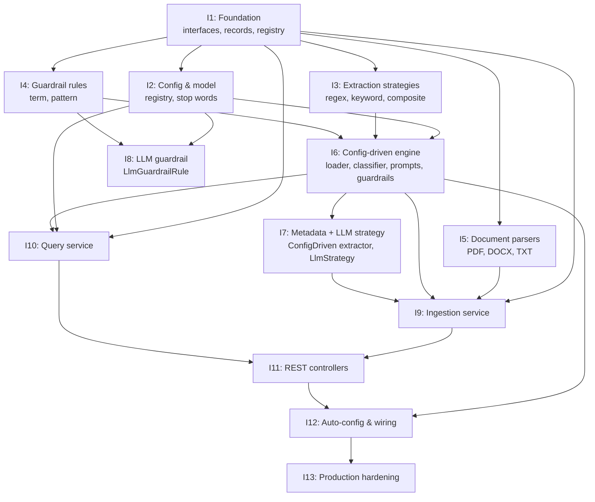

# Implementation Plan — Generic Multi-Domain RAG

> Parent: [technical-design.md](./technical-design.md) · Code reference: [framework-code.md](./framework-code.md)

This document breaks the proposed framework into **testable iterations** with **quality gates**. Each iteration produces a shippable slice that can be verified by tests and keeps the codebase in a working state.

---

## Table of Contents

1. [Quality Gates](#1-quality-gates)
2. [Iteration Dependencies](#2-iteration-dependencies)
3. [Iteration 1 — Foundation (interfaces, records, registry)](#3-iteration-1--foundation-interfaces-records-registry)
4. [Iteration 2 — Config & model registry](#4-iteration-2--config--model-registry)
5. [Iteration 3 — Extraction strategies (no LLM)](#5-iteration-3--extraction-strategies-no-llm)
6. [Iteration 4 — Guardrail rules (deterministic)](#6-iteration-4--guardrail-rules-deterministic)
7. [Iteration 5 — Document parsers](#7-iteration-5--document-parsers)
8. [Iteration 6 — Config-driven engine (YAML loader + classifier, prompts, guardrails)](#8-iteration-6--config-driven-engine-yaml-loader--classifier-prompts-guardrails)
9. [Iteration 7 — Config-driven metadata + LLM strategy](#9-iteration-7--config-driven-metadata--llm-strategy)
10. [Iteration 8 — LLM guardrail rule](#10-iteration-8--llm-guardrail-rule)
11. [Iteration 9 — Ingestion service](#11-iteration-9--ingestion-service)
12. [Iteration 10 — Query service](#12-iteration-10--query-service)
13. [Iteration 11 — REST controllers](#13-iteration-11--rest-controllers)
14. [Iteration 12 — Auto-configuration & wiring](#14-iteration-12--auto-configuration--wiring)
15. [Iteration 13 — Production hardening](#15-iteration-13--production-hardening)
16. [Optional iterations](#16-optional-iterations)

---

## 1. Quality Gates

These gates apply to **every iteration** before merge. They keep the codebase buildable, tested, and maintainable.

### 1.1 Build & test

| Gate | Requirement | How to verify |
|------|--------------|----------------|
| **Compile** | No compilation errors | `./gradlew compileJava compileTestJava` |
| **Unit tests** | All tests pass | `./gradlew test` |
| **No flaky tests** | Tests are deterministic; no external calls in unit tests | Review: no network, no real DB in unit tests |
| **Coverage (new code)** | ≥ 80% line coverage for code added in the iteration | `./gradlew test jacocoTestReport` (if JaCoCo applied); or team rule: new classes have tests |

### 1.2 Code quality

| Gate | Requirement | How to verify |
|------|--------------|----------------|
| **Lint / Checkstyle** | No new violations in changed files | `./gradlew checkstyleMain checkstyleTest` (if configured) or IDE lint |
| **Meaningful assertions** | Tests assert behavior, not only “no exception” | Review: every test has at least one assertion on outcome |
| **No PII in logs** | No names, emails, phones in log messages | Review + grep for sensitive patterns |
| **Specific exceptions** | Catch specific exception types; no empty catch blocks | Code review |

### 1.3 Definition of Done (per iteration)

- [ ] All deliverables for the iteration implemented and referenced in this plan
- [ ] Unit tests (and integration tests where specified) added and passing
- [ ] No hardcoded secrets or PII in new code
- [ ] Build green: `./gradlew clean build` (including tests; optional checkstyle)
- [ ] PR description links to this plan and lists the iteration number

### 1.4 Optional (recommended)

- **Integration tests** for critical paths (e.g. load YAML → classify, or ingest one file) using test profiles and in-memory or Testcontainers DB
- **JaCoCo** coverage report; fail build below 80% on new code
- **Conventional commits** for each commit (`feat:`, `fix:`, `test:`, `chore:`)

---

## 2. Iteration Dependencies

Iterations are ordered so that each builds on the previous. Parallel work is possible only where the diagram shows no dependency.

---

## 3. Iteration 1 — Foundation (interfaces, records, registry)

**Goal:** Define all domain abstractions and the registry. No YAML, no LLM, no I/O — pure interfaces and in-memory registry so later iterations can depend on them.

### 3.1 Deliverables (framework-code.md)

| # | Component | Reference |
|---|-----------|-----------|
| 1 | `RagDomain` | § 1.1 |
| 2 | `DomainModelConfig` | § 1.2 |
| 3 | `DocumentClassifier` | § 1.3 |
| 4 | `ExtractionStrategy` | § 1.4 |
| 5 | `MetadataExtractor` | § 1.5 |
| 6 | `MetadataExtractorRegistry` | § 1.6 |
| 7 | `GuardrailEvaluator`, `GuardrailDecision` | § 1.7 |
| 8 | `GuardrailRule` | § 1.8 |
| 9 | `PromptTemplateProvider` | § 1.9 |
| 10 | `DomainRegistry` | § 1.10 |

### 3.2 Acceptance criteria

- All interfaces and records compile.
- `DomainRegistry`: `register(domain)`, `get(id)` returns optional, `get(id)` for unknown returns empty.
- No external dependencies (no Spring, no LangChain4j) in this package if desired; otherwise minimal.

### 3.3 Tests to add

- `DomainRegistryTest`: register a stub `RagDomain`, get by id returns it; get unknown returns empty; get after register two, get first by id.
- `DomainModelConfigTest`: `resolveExtractionModel(fieldOverride)` returns field override when non-blank, else extraction model id.
- Optional: stub implementation of `RagDomain` (e.g. `StubRagDomain`) for use in later iterations.

### 3.4 Quality gates

- `./gradlew test` passes.
- New code in `feature/domain/` covered by tests (registry + record behavior).

---

## 4. Iteration 2 — Config & model registry

**Goal:** Load model definitions from `application.yml` and provide a `ModelRegistry` that resolves a model id to a `ChatModel`. Add general stop words (config or resource file).

### 4.1 Deliverables (framework-code.md)

| # | Component | Reference |
|---|-----------|-----------|
| 1 | `ModelDefinitionProperties` | § 2.1 |
| 2 | `ModelRegistry` | § 2.2 |
| 3 | `application.yml` — model config snippet | § 2.3 |
| 4 | `StopWordsConfig` (general stop words bean) | § 2.4 |

### 4.2 Acceptance criteria

- `ModelRegistry.resolve(modelId)` returns a `ChatModel` for a configured id; unknown id throws or returns optional (align with framework-code).
- General stop words load from `app.query.general-stop-words` (list) or `app.query.general-stop-words-file` (classpath file); fallback to default English set when both empty.
- Bean `Set<String> generalStopWords` available for injection.

### 4.3 Tests to add

- `ModelRegistryTest`: with `@TestConfiguration` and a test `application.yml` (or `@ConfigurationProperties` test), resolve known id returns non-null; resolve unknown behaves as designed.
- `StopWordsConfigTest`: with test profile YAML, verify loaded set contains expected words; with classpath file, verify file wins over list; with empty config, verify default set.
- Use mock or stub `ChatModel` where needed (e.g. LangChain4j test utilities or simple impl).

### 4.4 Quality gates

- All tests pass; no real API keys in tests.

---

## 5. Iteration 3 — Extraction strategies (no LLM)

**Goal:** Implement regex, keyword, and composite extraction strategies and the factory. Composite may chain regex + keyword only (LLM sub-strategy in Iteration 7).

### 5.1 Deliverables (framework-code.md)

| # | Component | Reference |
|---|-----------|-----------|
| 1 | `ExtractionStrategyFactory` | § 4.1 (regex, keyword, composite only) |
| 2 | `RegexExtractionStrategy` | § 4.2 |
| 3 | `KeywordExtractionStrategy` | § 4.4 |
| 4 | `CompositeExtractionStrategy` | § 4.5 (without LLM sub-call, or with mock) |

### 5.2 Acceptance criteria

- Factory creates strategy from a map/key (e.g. `extraction: regex`, `patterns: [...]`); regex returns first capture; keyword returns first matching category; composite tries strategies in order until one returns non-null.
- No real LLM calls; composite’s LLM step can be skipped or mocked.

### 5.3 Tests to add

- `RegexExtractionStrategyTest`: text containing a date pattern returns captured group; no match returns null; multiple patterns, first match wins.
- `KeywordExtractionStrategyTest`: text with keyword from category A returns A; multiple categories, first match wins; no keyword returns null.
- `CompositeExtractionStrategyTest`: first strategy returns value → that value; first null, second returns value → second’s value; all null → null.
- `ExtractionStrategyFactoryTest`: create regex/keyword/composite from config maps; unknown strategy type throws or returns empty optional.

### 5.4 Quality gates

- `./gradlew test`; no network; tests are deterministic.

---

## 6. Iteration 4 — Guardrail rules (deterministic)

**Goal:** Implement term-block and pattern-block guardrail rules and the guardrail rule factory. No LLM.

### 6.1 Deliverables (framework-code.md)

| # | Component | Reference |
|---|-----------|-----------|
| 1 | `GuardrailRuleFactory` | § 5.1 (term-block, pattern-block only) |
| 2 | `TermBlockGuardrailRule` | § 5.2 |
| 3 | `PatternBlockGuardrailRule` | § 5.3 |

### 6.2 Acceptance criteria

- Term-block: if query contains configured term (and optional intent), rule blocks with message.
- Pattern-block: if query matches configured regex, rule blocks.
- Factory builds rule from YAML-like map (`type`, `terms`, `pattern`, etc.).
- Evaluator (or single-rule evaluation) returns `GuardrailDecision` (blocked / passed).

### 6.3 Tests to add

- `TermBlockGuardrailRuleTest`: query containing term → blocked; query without term → passed; optional intent matching.
- `PatternBlockGuardrailRuleTest`: query matching pattern → blocked; no match → passed.
- `GuardrailRuleFactoryTest`: create term-block and pattern-block from config; unknown type throws or returns empty.

### 6.4 Quality gates

- All tests pass; no external calls.

---

## 7. Iteration 5 — Document parsers

**Goal:** Parse PDF, DOCX, and plain text into raw text. Registry selects parser by filename.

### 7.1 Deliverables (framework-code.md)

| # | Component | Reference |
|---|-----------|-----------|
| 1 | `DocumentParser` | § 6.1 |
| 2 | `DocumentParserRegistry` | § 6.2 |
| 3 | `PdfDocumentParser` | § 6.3 |
| 4 | `DocxDocumentParser` | § 6.4 |
| 5 | `PlainTextParser` | § 6.5 |

### 7.2 Acceptance criteria

- Registry tries parsers in order; first that `supports(filename)` wins; `parse(filename, bytes)` returns extracted text or throws.
- PDF: PDFBox-based extraction; DOCX: POI-based; TXT: UTF-8. Empty or unparseable can return null or throw as per design.

### 7.3 Tests to add

- `PdfDocumentParserTest`: parse a small test PDF from `src/test/resources`; expect non-empty text; unsupported extension returns false from `supports`.
- `DocxDocumentParserTest`: parse a small test DOCX; expect non-empty text.
- `PlainTextParserTest`: parse UTF-8 bytes; expect same string; supports `.txt`/`.md`.
- `DocumentParserRegistryTest`: register PDF, DOCX, TXT; for `file.pdf` get PDF parser and parse; for `file.xyz` no parser or fallback behavior.

### 7.4 Quality gates

- Tests use only test resources; no network; build passes with optional `poi-ooxml` and PDFBox.

---

## 8. Iteration 6 — Config-driven engine (YAML loader + classifier, prompts, guardrails)

**Goal:** Load domain YAML from a path, build a `ConfigDrivenRagDomain` with classifier, prompt provider, and guardrail evaluator. No metadata extraction yet (no LLM, no extractors).

### 8.1 Deliverables (framework-code.md)

| # | Component | Reference |
|---|-----------|-----------|
| 1 | `DomainDefinitionLoader` | § 3.1 (minimal: load YAML, build domain with classifier, prompts, guardrails) |
| 2 | `ConfigDrivenRagDomain` | § 3.2 (wired to classifier, guardrails, prompts; extractors can be empty or stub) |
| 3 | `ConfigDrivenDocumentClassifier` | § 3.3 |
| 4 | `ConfigDrivenGuardrailEvaluator` | § 3.6 |
| 5 | `ConfigDrivenPromptTemplateProvider` | § 3.7 |

### 8.2 Acceptance criteria

- Loader reads YAML from classpath or file path; builds at least one `RagDomain` with correct `domainId`, `supportedFileTypes`, `chunkSize`, `chunkOverlap`.
- Classifier: priority-ordered rules; filename + content keywords; first match wins; fallback rule.
- Guardrail evaluator: evaluates rules in order; first block wins.
- Prompt provider: returns query and fallback template from YAML.

### 8.3 Tests to add

- `DomainDefinitionLoaderTest`: load a minimal domain YAML (e.g. one doc_type, one classification rule, one guardrail, one prompt); assert domain id, classifier classifies a sample text to expected doc_type, guardrail blocks/permits sample queries, prompt provider returns expected template.
- `ConfigDrivenDocumentClassifierTest`: given a list of rules (e.g. from map), assert first matching rule’s doc_type returned; fallback when no rule matches.
- `ConfigDrivenGuardrailEvaluatorTest`: given list of term/pattern rules, assert blocked when query matches, passed when not.

### 8.4 Quality gates

- Tests use test YAMLs in `src/test/resources/domains/`; no production YAML paths; no real LLM.

---

## 9. Iteration 7 — Config-driven metadata + LLM strategy

**Goal:** Add metadata extraction to the config-driven engine: load field definitions from YAML, run regex/keyword/composite/LLM strategies. Wire `LlmExtractionStrategy` with a `ChatModel` (mock in tests).

### 9.1 Deliverables (framework-code.md)

| # | Component | Reference |
|---|-----------|-----------|
| 1 | `ConfigDrivenMetadataExtractorRegistry` | § 3.4 |
| 2 | `ConfigDrivenMetadataExtractor` | § 3.5 |
| 3 | `LlmExtractionStrategy` | § 4.3 |
| 4 | `ExtractionStrategyFactory` (full: include LLM) | § 4.1 |
| 5 | `ConfigDrivenRagDomain` (full: with extractors) | § 3.2 |

### 9.2 Acceptance criteria

- For a doc_type, extractor iterates fields; each field’s strategy (regex, llm, keyword, composite) is created by factory; LLM strategy uses `ModelRegistry` (or injected `ChatModel` in tests).
- Model resolution: field override → domain extraction model → default.
- Composite can include LLM as sub-step; factory passes model resolver where needed.

### 9.3 Tests to add

- `ConfigDrivenMetadataExtractorTest`: YAML with one regex field and one keyword field; extract returns map with correct values; missing optional field returns null or omitted.
- `LlmExtractionStrategyTest`: with mock `ChatModel` returning fixed string, extract returns that string; null/empty response handled.
- Integration-style test (optional): load full domain YAML with regex + keyword fields only, extract from sample text; no real LLM.

### 9.4 Quality gates

- LLM tests use only mocks or stubs; no real API keys; coverage for extractor and LLM strategy.

---

## 10. Iteration 8 — LLM guardrail rule

**Goal:** Add `LlmGuardrailRule` that uses a `ChatModel` to decide block/pass. Wire into factory and evaluator.

### 10.1 Deliverables (framework-code.md)

| # | Component | Reference |
|---|-----------|-----------|
| 1 | `LlmGuardrailRule` | § 5.4 |
| 2 | `GuardrailRuleFactory` (include `llm-block`) | § 5.1 |

### 10.2 Acceptance criteria

- Rule takes prompt template and optional model; calls `ChatModel`; parses response to blocked/passed and message.
- Factory creates `llm-block` rule from YAML (prompt, optional model id).

### 10.3 Tests to add

- `LlmGuardrailRuleTest`: mock `ChatModel` returns "BLOCK: reason" → decision blocked with message; returns "ALLOW" or similar → passed. Test timeout/error handling (e.g. treat as block or pass by policy).

### 10.4 Quality gates

- No real LLM in tests; mock only.

---

## 11. Iteration 9 — Ingestion service

**Goal:** Orchestrate the full ingestion flow: accept, parse, sanitize, classify, extract metadata, split, embed, store. Dependencies: `RagDomain`, parsers, embedding model, embedding store.

### 11.1 Deliverables (framework-code.md)

| # | Component | Reference |
|---|-----------|-----------|
| 1 | `DomainIngestionService` | § 7.1 |
| 2 | `DomainNotFoundException`, `UnsupportedFileTypeException` | § 7.2 |

### 11.2 Acceptance criteria

- Service receives `domainId`, `filename`, `bytes`; resolves domain from registry; validates file type; selects parser; parses and sanitizes; classifies; extracts metadata; splits with domain’s splitter; embeds; stores in embedding store. Per-file errors do not abort batch when multiple files.
- Sanitization: null bytes, Unicode NFC, whitespace (as in ingestion-pipeline.md).
- Re-ingestion: delete existing segments by source filename before storing new ones.

### 11.3 Tests to add

- `DomainIngestionServiceTest`: with mocked `DomainRegistry` (one domain), mocked parser (returns fixed text), mocked embedder and store; call ingest one file; verify store invoked with expected metadata (domain, doc_type, source), and segment count or store call count. Test unknown domain throws; unsupported file type throws.
- Optional: integration test with test profile, in-memory or Testcontainers PGVector, real parser and embedder (or stub embedder), one small PDF/DOCX.

### 11.4 Quality gates

- Unit tests use mocks only; no real DB or API in unit tests; build passes.

---

## 12. Iteration 10 — Query service

**Goal:** Orchestrate query flow: validate domain, run guardrails, extract terms, retrieve, hybrid score, deduplicate, generate answer with LLM, paginate, build explainability.

### 12.1 Deliverables (framework-code.md)

| # | Component | Reference |
|---|-----------|-----------|
| 1 | `DomainQueryService` | § 8.1 |

### 12.2 Acceptance criteria

- Input: domainId, question, optional filters (docTypes, maxResults, minScore, page, pageSize). Resolve domain; evaluate guardrails (block → return blocked result); extract terms (general + domain stop words); retrieve from store with domain filter; hybrid scoring; deduplicate by entity/source; generate answer via domain’s prompt template and query model; paginate; return answer + results + explainability.

### 12.3 Tests to add

- `DomainQueryServiceTest`: mocked registry (one domain with stub classifier, guardrails, prompt provider, model config), mocked retriever (returns fixed list of contents), mocked `ChatModel` (returns fixed answer); call query; assert answer text, that guardrail was called, that retriever was called with domain filter. Test guardrail blocked → result is blocked. Test term extraction uses domain + general stop words when both provided.

### 12.4 Quality gates

- All external collaborators mocked; no real embedding store or LLM in unit tests.

---

## 13. Iteration 11 — REST controllers

**Goal:** Expose ingest, query, and admin endpoints; delegate to services; return DTOs and appropriate status codes.

### 13.1 Deliverables (framework-code.md)

| # | Component | Reference |
|---|-----------|-----------|
| 1 | `DomainIngestController` | § 9.1 |
| 2 | `DomainQueryController` | § 9.2 |
| 3 | `DomainAdminController` | § 9.3 |

### 13.2 Acceptance criteria

- Ingest: POST multipart file(s), return 200 with summary or 404/422 for unknown domain / unsupported type.
- Query: POST JSON body (question, optional params), return 200 with answer + results or 404 for unknown domain; guardrail blocked → 200 with blocked payload or 403 as designed.
- Admin: GET domains, GET doc-types for domain, POST reload (optional); appropriate auth/roles as per design.

### 13.3 Tests to add

- `DomainIngestControllerTest`: MockMvc; multipart upload; mock service; expect 200 and response body fields; expect 404 when domain missing.
- `DomainQueryControllerTest`: MockMvc; POST query body; mock service; expect 200 and answer in body; expect 404 for unknown domain; test validation (e.g. blank question → 400 if validated).
- `DomainAdminControllerTest`: GET domains returns list; GET doc-types for domain returns list; reload (if implemented) returns expected status.

### 13.4 Quality gates

- Controller tests are slice tests or full integration with mocked services; no real DB/LLM in controller tests unless explicitly integration.

---

## 14. Iteration 12 — Auto-configuration & wiring

**Goal:** Wire all beans so the application starts with domain YAMLs loaded, registry populated, and ingest/query/admin endpoints available.

### 14.1 Deliverables (framework-code.md)

| # | Component | Reference |
|---|-----------|-----------|
| 1 | `DomainAutoConfiguration` | § 10.1 |
| 2 | `application.yml` (domains path, models, optional stop words) | § 2.3, § 2.4 |
| 3 | At least one minimal domain YAML (e.g. `domains/minimal.yml`) | New or from examples |

### 14.2 Acceptance criteria

- On startup, loader reads from `app.domains.definitions-path`; registry contains all enabled domains.
- Ingest and query endpoints work end-to-end with a test domain (e.g. upload one file, then query).
- Health or info endpoint (optional) reports loaded domains.

### 14.3 Tests to add

- `DomainAutoConfigurationTest`: `@SpringBootTest` with test profile; assert bean `DomainRegistry` exists and has at least one domain from test YAML.
- Optional: one end-to-end test (test profile, in-memory or test DB): start app, POST ingest one file, POST query, assert non-empty answer or result list.

### 14.4 Quality gates

- `./gradlew bootRun` (or run with test profile) starts without error; `./gradlew test` passes.

---

## 15. Iteration 13 — Production hardening

**Goal:** Global exception handling, request validation, virtual threads, and actuator health so the app is production-ready.

### 15.1 Deliverables (framework-code.md)

| # | Component | Reference |
|---|-----------|-----------|
| 1 | Global exception handler (`@RestControllerAdvice`) | § 13 |
| 2 | Request/response DTOs with Jakarta Validation | § 14.1–14.4 |
| 3 | Virtual thread configuration | § 15 |
| 4 | Actuator health indicator (domains) | § 16 |
| 5 | `build.gradle` (validation, actuator, dependencies) | § 17 |

### 15.2 Acceptance criteria

- Unknown domain, validation errors, and server errors return RFC 9457 ProblemDetail or consistent JSON; no stack traces in body.
- Query request: `@Valid`; blank question or invalid range → 400 with clear message.
- Virtual threads: executor and Tomcat (or server) configured for virtual threads as in design.
- Actuator health (or custom health) exposes status and list of loaded domains (or count).

### 15.3 Tests to add

- `GlobalExceptionHandlerTest`: trigger DomainNotFoundException, validation exception, generic exception; assert status code and body structure (type, title, detail).
- `QueryRequestValidationTest`: invalid request (blank question, negative page) returns 400 when validated.
- Health indicator test: with mock registry, indicator returns expected status and details.

### 15.4 Quality gates

- All tests pass; security rules respected (no PII in error bodies); build includes checkstyle if required.

---

## 16. Optional iterations

These can be scheduled after the core 13 iterations.

| Iteration | Goal | Framework reference | Tests |
|-----------|------|---------------------|--------|
| **Optional A** | Handcoded domain override | § 11 — `RecruitingDomainOverride` | Unit test override; registry returns override when present. |
| **Optional B** | Feedback API (HITL) | [technical-design.md § 19](./technical-design.md#19-human-in-the-loop-and-feedback) | Controller tests for POST feedback/query and feedback/ingestion; service/repository tests. |
| **Optional C** | Hot-reload domains | Admin reload endpoint | Test: load second YAML or change, call reload, assert registry updated. |
| **Optional D** | SSE ingest progress | Ingest stream endpoint | Test: MockMvc SSE client or similar; expect events. |

---

## Summary

| Iteration | Focus | Main test type |
|-----------|--------|----------------|
| 1 | Interfaces, registry | Unit |
| 2 | Model registry, stop words | Unit + config |
| 3 | Regex, keyword, composite strategies | Unit |
| 4 | Term/pattern guardrails | Unit |
| 5 | PDF, DOCX, TXT parsers | Unit + test resources |
| 6 | YAML loader, classifier, prompts, guardrails | Unit + integration (YAML) |
| 7 | Metadata extractor, LLM strategy | Unit (mock LLM) |
| 8 | LLM guardrail rule | Unit (mock LLM) |
| 9 | Ingestion service | Unit (mocks); optional integration |
| 10 | Query service | Unit (mocks) |
| 11 | REST controllers | Slice / MockMvc |
| 12 | Auto-config, wiring | SpringBootTest |
| 13 | Exception handling, validation, health | Unit + controller |
| Optional | Override, feedback, reload, SSE | Per feature |

Quality gates (build, tests, coverage, lint, no PII, meaningful assertions) apply to every iteration. Each iteration links to [framework-code.md](./framework-code.md) for the exact code to implement.
