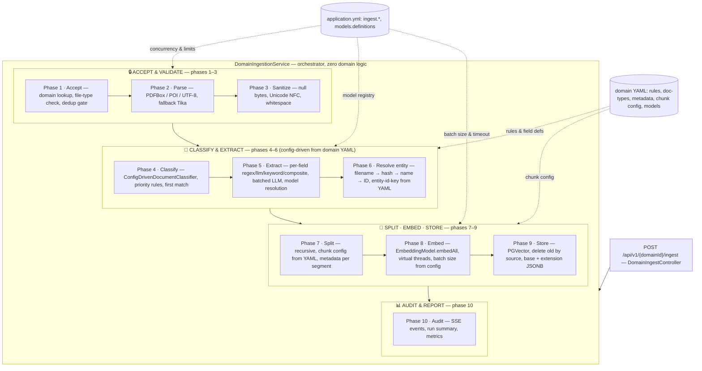
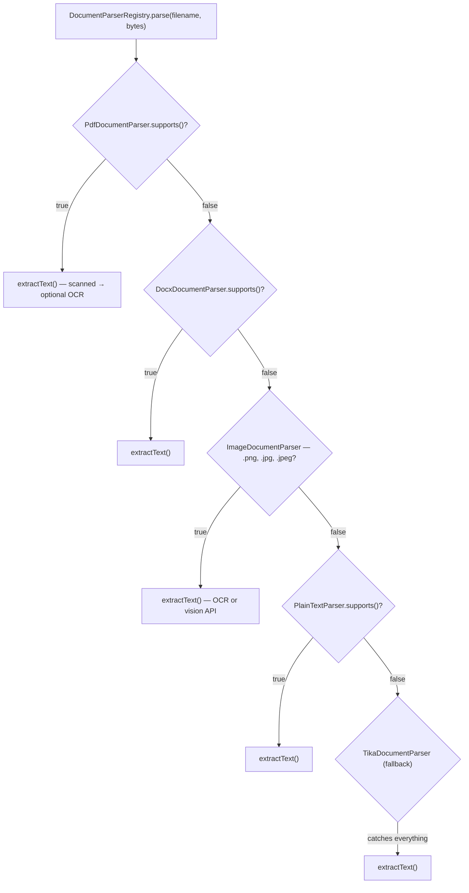
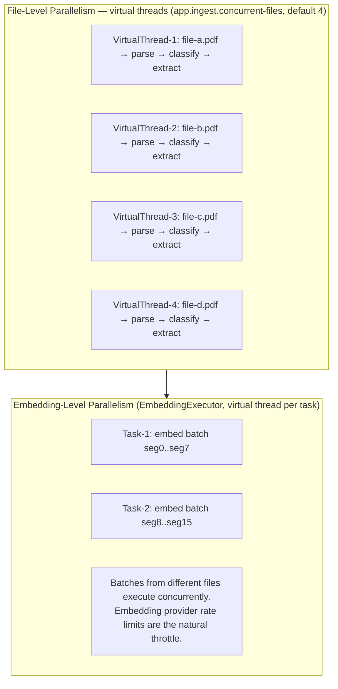

# Ingestion Pipeline — Detailed Design

> Parent: [technical-design.md](./technical-design.md) · Related: [extraction-strategies.md](./extraction-strategies.md), [domain-configuration-guide.md](./domain-configuration-guide.md)

---

## 1. Pipeline Overview

The ingestion pipeline transforms raw documents (PDF, DOC, DOCX, TXT) into embedded text segments
stored in PGVector, enriched with domain-specific and doc_type-specific metadata. The platform supports **English and Spanish** (and multilingual embeddings); query-side language handling (stop words, answer language) is in [query-pipeline.md](./query-pipeline.md) and [technical-design.md § 22](./technical-design.md#22-supported-languages-english-and-spanish).



### Class responsibility map

| Area | Primary class | Role |
|---|---|---|
| Entry point | `DomainIngestController` | REST endpoint — accepts file(s), delegates to service |
| Orchestration | `DomainIngestionService` | Drives all 10 phases; contains no domain logic |
| Domain lookup | `DomainRegistry` | Maps `domainId` → `ConfigDrivenRagDomain` |
| File parsing | `DocumentParserRegistry` | Tries registered `DocumentParser` impls in order |
| Classification | `ConfigDrivenDocumentClassifier` | Evaluates `classification-rules` from YAML |
| Metadata extraction | `ConfigDrivenMetadataExtractor` | Iterates `metadata[]` fields, delegates to strategies |
| Strategy dispatch | `ExtractionStrategyFactory` | Creates `regex` / `llm` / `keyword` / `composite` strategy instances |
| Model resolution | `ModelRegistry` | Resolves model alias → `ChatModel` (field → domain → default) |
| Splitting | LangChain4j `DocumentSplitters` | Recursive text splitting with configurable size / overlap |
| Embedding | LangChain4j `EmbeddingModel` | Converts text segments to vector embeddings |
| Storage | LangChain4j `EmbeddingStoreIngestor` + PGVector | Persists vectors + metadata as JSONB |
| Audit | `IngestAuditService` | Records run summary and per-file events |

### Concurrency: virtual threads

**Ingestion must be executed on virtual threads.** Batch and folder ingest run each file on a dedicated virtual thread (e.g. via `Executors.newVirtualThreadPerTaskExecutor()`), so many files can be processed in parallel without blocking platform threads. Embedding batches can also run on virtual threads. This is configurable via `app.ingest.virtual-threads-enabled` (default `true`). See [§ 10 Phase 8 — Embed](#10-phase-8--embed) for the concurrency model and [implementation-plan.md Iteration 9](./implementation-plan.md#11-iteration-9--ingestion-service).

---

## 2. Entry Points

Three ways to trigger ingestion, all converging into the same pipeline:

### 2.1 Single File Upload

```text
POST /api/v1/{domainId}/ingest
Content-Type: multipart/form-data

file: resume-maria-lopez.pdf
```

The controller extracts filename and bytes, delegates to `DomainIngestionService.ingest(domainId, filename, bytes)`.

### 2.2 Batch Upload (multiple files)

```text
POST /api/v1/{domainId}/ingest
Content-Type: multipart/form-data

files[]: resume-maria-lopez.pdf
files[]: cert-aws-saa.pdf
files[]: contract-nda-acme.pdf
```

Each file enters the pipeline independently. Failures are isolated per file —
one bad PDF does not abort the batch.

### 2.3 Folder Ingestion

```text
POST /api/v1/{domainId}/ingest/folder
```

Reads all files from the domain's `documents-path` (configured in YAML).
Files are processed in parallel using virtual threads.

### 2.4 SSE Progress Streaming

```text
POST /api/v1/{domainId}/ingest/stream
Content-Type: multipart/form-data
Accept: text/event-stream
```

Same as batch upload, but returns Server-Sent Events as each file completes:

```text
event: file-ingested
data: {"filename":"resume-maria-lopez.pdf","docType":"resume","fieldsExtracted":12}

event: file-skipped
data: {"filename":"broken.pdf","reason":"PDF parse failed"}

event: done
data: {"processed":8,"skipped":2,"elapsed_ms":4320}
```

---

## 3. Phase 1 — Accept & Validate

```text
Input:  domainId, filename, bytes
Output: validated input or rejection
```

### Steps

| # | Step | Detail |
|---|---|---|
| 1.1 | Resolve domain | `DomainRegistry.get(domainId)` — 404 if unknown or disabled |
| 1.2 | Validate file type | Check `filename` extension against `domain.supported-file-types` from YAML |
| 1.3 | Validate file size | Reject files exceeding `spring.servlet.multipart.max-file-size` (default 100MB) |
| 1.4 | Validate non-empty | Reject zero-byte files |
| 1.5 | Normalize filename | Strip path separators, handle duplicates in batch (append `-2`, `-3`, etc.) |

### Error handling

| Condition | Response |
|---|---|
| Unknown domain | `404 Not Found` — domain not registered |
| Unsupported file type | `422 Unprocessable Entity` — "Only .pdf, .doc, .docx files accepted for domain 'legal'" |
| File too large | `413 Payload Too Large` |
| Empty file | Skip with audit event `"skipped"`, reason `"Empty file"` |

---

## 4. Phase 2 — Parse

```text
Input:  filename, bytes
Output: raw text string (or null if unparseable)
```

### Steps

| # | Step | Detail |
|---|---|---|
| 2.1 | Select parser | `DocumentParserRegistry` iterates registered parsers; first that `supports(filename)` wins |
| 2.2 | Extract text | Call `parser.extractText(bytes)` |
| 2.3 | Handle failure | If null returned → skip file with reason `"Parse failed"` |

### Parser selection order



Parsers are tried in registration order. If a specific parser is registered (PDF, DOCX, image, plain),
it takes precedence over the Tika catch-all. Image parser is optional (e.g. for certificates as images).

### Parser internals

**PdfDocumentParser:**
- Uses Apache PDFBox 3.x `Loader.loadPDF(bytes)` + `PDFTextStripper.getText(doc)`
- Handles encrypted PDFs: if password-protected, skip with reason `"Password-protected PDF"`
- **Scanned PDFs:** if text is empty (or below a length threshold) after extraction, optionally run **OCR** (e.g. Tesseract): render each page to image via `PDFRenderer`, run OCR per page, concatenate text. Controlled by `app.ingest.ocr.enabled` (default false). See [technical-design.md § 20](./technical-design.md#20-ocr-and-image-document-support).
- **Embedded images in PDF:** by default text-only extraction does not read text inside embedded images. Optional: extract embedded images, run OCR or a vision API on each, append to document text (configurable).

**DocxDocumentParser:**
- Uses Apache POI `XWPFDocument` + `XWPFWordExtractor.getText()`
- Extracts text from body paragraphs, tables, headers, footers
- Ignores embedded images and charts (text only)

**Legacy .doc (Word 97–2003):** Resumes and other documents are often submitted in `.doc` format. Support can be provided by (1) a dedicated **DocDocumentParser** (e.g. Apache POI `HWPFDocument`) registered before Tika, or (2) the **Tika fallback** parser, which handles `.doc` among other formats. Domains that accept resumes should include `".doc"` in `supported-file-types` (e.g. `[".pdf", ".doc", ".docx"]`).

**PlainTextParser:**
- Reads bytes as UTF-8 (with fallback charset detection via BOM)
- Supports `.txt`, `.md`, `.csv`

**ImageDocumentParser (optional):**
- Supports standalone image files: `.png`, `.jpg`, `.jpeg` (e.g. **certificates shared as images**).
- `extractText(bytes)`: run OCR (Tesseract) or a vision-capable LLM on the image and return the extracted/described text.
- Domains that accept certificates as images add these extensions to `supported-file-types` in YAML. Same downstream pipeline (classify → extract metadata → split → embed → store). See [technical-design.md § 20](./technical-design.md#20-ocr-and-image-document-support).

---

## 5. Phase 3 — Sanitize

```text
Input:  raw text from parser
Output: clean text safe for storage and embedding
```

### Steps

| # | Step | Detail |
|---|---|---|
| 3.1 | Remove null bytes | `text.replace("\u0000", "")` — PostgreSQL rejects null bytes in text columns |
| 3.2 | Normalize Unicode | NFC normalization — ensures consistent character representation |
| 3.3 | Collapse whitespace | Replace runs of whitespace with single space; trim leading/trailing |
| 3.4 | Remove control chars | Strip ASCII control characters 0x01–0x08, 0x0B, 0x0C, 0x0E–0x1F |
| 3.5 | Validate non-empty | If text is blank after sanitization → skip with reason `"No extractable text"` |

---

## 6. Phase 4 — Classify

```text
Input:  filename, sanitized text, classification-rules from YAML
Output: doc_type string (e.g. "resume", "contract", "opinion")
```

### Steps

| # | Step | Detail |
|---|---|---|
| 4.1 | Load rules | Read `classification-rules` from domain YAML |
| 4.2 | Sort by priority | Descending — highest priority rules evaluated first |
| 4.3 | Evaluate filename | Check if filename matches any `filename-patterns` (glob matching, case-insensitive) |
| 4.4 | Count keyword hits | Scan text (lowercased) for each `content-keyword`; count distinct matches |
| 4.5 | Apply threshold | Rule matches if: filename matched AND keyword hits >= `min-keyword-hits` |
| 4.6 | First match wins | Return the `doc-type` of the first matching rule |
| 4.7 | Fallback | If no rule matches, use the rule with `priority: 1` and `min-keyword-hits: 0` (the fallback) |
| 4.8 | **Optional LLM fallback** | If the matching rule is the **fallback rule** and **LLM classification fallback is enabled** (`app.ingest.classification.llm-fallback-enabled` or domain `classification.llm-fallback-enabled`), call the LLM with document excerpt and list of valid doc_types; use returned doc_type (or keep fallback doc_type on failure). When the flag is off (default), skip this step. See [technical-design.md § 9.1](./technical-design.md#91-optional-llm-based-classification-fallback). |

### Classification decision flow

```text
File: "aws-cert-solutions-architect.pdf"
Text: "...AWS Certified Solutions Architect...credential id ABC123...expires 2027..."

Rule evaluation (sorted by priority DESC):
  ┌─────────────────────────┬──────────┬──────────────────────────────────┬────────┐
  │ Rule                    │ Priority │ Evaluation                       │ Result │
  ├─────────────────────────┼──────────┼──────────────────────────────────┼────────┤
  │ doc-type: certification │ 30       │ filename matches "*cert*" ✓      │        │
  │                         │          │ keywords: "certified" ✓          │        │
  │                         │          │          "credential id" ✓       │        │
  │                         │          │          "expiration" ✓          │        │
  │                         │          │ hits: 3 >= min: 2 ✓             │ MATCH  │
  ├─────────────────────────┼──────────┼──────────────────────────────────┼────────┤
  │ (remaining rules)       │ < 30     │ (not evaluated — first match)   │ SKIP   │
  └─────────────────────────┴──────────┴──────────────────────────────────┴────────┘

Result: doc_type = "certification"
```

---

## 7. Phase 5 — Extract Metadata

```text
Input:  filename, sanitized text, doc_type, metadata field definitions from YAML
Output: Map<String, String> of extracted metadata
```

This is the most complex phase. Each metadata field is extracted independently
using the strategy declared in YAML.

### Steps

| # | Step | Detail |
|---|---|---|
| 5.1 | Resolve doc_type def | Look up `doc-types.<doc_type>` from YAML |
| 5.2 | Iterate fields | For each field in `metadata[]`: |
| 5.3 | Resolve strategy | `ExtractionStrategyFactory.create(field.extraction, field.config)` |
| 5.4 | Execute strategy | `strategy.extract(text, config)` → returns extracted value or null |
| 5.5 | Type coercion | Convert string result to declared `type` (integer, float, boolean) |
| 5.6 | Truncate | Limit value to 512 characters (PGVector metadata value limit) |
| 5.7 | Skip nulls | If extraction returns null, omit the field from metadata |

### Strategy execution detail

See [extraction-strategies.md](./extraction-strategies.md) for full detail on each strategy.

**Regex strategy flow:**

```text
Field: cert_issue_date, extraction: regex
Patterns: ["(?:issued|awarded)[:\\s]*(\\d{4}-\\d{2}-\\d{2})", ...]

  Pattern 1 → try match → "issued: 2024-03-15" → capture group 1 = "2024-03-15" ✓ → return
  Pattern 2 → (not tried, pattern 1 matched)
```

**LLM strategy flow:**

```text
Field: candidate_name, extraction: llm, model: (inherited from domain → "gpt-4o-mini")
Prompt: "Extract the full name of the candidate. Return only the name."

  Resolve model: field.model=null → domain.models.extraction="gpt-4o-mini"
  Build LLM input:
    System: <field prompt>
    User: <first 8000 chars of document text>

  Call ChatModel["gpt-4o-mini"].chat(input) → "Maria Lopez" → return

Field: holding_summary, extraction: llm, model: "deepseek-r1" (field override)
Prompt: "Summarize the court's holding in one sentence."

  Resolve model: field.model="deepseek-r1" → use override
  Call ChatModel["deepseek-r1"].chat(input) → "The court granted..." → return
```

**Keyword strategy flow:**

```text
Field: employment_status, extraction: keyword
Keywords:
  open_to_work: ["open to", "seeking", "looking for"]
  employed: ["currently at", "present", "current role"]

  Scan text (lowercased) for each category:
    "open to" found? → no
    "seeking" found? → yes → return "open_to_work"
```

**Composite strategy flow:**

```text
Field: candidate_location, extraction: composite
Strategies:
  1. regex: ["(?:based in)\\s+([A-Z][a-zA-Z\\s,.-]+)"]
  2. llm: "Extract the candidate's city and state."

  Strategy 1 (regex) → try match → "based in Denver, CO" → "Denver, CO" ✓ → return
  Strategy 2 (llm)   → (not tried, strategy 1 succeeded)
```

### LLM call optimization

LLM calls are expensive. The engine optimizes by:

| Optimization | Detail |
|---|---|
| Text truncation | Only the first N characters are sent to the LLM (`app.ingest.llm-enrichment.max-chars`, default 8000) |
| Field batching | When multiple fields use `llm` extraction, the engine can batch them into a single LLM call with a combined prompt |
| Regex-first in composite | Composite strategies try cheap strategies (regex, keyword) before expensive ones (LLM) |
| Caching within document | If two fields need the same LLM analysis, the result is cached per document |
| Skip on parse failure | If the document text is too short (< 50 chars), skip LLM extraction entirely |

### Field batching example

Instead of 5 separate LLM calls for a resume:

```text
Without batching:
  LLM call 1: "Extract candidate name"         → "Maria Lopez"
  LLM call 2: "Extract top skills"             → "Java, Spring Boot, ..."
  LLM call 3: "Extract years of experience"    → "7"
  LLM call 4: "Extract top role"               → "Backend Engineer"
  LLM call 5: "Extract languages spoken"       → "English, Spanish"

With batching (single call):
  Prompt: "Extract the following from this resume, return JSON:
    1. candidate_name: full name
    2. candidate_top_skills: top 8 technical skills, comma-separated
    3. candidate_years_experience: total years (number only)
    4. candidate_top_role: single best-fit job title
    5. languages_spoken: human languages, comma-separated"

  Response: {
    "candidate_name": "Maria Lopez",
    "candidate_top_skills": "Java, Spring Boot, PostgreSQL, Kafka, ...",
    "candidate_years_experience": "7",
    "candidate_top_role": "Backend Engineer",
    "languages_spoken": "English, Spanish"
  }
```

The engine auto-detects when multiple fields in a doc_type use `llm` extraction
and groups them into a single structured prompt. Individual `prompt` values from YAML
become the field descriptions in the batch.

---

## 8. Phase 6 — Resolve Entity

```text
Input:  filename, extracted metadata, domain's entity-id-key from YAML
Output: entity_id value for the shared base metadata
```

### Steps

| # | Step | Detail |
|---|---|---|
| 6.1 | Check entity key | Read `entity-id-key` from domain YAML (e.g. `candidate_id`, `matter_id`) |
| 6.2 | Lookup existing | Check if an entity already exists for this source filename |
| 6.3 | Create or merge | If new → generate entity ID. If existing → merge metadata (e.g. candidate profile update) |
| 6.4 | Cross-doc linking | If a certification and a resume share the same `candidate_name` → link to same entity |

### Entity resolution strategies

| Strategy | When used | How it works |
|---|---|---|
| Filename match | Always tried first | Same filename → same entity (re-ingestion) |
| Content hash match | Deduplication | Same text content → same entity (duplicate file) |
| Name matching | When entity has a name field | Fuzzy name match across documents within the same domain |
| Explicit ID | When document contains an entity reference | Extracted metadata contains an ID that maps to an existing entity |

---

## 9. Phase 7 — Split

```text
Input:  sanitized text, chunk-size and chunk-overlap from YAML
Output: List<TextSegment> with metadata attached to each segment
```

### Steps

| # | Step | Detail |
|---|---|---|
| 7.1 | Read chunk config | `chunk-size` and `chunk-overlap` from domain YAML |
| 7.2 | Create splitter | `DocumentSplitters.recursive(chunkSize, chunkOverlap)` |
| 7.3 | Split text | Produces ordered list of text segments |
| 7.4 | Attach metadata | Each segment receives the full metadata map (base + extension) |
| 7.5 | Add segment index | `segment_index: 0, 1, 2, ...` for ordering within a document |

### Splitting behavior by domain

| Domain | chunk-size | chunk-overlap | Rationale |
|---|---|---|---|
| Recruiting | 500 | 100 | Resumes are short and dense; small chunks give precise skill matching |
| Legal | 1000 | 200 | Legal clauses are long; larger chunks preserve cross-references |
| Medical | 800 | 150 | Clinical notes have moderate density |

### How recursive splitting works

```text
Document text (3200 tokens):
┌─────────────────────────────────────────────────────────────────────┐
│ Education section ... Skills section ... Experience at Company A    │
│ ... Experience at Company B ... Certifications ... Projects ...     │
└─────────────────────────────────────────────────────────────────────┘

With chunk-size=500, chunk-overlap=100:

Segment 0: tokens   0–499  (Education + start of Skills)
Segment 1: tokens 400–899  (overlap: 400–499 repeated | Skills + start of Experience A)
Segment 2: tokens 800–1299 (overlap: 800–899 repeated | Experience A continued)
Segment 3: tokens 1200–1699 (overlap: 1200–1299 | Experience A + start of B)
Segment 4: tokens 1600–2099 (overlap: 1600–1699 | Experience B)
Segment 5: tokens 2000–2499 (overlap: 2000–2099 | Certifications)
Segment 6: tokens 2400–2899 (overlap: 2400–2499 | Certifications + Projects)
Segment 7: tokens 2800–3199 (overlap: 2800–2899 | Projects to end)

Each segment carries the FULL metadata:
  domain=recruiting, doc_type=resume, source=resume-maria.pdf,
  candidate_name=Maria Lopez, candidate_top_skills=Java..., segment_index=0
```

The overlap ensures that sentences spanning a chunk boundary are captured
in at least one segment, preventing loss of context at boundaries.

---

## 10. Phase 8 — Embed

```text
Input:  List<TextSegment>
Output: List<Embedding> (vector representations)
```

### Steps

| # | Step | Detail |
|---|---|---|
| 8.1 | Batch segments | Group segments into batches of `max-segments-per-batch` (default 8) |
| 8.2 | Call embedding model | `EmbeddingModel.embedAll(batch)` → list of vector embeddings |
| 8.3 | Timeout handling | Each batch has a timeout (`file-timeout-seconds`, default 60s) |
| 8.4 | Retry on transient failure | Retry once on timeout or 5xx from embedding provider |
| 8.5 | Cancel on hard failure | If embedding model returns 4xx → cancel, skip file |

### Concurrency model (virtual threads)

Ingestion is executed on **virtual threads**: each file in a batch or folder run is processed on its own virtual thread, and embedding tasks use virtual threads as well. The executor is typically `Executors.newVirtualThreadPerTaskExecutor()` when `app.ingest.virtual-threads-enabled` is true (default).



---

## 11. Phase 9 — Store

```text
Input:  List<Embedding> + List<TextSegment> (with metadata)
Output: rows in document_embeddings table
```

### Steps

| # | Step | Detail |
|---|---|---|
| 9.1 | Remove old segments | Delete existing segments for this `source` filename: `embeddingStore.removeAll(metadataKey("source").isEqualTo(filename))` |
| 9.2 | Assemble metadata | Merge base metadata + extension metadata into a single `Metadata` object |
| 9.3 | Store | `EmbeddingStoreIngestor.ingest(document)` — handles split + embed + store in one call |

### Metadata assembly

```text
Base metadata (engine-provided):
  domain         = "recruiting"
  doc_type       = "certification"
  source         = "aws-cert-solutions-architect.pdf"
  content_hash   = "a3f8c9..."
  ingested_at    = "2026-03-11T14:30:00Z"
  language       = "en"
  entity_id      = "c-a1b2c3d4"
  segment_index  = 0

Extension metadata (extracted per YAML):
  cert_name            = "AWS Solutions Architect Associate"
  cert_issuer          = "Amazon Web Services"
  cert_issue_date      = "2024-03-15"
  cert_expiration_date = "2027-03-15"
  cert_credential_id   = "ABC123XYZ"
  cert_status          = "active"

Stored as JSONB:
  {
    "domain": "recruiting",
    "doc_type": "certification",
    "source": "aws-cert-solutions-architect.pdf",
    "content_hash": "a3f8c9...",
    "ingested_at": "2026-03-11T14:30:00Z",
    "language": "en",
    "entity_id": "c-a1b2c3d4",
    "segment_index": 0,
    "cert_name": "AWS Solutions Architect Associate",
    "cert_issuer": "Amazon Web Services",
    "cert_issue_date": "2024-03-15",
    "cert_expiration_date": "2027-03-15",
    "cert_credential_id": "ABC123XYZ",
    "cert_status": "active"
  }
```

---

## 12. Phase 10 — Audit & Report

```text
Input:  per-file result (ingested | skipped | failed)
Output: audit trail + SSE progress events + metrics
```

### Steps

| # | Step | Detail |
|---|---|---|
| 10.1 | Record file event | `IngestAuditService.addFileEvent(filename, status, reason)` |
| 10.2 | Write ledger entry | If ledger enabled: `IngestionLedgerService.record(domainId, source, status, reason, docType, suggestedDocType, nextSteps)` — see § 17 |
| 10.3 | Emit SSE event | `IngestProgressEvent.fileIngested(filename)` or `fileSkipped(filename, reason)` |
| 10.4 | Update metrics | `ObservabilityService.recordIngestRun(processed, skipped)` |
| 10.5 | Save run summary | `IngestAuditService.saveRun(runHandle, processed, skipped)` |

### Audit record structure

```text
IngestRunAudit:
  run_id:       "run-2026-03-11-143000-abc123"
  domain_id:    "recruiting"
  started_at:   "2026-03-11T14:30:00Z"
  completed_at: "2026-03-11T14:30:04Z"
  total_files:  10
  processed:    8
  skipped:      2
  file_events:
    - filename: "resume-maria.pdf", status: "ingested", doc_type: "resume", fields_extracted: 12
    - filename: "cert-aws.pdf", status: "ingested", doc_type: "certification", fields_extracted: 6
    - filename: "broken.pdf", status: "skipped", reason: "PDF parse failed"
    - filename: "photo.jpg", status: "skipped", reason: "Unsupported file type"
    ...
```

---

## 13. Deduplication

### Content-level deduplication

Two files with identical text content (different filenames) are detected via `content_hash`:

```text
File A: "resume-maria-v1.pdf"  →  SHA-256: "a3f8c9..."
File B: "maria-lopez-cv.pdf"   →  SHA-256: "a3f8c9..."  (same content)

Phase 6 detects the hash match → File B is linked to the same entity as File A.
File B's segments are NOT re-embedded (skip with reason: "Duplicate content").
```

### Concurrent deduplication gates

When ingesting in parallel, two threads might process files with the same content hash
simultaneously. A `ConcurrentHashMap<String, CompletableFuture<Void>>` acts as a gate:

```text
Thread-1: file-a.pdf, hash="a3f8c9"
  → putIfAbsent(hash, new gate) → wins → proceeds with ingestion
  → on completion: gate.complete(null)

Thread-2: file-b.pdf, hash="a3f8c9"
  → putIfAbsent(hash, new gate) → loses (gate exists)
  → waits on existing gate (with timeout)
  → gate completes → checks if entity exists → skips as duplicate
```

### Re-ingestion (same filename, updated content)

```text
File: "resume-maria.pdf" (updated version)
  1. Old segments for source="resume-maria.pdf" are DELETED
  2. New text is parsed, classified, extracted
  3. New segments are embedded and stored
  4. Entity metadata is updated (merged, not replaced)
  5. Entity version history is preserved
```

### Running ingestion multiple times (tracking and hash-based skip)

When you **run the process several times** (e.g. folder ingest on a schedule), you need to **track what was ingested** and **avoid re-processing unchanged files** to save resources (no redundant embedding or store calls).

- **Track what was ingested:** Persist per `(domain_id, source)` at least: `source`, `status`, **content_hash**, and optionally timestamp. The [ingestion ledger](./technical-design.md#23-ingestion-ledger-and-classification-help-flow) (optional iteration E) provides this; the service can also store `content_hash` in segment metadata or a dedicated table.
- **Compare by hash:** After parse and sanitize, compute **content_hash** (SHA-256 of normalized text). Look up the hash previously stored for this `(domain_id, source)`.
  - **Same hash** → file unchanged; **skip** extract, split, embed, store; record skip (e.g. `skipped — Unchanged (same content hash)`).
  - **No stored hash or different hash** → new or updated file; run the full pipeline (classify → extract → split → embed → store) and persist the new hash.
- **Re-ingest updated files:** Same source with a **different** hash is treated as an update: delete existing segments for that source, then run the full pipeline (see Re-ingestion above).

See [implementation-plan.md § 11.2.1](./implementation-plan.md#1121-running-ingestion-multiple-times-tracking--hash-based-skip) for acceptance criteria and flow.

---

## 14. Error Handling Strategy

### Per-file isolation

Every file is processed independently. A failure in one file does not affect others:

```text
Batch: [file-a.pdf, file-b.pdf, file-c.pdf]

  file-a.pdf → ingested ✓
  file-b.pdf → PDF parse failed → skipped (logged, audit recorded, SSE emitted)
  file-c.pdf → ingested ✓

Result: processed=2, skipped=1
```

### Error classification

| Error Type | Phase | Handling | Retry? |
|---|---|---|---|
| Unsupported file type | Accept | Skip with reason | No |
| Empty file | Accept | Skip with reason | No |
| PDF parse failure | Parse | Skip with reason | No |
| Password-protected PDF | Parse | Skip with reason | No |
| No extractable text | Sanitize | Skip with reason | No |
| LLM extraction timeout | Extract | Use partial metadata; log warning | Yes (once) |
| LLM extraction error | Extract | Skip that field; continue with others | No |
| Embedding timeout | Embed | Skip file with reason | Yes (once) |
| Embedding 4xx error | Embed | Skip file with reason | No |
| Embedding 5xx error | Embed | Retry once; skip if still failing | Yes (once) |
| PGVector write failure | Store | Skip file with reason; log error | No |

### Partial metadata tolerance

If metadata extraction fails for some fields but succeeds for others, the document
is still ingested with whatever metadata was successfully extracted. Only a complete
parse failure (no text at all) causes a skip.

```text
Resume "maria.pdf":
  candidate_name:             "Maria Lopez"     ✓ extracted
  candidate_top_skills:       "Java, Spring..." ✓ extracted
  candidate_years_experience: null               ✗ LLM timed out → field omitted
  candidate_location:         "Denver, CO"      ✓ extracted (regex)
  education_level:            null               ✗ LLM error → field omitted

Result: ingested with 3/5 fields. Warning logged for missing fields.
```

---

## 15. Complete Pipeline Example

End-to-end trace for a single file:

```text
Input: domain="recruiting", filename="cert-aws-saa.pdf", bytes=[...]

Phase 1 — Accept
  ✓ Domain "recruiting" exists and is enabled
  ✓ Extension ".pdf" is in supported-file-types
  ✓ File size 245KB < 100MB limit
  ✓ Non-empty file
  ✓ Filename normalized to "cert-aws-saa.pdf"

Phase 2 — Parse
  ✓ PdfDocumentParser selected (supports ".pdf")
  ✓ PDFBox extracted 1,847 characters of text

Phase 3 — Sanitize
  ✓ Null bytes removed (0 found)
  ✓ Unicode NFC normalized
  ✓ Whitespace collapsed: 1,847 → 1,792 characters
  ✓ Non-empty after sanitization

Phase 4 — Classify
  Rules evaluated by priority (DESC):
    certification (priority 30): filename matches "*cert*" ✓
      keywords found: "certified" ✓, "credential id" ✓, "expiration" ✓ → 3 hits >= 2 min ✓
    → MATCH: doc_type = "certification"

Phase 5 — Extract Metadata
  Field cert_name (llm):
    Prompt: "Extract the certification name."
    LLM response: "AWS Solutions Architect Associate"
    → stored: cert_name = "AWS Solutions Architect Associate"

  Field cert_issuer (llm):
    Prompt: "Extract the issuing organization."
    LLM response: "Amazon Web Services"
    → stored: cert_issuer = "Amazon Web Services"

  Field cert_issue_date (regex):
    Pattern: "(?:issued|awarded)[:\\s]*(\\d{4}-\\d{2}-\\d{2})"
    Match: "issued: 2024-03-15" → capture: "2024-03-15"
    → stored: cert_issue_date = "2024-03-15"

  Field cert_expiration_date (regex):
    Pattern: "(?:expires?|expiration|valid until)[:\\s]*(\\d{4}-\\d{2}-\\d{2})"
    Match: "expiration: 2027-03-15" → capture: "2027-03-15"
    → stored: cert_expiration_date = "2027-03-15"

  Field cert_credential_id (regex):
    Pattern: "(?:credential id|certificate id)[:\\s]*([A-Z0-9-]{4,30})"
    Match: "Credential ID: AWS-SAA-C03-12345"
    → stored: cert_credential_id = "AWS-SAA-C03-12345"

  Field cert_status (keyword):
    Category "active": ["active", "valid", "current"]
    Text contains "valid" → match
    → stored: cert_status = "active"

Phase 6 — Resolve Entity
  entity-id-key: candidate_id
  Lookup by filename "cert-aws-saa.pdf" → no existing entity
  Lookup by candidate name → found "Maria Lopez" (from previously ingested resume)
  → entity_id = "c-a1b2c3d4" (linked to existing candidate)

Phase 7 — Split
  chunk-size: 500, chunk-overlap: 100
  1,792 characters → 4 text segments
  Each segment receives full metadata (base + certification extension)

Phase 8 — Embed
  4 segments → 1 batch (< max-segments-per-batch of 8)
  EmbeddingModel.embedAll([seg0, seg1, seg2, seg3]) → 4 vectors (dim=1536)
  Completed in 1.2s

Phase 9 — Store
  Old segments for source="cert-aws-saa.pdf" deleted (0 found — first ingestion)
  4 new rows inserted into document_embeddings

Phase 10 — Audit
  File event: {filename: "cert-aws-saa.pdf", status: "ingested",
               doc_type: "certification", fields_extracted: 6}
  SSE emitted: event=file-ingested
  Metrics: ingest_files_processed +1
```

---

## 16. Configuration Reference

```yaml
# Ingestion-related settings in application.yml
app:
  ingest:
    file-timeout-seconds: ${INGEST_FILE_TIMEOUT_SECONDS:60}
    concurrent-files: ${INGEST_CONCURRENT_FILES:4}
    virtual-threads-enabled: ${INGEST_VIRTUAL_THREADS_ENABLED:true}
    classification:
      llm-fallback-enabled: ${INGEST_CLASSIFICATION_LLM_FALLBACK_ENABLED:false}   # when true, use LLM to suggest doc_type when fallback rule would apply
    llm-enrichment:
      enabled: ${INGEST_LLM_ENRICHMENT_ENABLED:true}
      max-chars: ${INGEST_LLM_ENRICHMENT_MAX_CHARS:8000}
      batch-fields: ${INGEST_LLM_BATCH_FIELDS:true}
    deduplication:
      enabled: ${INGEST_DEDUP_ENABLED:true}
      gate-timeout-seconds: ${INGEST_DEDUP_GATE_TIMEOUT:120}

# Domain-specific settings in each domain YAML
domain:
  chunk-size: 500        # tokens per segment
  chunk-overlap: 100     # overlap between segments
  supported-file-types: [".pdf", ".doc", ".docx"]
  documents-path: ./downloaded-resumes
```

**Embedding and LLM models:** All API access is **via OpenRouter**. Production = benchmark-grade (e.g. openai/gpt-4o-mini, openai/text-embedding-3-small); development = free/low-cost (in-process embeddings, OpenRouter free). See [model-recommendations.md](./model-recommendations.md). Extraction model is set per domain in `models.extraction`.

---

## 17. Ingestion ledger and classification-help

See [technical-design.md § 23](./technical-design.md#23-ingestion-ledger-and-classification-help-flow) for the product design. This section describes how the pipeline integrates with the ledger and the preflight (classify-only) flow.

### Dashboard or endpoint: what was ingested and what wasn’t (with reason)

To understand **what was ingested and what wasn’t, with a reason** for each file, use the **ledger endpoint** and optionally a **dashboard**:

- **Endpoint:** `GET /api/v1/{domainId}/ingestion/ledger` with optional query params: `status` (ingested | rejected | skipped | failed), `since` (ISO-8601 date), `limit`, `offset`. Response: list of entries with `source`, `status`, `reason`, `doc_type`, `next_steps`, `created_at`. This is the single API for reporting.
- **Dashboard:** A dashboard (or admin UI) can call this endpoint and display a table with columns **Source**, **Status**, **Reason**, **Doc type**, **Next steps**, **Created at**, with filters by status and date. The dashboard is any UI that consumes the ledger GET; an optional iteration can deliver a minimal static page or SPA.

See [technical-design.md § 23.1](./technical-design.md#231-ingestion-ledger-persistent-tracking) for the full API contract (query params, response shape).

### 17.1 Ingestion ledger — where records are written

When `app.ingestion.ledger.enabled` is true, the orchestrator writes a **ledger entry** for every file it processes:

| Phase / outcome | When | Ledger fields |
|-----------------|------|----------------|
| **Rejected** (Phase 1) | Unsupported file type, too large, empty | `status: rejected`, `reason`, `next_steps` (e.g. "Add .jpeg to supported-file-types…") |
| **Skipped** (Phase 2) | Parse failed, no text | `status: skipped`, `reason`; optional `suggested_doc_type` and `next_steps` if classification was run on partial text |
| **Skipped** (Phase 4+) | Unclassifiable, duplicate content, etc. | `status: skipped`, `reason`, optional `suggested_doc_type`, `next_steps` |
| **Failed** (any) | Exception or store failure | `status: failed`, `reason`, optional `next_steps` |
| **Ingested** (after Phase 9) | Success | `status: ingested`, `doc_type`, optional `next_steps` (e.g. "Use feedback API to correct doc_type if needed") |

**Write points:** (1) After Phase 1 if rejected; (2) after Phase 2 if parse fails; (3) after Phase 4/6 if skipped (e.g. duplicate); (4) after Phase 9 on success; (5) on any unhandled exception (failed). The ledger key is `(domain_id, source)` where `source` is the filename or content-based id used for idempotency.

**API (dashboard/report):** `GET /api/v1/{domainId}/ingestion/ledger` with optional `?status=rejected&since=2026-03-01&limit=100&offset=0` returns ledger entries so you can see which documents were ingested and which weren’t, with reasons and next_steps.

### 17.2 Preflight (classify-only) flow

`POST /api/v1/{domainId}/ingest/preflight` accepts a single file (multipart). It does **not** run the full pipeline to store; it only:

1. **Accept & validate** — Same as Phase 1. If file type is unsupported → return immediately with `status: rejected`, `reason`, and `next_steps` (e.g. add extension, enable image parser).
2. **Parse** — Same as Phase 2. If parse fails → return `status: failed`, `reason`, `next_steps`.
3. **Classify only** — Run Phase 4 (classification) on the extracted text. No extraction (Phase 5), no split/embed/store.
4. **Response** — `suggested_doc_type`, optional `confidence`, `next_steps` (e.g. "Ready to ingest; suggested doc_type: resume. Call POST /ingest to ingest.").

Preflight does **not** write to the embedding store or create segments. Optionally, the implementation can write a ledger entry with `status: preflight` so the run appears in the ledger for auditing.

### 17.3 Next-steps generation

**next_steps** is produced from a small rule set keyed by status and reason (or phase), so the engine stays config-driven. Examples:

- Unsupported file type → "Add `<ext>` to supported-file-types in domain YAML and enable an image parser (OCR or vision) if this is an image."
- Parse failed → "Re-export or fix the file and try again; or use a different format."
- No extractable text → "Enable OCR in config for scanned PDFs, or provide a text-layer PDF."
- Duplicate content → "No action; or delete existing by source and re-ingest if you need to refresh."
- Ingested → "Document ingested as `<doc_type>`. Use feedback API to correct doc_type or metadata if needed."

Configuration can expose a **next-steps template** map in domain or app config so operators can customize messages without code changes.
