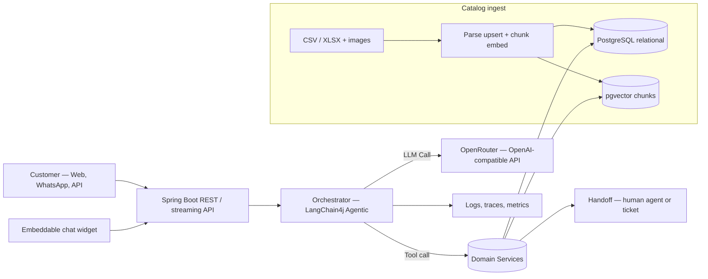
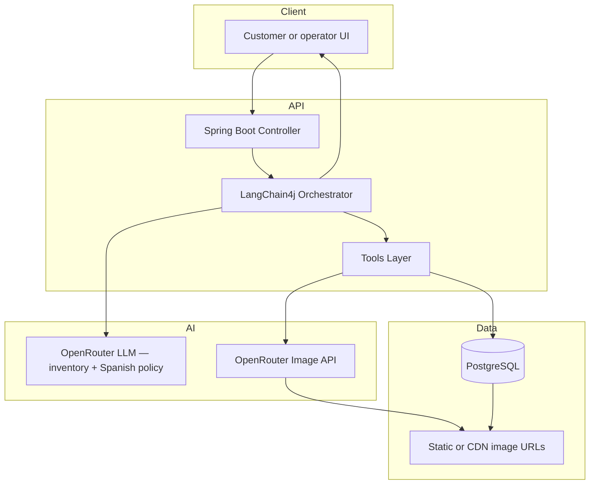
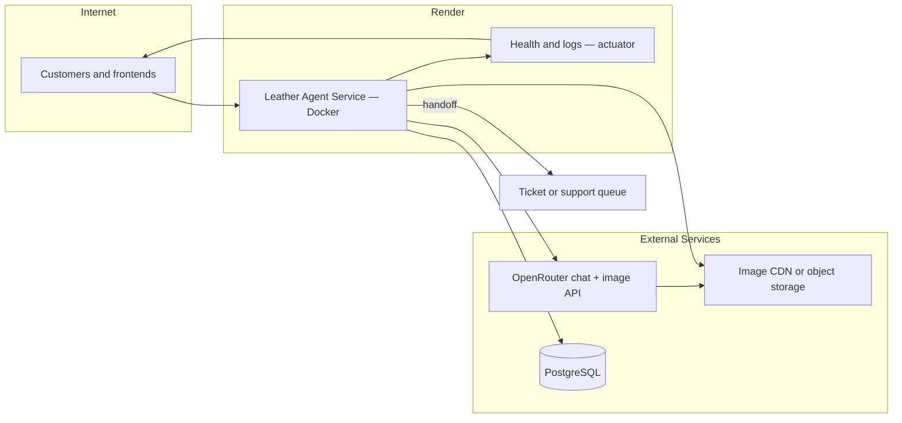
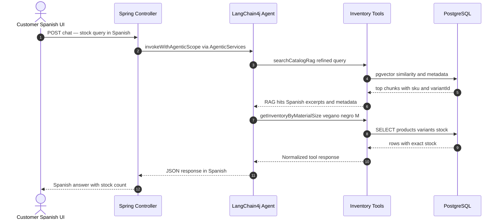
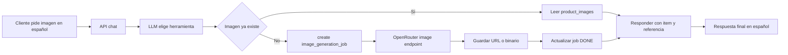

# Technical Design: Leather Store Inventory Query Agent (Java 25, Spring Boot 4.0.4, LangChain4j 1.12.2 + Agentic 1.12.2-beta22, PostgreSQL, OpenRouter)

**Location:** This document is the **leather inventory agent** product spec, kept under [`leather-inventory-agent/`](./README.md) so it is not mixed with the **generic multi-domain RAG** documentation at the repository root ([`technical-design.md`](../technical-design.md), [`implementation-plan.md`](../implementation-plan.md), etc.). Cross-cutting engineering checklists for leather still appear in **implementation-plan § 18**.

## Table of contents

1. [Objective](#1-objective)
2. [Initial scope (POC)](#2-initial-scope-poc)
3. [Proposed architecture](#3-proposed-architecture)
4. [Software components](#4-software-components) — includes [§4.8 Catalog ingest (XLSX/CSV) and hybrid RAG](#48-catalog-ingest-xlsxcsv-and-hybrid-rag) and [§4.8.1 Product category taxonomy](#481-product-category-taxonomy-relational-and-rag)
5. [OpenRouter + LangChain4j](#5-openrouter--langchain4j)
6. [PostgreSQL data model](#6-postgresql-data-model)
7. [Test data](#7-test-data)
8. [Agent request flow](#8-agent-request-flow)
9. [Security, quality, and operations](#9-security-quality-and-operations)
10. [Operations, KPIs, and deployment](#10-operations-kpis-and-deployment)
11. [Implementation roadmap](#11-implementation-roadmap)
12. [Compatibility notes](#12-compatibility-notes)
13. [Technical specifications (for implementation)](#13-technical-specifications-for-implementation)
14. [Local development setup](#14-local-development-setup)
15. [Implementation plan with iterations](#15-implementation-plan-with-iterations)
16. [Sample code (POC)](#16-sample-code-poc)
17. [TOON (Token-Oriented Object Notation)](#17-toon-token-oriented-object-notation)
18. [Embeddable chat widget (vanilla JS / jQuery)](#18-embeddable-chat-widget-vanilla-js--jquery)
19. [Demo kit and samples (product showcase)](#19-demo-kit-and-samples-product-showcase)

---

## 1. Objective
Implement a conversational assistant with agentic capabilities for a leather store (eCommerce-style catalog) focused only on inventory visibility. **Catalog and inventory live in relational tables** (loaded from XLSX/CSV, API, or manual ops). **Product search and discovery in chat are RAG-first:** the **LLM agent** chooses when to call **`searchCatalogRag`** (pgvector), interprets results, and chains into **stock/detail tools** that read **only** from SQL for **exact quantities and prices** — see **§4.8**. The **agent is created with LangChain4j Agentic** — **`AgenticServices.agentBuilder()`** → **`UntypedAgent`**, plus **`@Tool`** beans and an OpenRouter-backed **`ChatModel`** (see §4.2 and §5.D; same family of APIs as `agent-ui-editor`’s `WorkflowGraphInterpreter`). The POC should:
- answer stock/product availability questions,
- return SKU and variant-level stock quickly,
- provide **exact** quantities/prices from **relational rows** loaded from the spreadsheet (not inferred only from retrieved chunks),
- answer only in Spanish,
- escalate to human support only when inventory intent is ambiguous or unsupported.
- serialize **tabular tool results** as **TOON** (Token-Oriented Object Notation) **by default** to reduce LLM context tokens vs JSON; disable with `APP_AGENT_TOON_ENABLED=false` if needed (see §17).
- support an **optional embeddable web chat** (vanilla JavaScript, optional jQuery) that any site can load via `<script>` and configure with **properties / `data-*` attributes** (see **§18** and **Iterations 6–7**).

## 2. Initial scope (POC)
- **Catalog input:** one or more **CSV/XLSX** files (and/or exports from ERP) as the **system of record for bulk load**, plus **images** referenced by URL, path, or companion folder/object storage — **ingested** on a schedule or admin trigger (§4.8).
- **Search:** user questions are answered by the **agent** using **`searchCatalogRag`** as the **default** way to find relevant products (semantic + metadata), possibly over multiple turns; **optional** `searchProducts` / `getInventoryByMaterialSize` remain for narrow structured lookups when the model chooses them.
- Product details and **exact** stock/price after a candidate SKU/variant is identified — always from **relational tools**, not from chunk text alone.
- Variant-level inventory checks (size, color, SKU/variant stock).
- Out-of-stock / low-stock warnings.
- Suggested alternatives based on similar variants.
- Human handoff with query context.
- **Image generation (in scope for this POC, but a distinct slice):** catalog/gallery reads, optional OpenRouter image generation, job tracking, and cost/abuse controls (rate limits, quotas). Ingested catalog images are **not** the same as generated images; both can coexist.
- No order lookup, shipping quote, return policy, or payment flows.

---

## 3. Proposed architecture



## 4. Software components

### 4.1 API / channel layer
- `POST /api/agent/chat`: text chat endpoint (non-streaming).
- `POST /api/agent/chat/stream`: SSE/WebSocket streaming if needed.
- JWT/Bearer or internal API key authentication by channel.
- Optional **admin/batch API** or job: **`POST /api/admin/catalog/ingest`** (multipart file or storage pointer) — delegates to §4.8; not required on the same port as public chat in production (separate auth).

### 4.2 Orchestration layer
- **Agent = LangChain4j Agentic `UntypedAgent` (mandatory for this POC):** build with **`dev.langchain4j.agentic.AgenticServices.agentBuilder()`** — `.chatModel(...)` (OpenRouter via **`OpenAiChatModel`** as **`ChatModel`**), `.systemMessage(...)`, `.userMessageProvider(scope -> …)` (read `userMessage` / `sessionId` from **`AgenticScope`** state), `.tools(yourToolBeans...)`, `.outputKey(...)`, then **`.build()`** → **`UntypedAgent`** (see §5.D). The REST layer calls **`invokeWithAgenticScope(Map)`** (or the API your **`langchain4j-agentic`** version exposes) and maps the result to `ChatResponse`. **Tool choice and multi-step tool use are driven by the LLM through LangChain4j Agentic**—do **not** replace that with a hand-written `switch`/router as the primary orchestrator.
- **TOON by default:** when `app.agent.toon.enabled` is **true** (default), encode **uniform tabular tool results** (e.g. variant/stock rows) as TOON **inside `@Tool` return values** (or formatters those tools call) before the model reads them, instead of verbose JSON. Set `app.agent.toon.enabled: false` only for debugging or A/B against JSON (see §17).
- **RAG-first search (agent policy):** for open-ended “what do you have…”, “similar to…”, style/material questions, the model should **prefer `searchCatalogRag`** (possibly with refined queries across turns) before relying on pure SQL keyword search. The **Agentic** loop decides retrieval parameters and follow-up tools.
- A strict system prompt requiring:
  - Do not invent stock/price.
  - Use only **stock/price** values returned by **`getStockByVariant`** / **`getStockBySku`** / **`getInventoryByMaterialSize`** (or equivalent structured tools)—**never** from embedding excerpts alone.
  - Use **`searchCatalogRag`** to discover candidates; use metadata (`sku`, `variantId`) from hits to call stock tools.
  - Ask for SKU/color/size if missing and needed.
  - Always answer in Spanish, regardless of input language.
- Message handling + session memory (`sessionId`) with configurable message window.

### 4.3 Tooling layer (inventory + images)

**Canonical tool contract (use these names everywhere: diagrams, `usedTools`, tests, LangChain4j `@Tool` methods):**

| Tool name | Purpose | Typical parameters / notes |
|-----------|---------|----------------------------|
| `searchCatalogRag` | **Primary catalog search** — semantic retrieval over **pgvector** chunks built from ingested rows; returns excerpts + **metadata** (`sku`, `variantId`, …). Used by the **LLM agent** to find products; **not** authoritative for stock numbers | `query`, optional `maxResults`, metadata filters |
| `searchProducts` | **Optional / supplementary** structured search (SQL/keyword) when filters are explicit or RAG underperforms — not the default discovery path | `query`, `color`, `size`, `material`, optional limits |
| `getProductDetailBySku` | Product metadata by SKU | `sku` |
| `getStockBySku` | Aggregate or product-level stock | `sku` |
| `getStockByVariant` | Exact stock for a variant (composite SKU / variant id) | `variantSku` or `variantId` |
| `getInventoryByMaterialSize` | **Single DB-oriented read** for “material + color + size” style questions (same data as filtered search + stock, exposed as one tool for routing clarity) | `material`, `color`, `size`; optional `sku` hint |
| `getInventoryAndImage` | Combined path: resolve inventory row(s) then attach ready image ref (gallery or generation policy) | `sku`, `size`, `color`, `material` as applicable |
| `getProductImageGallery` | Return best READY image for product/variant | `productId`, optional `variantId` |
| `generateProductImage` | Create image via OpenRouter, persist job + `product_images` | `productId`, `variantId`, `userPrompt` |
| `handoffToHuman` | Escalate with session context | `reasonCode`, optional summary for operators |
| `syncCatalogFromSpreadsheet` | **Batch ingest** (operator): parse CSV/XLSX, upsert relational tables, rebuild/replace embedding index for leather domain | file path or upload id; optional dry-run |

**Search vs stock truth:** **Finding products** = **`searchCatalogRag`** + **agent reasoning** (re-query, compare chunks, disambiguate). **Stating availability or counts** = **`getStockByVariant`** / **`getStockBySku`** / **`getInventoryByMaterialSize`** only. **`searchProducts`** is a **fallback** for tight filter-by-column cases. System prompt: **never state a quantity unless it came from a stock-oriented tool**, even if a chunk mentions a number.

**Aliases:** Traces may show `searchCatalogRag` → `getStockByVariant` as the canonical path. Prefer **`getInventoryByMaterialSize`** only when the user already gave **material + color + size** explicitly and you skip broad RAG—or after RAG surfaced the same triple.

### 4.4 Data layer
- PostgreSQL as the primary datastore (available external DB).
- **Relational tables (loaded from CSV/XLSX ingest):**
  - `products`, `product_variants`, `product_images`, `image_generation_jobs`, `agent_sessions`, `agent_messages`, `agent_handoffs`.
- **pgvector (same PostgreSQL instance):** embedding table(s) for catalog chunks (aligned with [technical-design.md §11](../technical-design.md#11-embedding-store-schema) — e.g. `document_embeddings` with metadata `domain_id=leather`, `sku`, `variant_id`). **Extension:** `CREATE EXTENSION vector`.
- **Object storage (optional):** S3/Render disk for binary images if not only URLs; DB holds pointers.

### 4.5 Deployment target (Render)
- Primary target: Render Web Service running a Docker container.
- External dependency: PostgreSQL from Render (or already available managed PostgreSQL).
- **No Redis** required. **pgvector is in scope** when using **RAG over ingested catalog text** (§4.8); embeddings live in PostgreSQL.
- Session memory and short-term context can be stored in PostgreSQL (`agent_sessions` and `agent_messages`).

### 4.6 Integrations
- **OpenRouter** for LLM:
  - OpenAI-compatible endpoint.
  - API key managed through environment secrets.
  - Model choice and rate/cost parameters per environment.
  - **`TOON` is on by default** for tabular tool payloads (§17); pair with a **capable chat model** for tool use + structured context — see **§17.1** (e.g. `openai/gpt-4o-mini` for POC, `openai/gpt-4o` or `anthropic/claude-3.5-sonnet` for production).
  - `response-language: es` policy enforced at system prompt and validator layer.
- OpenRouter image generation models:
  - Reuse OpenRouter key and endpoint for image creation.
  - Persist generated URLs in PostgreSQL (`product_images`) and retry on transient failures.

### 4.7 Embeddable web client (optional)
- **Delivered in Iterations 6–7:** a **single-file or small bundle** (e.g. `leather-chat.min.js`) that any HTML page can load and initialize with **`LeatherChat.mount(selector, options)`** and/or **`data-leather-*`** attributes on the mount node (full contract in **§18**).
- Talks to **`POST /api/agent/chat`** only (JSON), on the **integrator’s origin** via a **BFF** that proxies to Leather—**no API keys or Bearer tokens in the widget** (see **§18**).
- The **Leather** service may be reached **server-to-server** from the BFF; browser **CORS** on Leather is optional for that model (**§13.8**, **§18.6**).

### 4.8 Catalog ingest (XLSX/CSV) and hybrid RAG

**Product vision:** inventory starts as **spreadsheet(s)** and **images** (URLs or files). You **ingest** that into the app; shoppers ask questions in chat. Using **RAG for “everything”** (including exact stock) **can sound simple but is unsafe**: retrieved chunks can be **wrong, partial, or outdated**, and the model may **hallucinate quantities**. The recommended model is **hybrid**:

| Layer | Role |
|--------|------|
| **Relational tables** | **Source of truth** for SKU, variant, **stock qty**, price. Loaded from CSV/XLSX (or other ETL). Stock/detail tools read **only** here for authoritative numbers. |
| **pgvector + RAG** | **Primary user-facing search**: the **LLM agent** calls **`searchCatalogRag`** to find relevant products (semantic + metadata). Chunks mirror table-derived text so retrieval stays aligned with catalog; agent then calls stock tools using **`sku` / `variantId`** from hit metadata. |
| **Images** | Ingest stores **URLs or storage keys** in `product_images`; gallery/generation tools unchanged. |

**Ingest pipeline (leather-specific ETL + reuse generic RAG primitives):**

1. **Parse** CSV/XLSX (column mapping config: `sku`, `color`, `size`, `stock`, `name`, `description`, `image_url`, …).
2. **Upsert** `products` / `product_variants` / `product_images` (transactional; validate types; reject bad rows with audit log).
3. **Build text chunks** per row or per product (e.g. concatenate name + attributes + description); attach **metadata** for filters (`sku`, `variant_id`, `material`).
4. **Embed** with the same **`EmbeddingModel`** you use at query time; **delete/replace** old vectors for changed SKUs (or full rebuild for POC).
5. **Store** in **pgvector** (LangChain4j **`EmbeddingStoreIngestor`** / `PgVectorEmbeddingStore` — same patterns as generic RAG).

**Query-time:** user message → **Agentic** loop: model typically calls **`searchCatalogRag`** first for discovery (possibly multiple times with refined queries) → then **`getStockByVariant`** / **`getInventoryByMaterialSize`** before stating availability or counts. **TOON** (§17) applies to **tabular tool outputs**, not to raw embedding hits.

#### 4.8.1 Product category taxonomy (relational and RAG)

Use a **controlled set of category codes** in `products.category` and in **embedding metadata** (e.g. `category` on chunks) so shoppers can ask in natural Spanish (“¿tienen **chaquetas** de cuero?”, “**shorts** negros”, “**botas** marrones”) while filters and reporting stay stable.

| Code | Article type (EN) | Typical Spanish in chunks / descriptions | RAG notes |
|------|-------------------|------------------------------------------|-----------|
| `JACKET` | Jackets, blazers, bombers (leather) | chaqueta, blazer, campera, cazadora | Outerwear; often size + color + fit |
| `COAT` | Coats, trenches, parkas (leather) | abrigo, trench, sobretodo | Long outerwear |
| `VEST` | Vests, waistcoats | chaleco, chaleco sin mangas | Layering |
| `SHORT` | Shorts, bermudas (leather / leather-trim) | shorts, bermudas | Warm-weather bottoms |
| `PANT` | Trousers, pants, leggings (leather) | pantalón, pantalones, calzas cuero | Bottoms; inseam / length in variant or description |
| `SKIRT` | Skirts | falda | Length + size |
| `TOP` | Shirts, blouses, crop tops (leather) | camisa, blusa, top | Upper body; less common in full leather but include if sold |
| `DRESS` | Dresses | vestido | Full garment |
| `FOOTWEAR` | Shoes, boots, loafers, sneakers (leather) | zapatos, botas, mocasines, zapatillas cuero | Existing sample uses boots here |
| `BAG` | Handbags, backpacks, totes, briefcases | bolso, mochila, maletín, cartera grande | Existing `BAG` rows |
| `WALLET` | Wallets, card holders | billetera, cartera, tarjetero | Small leather goods |
| `BELT` | Belts | cinturón, correa | Often waist size; existing `BELT` rows |
| `GLOVE` | Gloves | guantes | Size S/M/L |
| `HEADWEAR` | Hats, caps (leather / leather brim) | gorra, sombrero, boina | One-size or S/M/L |
| `ACCESSORY` | Bracelets, keychains, watch straps, misc. | pulsera, llavero, correa de reloj | Catch-all for small items |
| `TECH_SLV` | Laptop sleeves, tablet covers, phone pouches | funda laptop, funda tablet, funda móvil | Flat / dimension-based |
| `OTHER` | Uncategorized | use sparingly | Migrate to a specific code when possible |

**Ingest / chunking (anticipate RAG):**

- **Repeat category in prose:** each chunk should include the article type in **both** languages where useful (e.g. “Chaqueta de cuero genuino, color negro, corte slim…” / “Black genuine leather jacket…”) so semantic search matches colloquial queries.
- **Metadata:** store the **same code** as `category` (and optionally `subcategory` or `style` free text for “biker”, “minimal”, “office”) for **pre-filter** or **post-filter** in `searchCatalogRag` if you add metadata filters later.
- **Spreadsheet column:** CSV/XLSX may use a Spanish column (`categoría`) — map to the **code** on upsert; document the mapping in operator runbooks.

**Existing seed data** in §7 uses `BAG`, `BELT`, `FOOTWEAR`, `WALLET`, `ACCESSORY` — align new rows with the table above (rename `ACCESSORY` only if you split into `GLOVE` / `HEADWEAR` / etc.).

**Reference docs** in this repo for implementation detail:

| Concern | Document | What to read |
|--------|----------|----------------|
| **Schema & indexes** | [technical-design.md](../technical-design.md) | **§11 Embedding store schema** — `document_embeddings`, `vector(dimension)`, **IVFFlat** |
| **Load (generic file ingest)** | [ingestion-pipeline.md](../ingestion-pipeline.md) | Phases 7–9: split → embed → PGVector; **`POST /api/v1/{domainId}/ingest`** patterns |
| **Retrieve** | [query-pipeline.md](../query-pipeline.md) | Phase 4–5 vector + hybrid re-rank; adapt inside **`searchCatalogRag`** |
| **Code patterns** | [framework-code.md](../framework-code.md) | `EmbeddingStoreIngestor`, **`EmbeddingStoreContentRetriever`**, **`langchain4j-pgvector`** |

**Pure RAG-only (no stock tools):** acceptable only for **demos** where wrong stock is acceptable; **not** for production inventory truth.

---

## 5. OpenRouter + LangChain4j

Subsections **5.A–5.E** are stack setup (Gradle, YAML, beans). Subsections **5.1–5.8** describe behavior, diagrams, and image design.

### 5.A Gradle dependencies
```kotlin
plugins {
    id("org.springframework.boot") version "4.0.4"
    id("io.spring.dependency-management") version "1.1.7"
    id("java")
}

java {
    toolchain {
        languageVersion = JavaLanguageVersion.of(25)
    }
}

group = "com.example"
version = "0.0.1-SNAPSHOT"

repositories {
    mavenCentral()
}

dependencies {
    implementation("org.springframework.boot:spring-boot-starter-web")
    implementation("org.springframework.boot:spring-boot-starter-actuator")
    implementation("org.springframework.boot:spring-boot-starter-data-jpa")
    implementation("org.springframework.boot:spring-boot-starter-validation")
    val langchain4jVersion = "1.12.2" // core + open-ai; align with agentic line
    val langchain4jAgenticVersion = "1.12.2-beta22" // pre-release; pin until Agentic GA matches BOM
    implementation("dev.langchain4j:langchain4j:$langchain4jVersion")
    implementation("dev.langchain4j:langchain4j-open-ai:$langchain4jVersion")
    implementation("dev.langchain4j:langchain4j-pgvector:$langchain4jVersion") // RAG: §4.8
    implementation("dev.langchain4j:langchain4j-agentic:$langchain4jAgenticVersion")
    runtimeOnly("org.postgresql:postgresql")
}
```

- **LangChain4j versions:** use **`langchain4j-agentic:1.12.2-beta22`** with **`langchain4j`** / **`langchain4j-open-ai:1.12.2`** on the same release line; resolve any transitive version clashes explicitly in Gradle if the agentic artifact pulls a different core revision.
- **pgvector:** PostgreSQL must have **`CREATE EXTENSION vector`**; use **`langchain4j-pgvector`** for **`searchCatalogRag`** / ingest (§4.8). Add an **`EmbeddingModel`** bean (OpenRouter or local) consistent between ingest and query.
- Prefer **`RestClient`** (Spring Boot 3.2+, provided via `spring-boot-starter-web`) for blocking OpenRouter HTTP calls in a servlet app; avoid **`WebClient` + `.block()`** unless the stack is fully reactive (see §16.4).

### 5.B OpenRouter configuration (`application.yml`)
```yaml
app:
  llm:
    provider: openrouter
    base-url: https://openrouter.ai/api/v1
    api-key: ${OPENROUTER_API_KEY}
    model: openai/gpt-4o-mini
    temperature: 0.2
    timeout-seconds: 30
    site-referrer: https://your-domain.com
    app-title: LeatherAgent
  agent:
    toon:
      enabled: ${APP_AGENT_TOON_ENABLED:true}
      delimiter: comma          # `tab` often tokenizes smaller; see §17
      fenced-code-language: toon
      strict-decode-model-toon: false  # set true only if the model must return TOON you parse server-side
```

### 5.C Java chat model bean (`ChatModel` for Agentic)

**AgenticServices** uses the unified **`ChatModel`** API. **`OpenAiChatModel`** targets OpenRouter’s OpenAI-compatible base URL (same as `agent-ui-editor`’s `OpenRouterChatModelFactory`).

```java
import dev.langchain4j.model.chat.ChatModel;
import dev.langchain4j.model.openai.OpenAiChatModel;

@Configuration
public class LlmConfig {
    @Bean
    ChatModel inventoryChatModel(LlmProperties props) {
        return OpenAiChatModel.builder()
            .baseUrl(props.baseUrl())
            .apiKey(props.apiKey())
            .modelName(props.model())
            .temperature(props.temperature())
            .timeout(Duration.ofSeconds(props.timeoutSeconds()))
            .build();
    }
}
```

### 5.D LangChain4j Agentic (1.12.x, `langchain4j-agentic` **1.12.2-beta22**) — **creating the agent with `AgenticServices`**

Use **`dev.langchain4j.agentic.AgenticServices`** (module **`langchain4j-agentic`**) to build an **`UntypedAgent`**. This matches the pattern used in **`agent-ui-editor`** (`WorkflowGraphInterpreter.buildAgent`).

```java
import dev.langchain4j.agentic.AgenticServices;
import dev.langchain4j.agentic.UntypedAgent;
import dev.langchain4j.model.chat.ChatModel;

@Bean
UntypedAgent leatherInventoryAgent(ChatModel inventoryChatModel, LeatherTools leatherTools) {
    String systemMessage = """
        You are an expert assistant for a leather store.
        Use tools for any query that depends on SKU, size, color, variant, stock availability, or product imagery.
        The assistant must respond ONLY in Spanish, with natural Spanish phrasing.
        If you do not have exact evidence from tools or database, do not fabricate answers.
        When unsure, respond: "No lo puedo confirmar todavía; te transfiero a soporte humano."
        When tool results are provided in TOON format (fenced code block labeled toon), treat them as tabular data: the header declares field names and row count [N]; each indented row is one record. Do not invent rows beyond [N].
        """;
    return AgenticServices.agentBuilder()
        .chatModel(inventoryChatModel)
        .name("leather-inventory")
        .systemMessage(systemMessage)
        .userMessageProvider(scope -> {
            Object text = scope.readState("userMessage");
            return text != null ? text.toString() : "";
        })
        .tools(leatherTools)
        .outputKey("response")
        .build();
}
```

**Invocation from Spring:** the REST façade builds a **scope input** `Map` that includes **`userMessage`** (and optionally **`sessionId`** for your own logging or future memory). Call **`leatherInventoryAgent.invokeWithAgenticScope(...)`** (exact signature per your **`langchain4j-agentic`** version). If the framework expects a nested **`"input"`** map (as in `WorkflowGraphInterpreter`), use `Map.of("input", Map.of("userMessage", message, "sessionId", sessionId))` and adjust **`userMessageProvider`** to read from that structure.

**Result handling:** the call may return **`ResultWithAgenticScope<T>`** — use **`.result()`** for the assistant text and **`.agenticScope()`** for **`AgentInvocation`** / telemetry (e.g. tool names), similar to **`WorkflowRunService`** in `agent-ui-editor`.

**Session memory:** persist turns in PostgreSQL (`agent_messages`) in the façade; optionally hydrate **`AgenticScope`** / managed context if your Agentic version documents a pattern for multi-turn state. For **`AgenticServices`**, prefer **application-side** history (prepend summaries or last *n* turns into `userMessage` or scope) unless you adopt a documented Agentic memory integration—do not assume **`ChatMemoryProvider`** (that stack is for **`AiServices`**, not this POC).

### 5.E OpenRouter image generation configuration (`application.yml`)
```yaml
image:
  provider: openrouter
  base-url: https://openrouter.ai/api/v1
  api-key: ${OPENROUTER_API_KEY}
  model: google/gemini-2.0-flash-preview-image
  timeout-seconds: 60
  output-format: url
```

```java
public record ProductImageRequest(String productId, String variantId, String prompt) {}

public interface ImageGenerationTools {
    @Tool("Generate a product image from a structured prompt and return image URL.")
    String generateProductImage(ProductImageRequest request);
}
```

---

### 5.1 User Stories (Inventory POC)

- As a sales agent, I want to know if a product is available before confirming sale so I can avoid selling out-of-stock inventory.
- As a customer, I want to ask for stock by SKU or color/size and get an exact remaining quantity so I can decide quickly.
- As a customer, I want to ask “Do you have this in my size?” and receive a precise answer with variant details.
- As a customer, I want to receive suggested similar items when the requested variant is out of stock so I can still complete a purchase.
- As an inventory operator, I want the assistant to use only live stock data so I can trust all responses.
- As a customer, I want to see product images from catalog or generated images for quick visual confirmation.
- As a store manager, I want all image requests and generation jobs tracked so I can audit costs and quality.
- As an agent supervisor, I want unclear queries to be handed off with context so my team can continue the conversation with zero loss.
- As a business stakeholder, I want all agent responses to stay in Spanish so customers have a consistent local experience.

### 5.2 Component diagram



### 5.3 Component responsibilities
- `Controller`: validate request, map locale/session, call a **façade** that invokes **`UntypedAgent.invokeWithAgenticScope(...)`** (§5.D, §16.2).
- **`UntypedAgent` (AgenticServices)**: the **primary** orchestrator—OpenRouter decides when to call tools; LangChain4j Agentic executes **`@Tool`** methods on your beans.
- `LanguageGuard` / policy layer: optional pre-checks on input and post-checks on model output (Spanish); **does not** replace LLM tool routing.
- `Tools` (`LeatherTools`, etc.): Spring `@Component`s with **`@Tool`** methods; include **`searchCatalogRag`** (delegates to **`EmbeddingStore` / retriever** + pgvector) and SQL-backed stock/image tools; keep DB, vector store, and OpenRouter image client isolated.
- `Repositories`: handle PostgreSQL reads for products, variants, images, and sessions.
- `Image Generator`: call OpenRouter image endpoint and persist `image_generation_jobs`.
- `Handoff service`: package context and notify manual support when handoff trigger conditions occur.

### 5.4 Query handling approach

- Input is always processed in three phases (implemented by the **agent + framework**, not a separate hard-coded router):
  - **Intent / planning**: model decides if the turn needs **RAG search**, **stock lookup**, **image** path, clarification, or handoff.
  - **Tool dispatch**: **`searchCatalogRag`** for discovery; then structured tools for **exact** data; validate required parameters.
  - **Response synthesis**: natural Spanish answer from tool outputs; persist context.

- Query-to-tool routing (**RAG-first**):
  - Open-ended search / “what do you have…” / style-material questions => **`searchCatalogRag`**, then **`getStockByVariant`** (or **`getInventoryByMaterialSize`**) using metadata from hits.
  - `¿Tienes X disponible?` / `¿Cuánto stock hay de...` => **`getStockBySku`** / **`getStockByVariant`** if SKU/variant known; else **`searchCatalogRag`** then stock tool.
  - User already states **material + color + size** explicitly => **`getInventoryByMaterialSize`** **or** RAG then same tool—model chooses.
  - `¿Me puedes mostrar fotos de...` => **`searchCatalogRag`** (if product unclear) → **`getProductImageGallery`** → optional **`generateProductImage`**.
  - `¿qué hay disponible?` + constraints => **`searchCatalogRag`** with filters in query or metadata; optional **`searchProducts`** if SQL path is clearer.
  - Ambiguous + out-of-scope => **`handoffToHuman`**.

- Failure handling:
  - Missing SKU, size, or color: ask one focused clarification question in Spanish.
  - If product not found: respond with a brief no-stock message and up to 3 alternatives.
  - If DB/tool call fails: retry once, then handoff with trace.

### 5.5 Sample queries and execution path

- `¿Tienen el bolso de viaje BAG-TRAVEL-01 en stock?`
  - Intent: stock check by SKU
  - Tool path: `getStockBySku("BAG-TRAVEL-01")`
  - Response: stock and location availability.

- `¿Me buscas botas color marrón talla 39?`
  - Intent: inventory query with filters
  - Tool path: `searchCatalogRag("botas marrón talla 39")` → read `variantSku` from metadata → `getStockByVariant("BOTOX-VEG-03-39")` (or `getInventoryByMaterialSize` if filters map cleanly)
  - Response: exact units by variant.

- `¿Hay stock de cinturón en negro talla 120?`
  - Intent: stock check by category + color + size
  - Tool path: `getStockByVariant("BELT-LTBK-02-120")`
  - Response: cantidad y estado (disponible/agotado).

- `muéstrame opciones de carteras`
  - Intent: search
  - Tool path: `searchCatalogRag("carteras opciones catálogo")` → `getStockByVariant` / `getProductDetailBySku` per candidate SKU from metadata
  - Response: lista con precios y stock (números desde herramientas SQL).

- `¿Me puedes crear una imagen del bolso de viaje en estudio?`
  - Intent: image
  - Tool path: `getProductImageGallery(productId)` → if empty, `generateProductImage(...)`
  - Response: URL(s) de imagen(es) y notas de estilo.

- `¿Cuántas carteras Napa negras tamaño One Size tienes?`
  - Intent: stock check by category + color + size
  - Tool path: `searchCatalogRag("carteras Napa negro One Size")` → `getStockByVariant("WAL-RUN-05-BLK")` (SKU desde metadata)
  - Response: unidades disponibles y precio de referencia del producto.

- `Muéstrame imágenes de botas en color camel, por favor`
  - Intent: image + catalog
  - Tool path: `searchCatalogRag("botas color camel")` → `getProductImageGallery(productId)` desde metadata
  - Response: resultados con variantes, stock y links de imagen.

- `quiero pedir ahora`
  - Intent: order flow (out-of-scope for this POC)
  - Tool path: no tool
  - Response: transferir a agente humano con contexto.

### 5.6 Guardrails and safety controls

- Functional guardrails
  - Scope-only policy: respond only to inventory/product search and image queries; everything else goes to human.
  - Always answer in Spanish.
  - Must fetch stock from tools/DB; never infer or approximate stock.
  - SKU/variant validation required before claiming availability.
  - If user asks for unsupported actions, return a transfer message in Spanish.

- Data and model guardrails
  - Input length cap: reject messages > 1200 chars with polite truncation guidance.
  - PII redaction (optional): emails/phones in logs can be masked.
  - Tool result integrity: ignore empty/invalid tool responses and re-prompt with clarification.
  - Confidence threshold check (model score or business rule): below threshold -> escalation.

- Operational guardrails
  - Timeout hard limits:
    - LLM <= 30s
    - DB <= 5s
    - Image generation <= 60s
  - Retry policy:
    - Tool call: one retry on transient failures.
    - Image generation: max 2 retries with capped backoff.
  - Circuit-breaker style behavior:
    - If OpenRouter fails repeatedly, serve fallback “I am unable to answer now” and handoff.
    - If DB unavailable, do not serve stale data.
  - Idempotency: repeated stock query for same intent within short TTL returns stable response.

- Security guardrails
  - Rate limiting by IP/session.
  - Basic prompt-injection filtering before tool invocation.
  - CORS by allowed domains only.
  - Secrets managed in Render environment variables, never committed in config.

- Brand guardrails
  - Inventory responses must remain concise and transactional.
  - No speculative recommendations outside available inventory.
  - Product image prompts must enforce style guide:
    - no people,
    - no text/watermarks,
    - no offensive content,
    - no brand misuse.
  - Store tone: respectful, clear, short, and Spanish-only.

- Governance and audit guardrails
  - Log every tool call with correlation id and request/response status.
  - Persist `agent_handoffs` for all escalations.
  - Dashboard alert if:
    - handoff rate > 35% in 1h,
    - image generation failure rate > 10% in 1h,
    - Spanish compliance violations > 0 (see §9.4).

### 5.7 Architecture/Deployment diagram



### 5.8 Image storage and generation design

**POC default vs optional paths:** The **default POC** stores **`image_url` (and metadata) in PostgreSQL** after generation or CDN upload—this matches §5.8.2–5.8.3 and deployment simplicity on Render. Storing **`bytea` in Postgres** or returning **base64 in the chat API** (§8.1.2) is an **optional** demo path for environments without object storage; pick one primary strategy per environment and document it in `application.yml`.

### 5.8.1 Storage model (recommended)
- Keep the actual image bytes in object storage (S3-compatible, Cloudinary, Cloudflare R2, GCS, etc.).
- Persist only metadata and URLs in PostgreSQL:
  - `product_images.image_url`: canonical display URL.
  - `product_images.prompt`: prompt used to generate or select image.
  - `image_generation_jobs`: audit trail for every generation request.
- Use `status` in `product_images` to mark `READY`, `DEPRECATED`, or `FAILED`.
- Store multiple images per SKU/variant by grouping on `product_id` and `variant_id`.
- Keep one `image_preference` key (`"PRIMARY"`, `"DETAIL"`, `"LIFESTYLE"` ) per product if needed (can be derived from prompt).

### 5.8.2 Generation flow
1. User asks for image.
2. Agent calls `getProductImageGallery(productId, variantId)`.
3. If no usable image exists (`READY`), call `generateProductImage`.
4. Create `image_generation_jobs` row with `PENDING`.
5. Call OpenRouter image endpoint with a constrained template prompt.
6. On success:
   - Upload/copy returned URL to stable CDN domain if needed.
   - Create/update `product_images` row with `READY`.
   - Update job row to `DONE` with `result_image_url`.
7. On failure:
   - Update job to `FAILED` with a **stable** `failure_reason` code (e.g. `OPENROUTER_IMAGE_FAILED`), not raw exception text.
   - Return handoff response.

### 5.8.3 SQL behavior for image query
- `getProductImageGallery(productId, variantId)` should prefer:
  1) variant image with `READY`,
  2) product image with `READY`,
  3) fallback placeholder image.
- Avoid returning images in `PENDING` or `FAILED`.

### 5.8.4 OpenRouter image call example (Java + Spring)

**API contract:** OpenRouter exposes OpenAI-compatible HTTP APIs, but paths, field names, and image models change over time. **Verify** the current docs for `/v1/images/generations` (or equivalent), request body (`model`, `prompt`, `response_format`, etc.), and whether the response returns `url`, `b64_json`, or both—adjust `OpenRouterImageApi` and DTOs before production.

```java
// import org.springframework.boot.context.properties.EnableConfigurationProperties;
// import org.springframework.web.client.RestClientException;

@Configuration
@EnableConfigurationProperties(ImageProperties.class)
class ImagePropertiesConfiguration { }

// Immutable record: register via @EnableConfigurationProperties above. If binding fails on your Spring Boot version, use a mutable class with setters or @ConstructorBinding on a dedicated type.
@ConfigurationProperties(prefix = "image")
public record ImageProperties(
    String provider,
    String baseUrl,
    String apiKey,
    String model,
    Integer timeoutSeconds,
    String outputFormat
) {}

public interface OpenRouterImageApi {
    @PostExchange(url = "/images/generations", contentType = MediaType.APPLICATION_JSON_VALUE)
    ImageGenerationResponse generate(@RequestHeader("Authorization") String auth,
                                    @RequestBody ImageGenerationRequest request);
}

public record ImageGenerationRequest(String model, String prompt, String size, int n, String format) {}

public record ImageGenerationResponse(List<ImageData> data, String id) {}
public record ImageData(String url, String b64Json) {}

@Service
public class InventoryImageGenerationService {

    private final OpenRouterImageApi openRouterImageApi;
    private final ImageProperties props;
    private final ProductImageRepository productImageRepository;
    private final ImageGenerationJobRepository jobRepository;
    private final ProductRepository productRepository;
    private final ProductVariantRepository variantRepository;

    public InventoryImageGenerationService(OpenRouterImageApi openRouterImageApi,
                                          ImageProperties props,
                                          ProductImageRepository productImageRepository,
                                          ImageGenerationJobRepository jobRepository,
                                          ProductRepository productRepository,
                                          ProductVariantRepository variantRepository) {
        this.openRouterImageApi = openRouterImageApi;
        this.props = props;
        this.productImageRepository = productImageRepository;
        this.jobRepository = jobRepository;
        this.productRepository = productRepository;
        this.variantRepository = variantRepository;
    }

    public String generateProductImage(Long productId, Long variantId, String userPrompt) {
        var product = productRepository.findById(productId).orElseThrow(() -> new IllegalArgumentException("product not found"));

        ImageGenerationJob job = jobRepository.save(new ImageGenerationJob(
                null, product, resolveVariant(variantId), userPrompt, "PENDING", null, null, OffsetDateTime.now(), OffsetDateTime.now()
        ));

        try {
            var req = new ImageGenerationRequest(
                    props.model(),
                    buildSafePrompt(product, userPrompt),
                    "1024x1024",
                    1,
                    props.outputFormat() == null ? "url" : props.outputFormat()
            );
            var response = openRouterImageApi.generate("Bearer " + props.apiKey(), req);

            String imageUrl = response.data().getFirst().url();
            ProductImage image = new ProductImage(
                null, product, resolveVariant(variantId), imageUrl, req.prompt(), "OPENROUTER", "READY", OffsetDateTime.now(), OffsetDateTime.now()
            );
            productImageRepository.save(image);

            job.setStatus("DONE");
            job.setResultImageUrl(imageUrl);
            job.setUpdatedAt(OffsetDateTime.now());
            jobRepository.save(job);
            return imageUrl;
        } catch (RestClientException ex) {
            job.setStatus("FAILED");
            // Persist stable operator codes only — never raw exception messages (may contain provider payloads or internals).
            job.setFailureReason("OPENROUTER_IMAGE_FAILED");
            job.setUpdatedAt(OffsetDateTime.now());
            jobRepository.save(job);
            throw new IllegalStateException("No se pudo generar la imagen en este momento.", ex);
        }
    }

    private String buildSafePrompt(Product product, String userPrompt) {
        return "Premium leather product catalog style, no people, no text/watermark: " + userPrompt + " for " + product.name();
    }

    private ProductVariant resolveVariant(Long variantId) {
        return variantId == null ? null : variantRepository.findById(variantId).orElse(null);
    }
}
```

### 5.8.5 JPA entity model
```java
@Entity
public class ProductImage {
    @Id @GeneratedValue(strategy = GenerationType.IDENTITY)
    private Long id;
    @ManyToOne(fetch = FetchType.LAZY) private Product product;
    @ManyToOne(fetch = FetchType.LAZY) private ProductVariant variant;
    private String imageUrl;
    @Column(columnDefinition = "TEXT") private String prompt;
    private String source;
    private String status; // READY | DEPRECATED | FAILED
    private OffsetDateTime generatedAt;
    private OffsetDateTime createdAt;
}

@Entity
public class ImageGenerationJob {
    @Id @GeneratedValue(strategy = GenerationType.IDENTITY)
    private Long id;
    @ManyToOne(fetch = FetchType.LAZY) private Product product;
    @ManyToOne(fetch = FetchType.LAZY) private ProductVariant variant;
    @Column(columnDefinition = "TEXT") private String requestedPrompt;
    private String status; // PENDING | DONE | FAILED
    private String resultImageUrl;
    @Column(columnDefinition = "TEXT") private String failureReason;
    private OffsetDateTime createdAt;
    private OffsetDateTime updatedAt;
}
```

### 5.8.6 Tools integration
```java
public interface InventoryImageTools {
    @Tool("Get existing catalog images for product and variant.")
    List<String> getProductImageGallery(String sku, String variantSku);

    @Tool("Generate a product image with safe templates and return URL.")
    String generateProductImage(String sku, String variantSku, String prompt);
}
```

### 5.8.7 Cost and control guardrails for generation
- Limit one generation request per product per 10 minutes per session.
- Require explicit user intent ("genera imagen" or "muéstrame más imágenes") before generating.
- Default to returning existing image first (never auto-regenerate if one `READY` exists).
- Enforce style templates so image generation does not drift from brand tone.

## 6. PostgreSQL data model

### 6.1 Minimum schema

**`products.category`:** use the **controlled codes** in **[§4.8.1](#481-product-category-taxonomy-relational-and-rag)** (e.g. `JACKET`, `SHORT`, `FOOTWEAR`, `BAG`) so RAG metadata, SQL filters, and spreadsheets stay aligned.

```sql
CREATE TABLE products (
  id BIGSERIAL PRIMARY KEY,
  sku VARCHAR(50) UNIQUE NOT NULL,
  name VARCHAR(200) NOT NULL,
  category VARCHAR(100),
  material VARCHAR(120),
  color VARCHAR(80),
  price NUMERIC(10,2) NOT NULL,
  currency VARCHAR(3) NOT NULL DEFAULT 'USD',
  active BOOLEAN DEFAULT true,
  created_at TIMESTAMP DEFAULT NOW()
);

CREATE TABLE product_variants (
  id BIGSERIAL PRIMARY KEY,
  product_id BIGINT NOT NULL REFERENCES products(id) ON DELETE CASCADE,
  size VARCHAR(20),
  color VARCHAR(80),
  sku_variant VARCHAR(80) UNIQUE NOT NULL,
  stock INTEGER NOT NULL DEFAULT 0,
  created_at TIMESTAMP DEFAULT NOW()
);

CREATE TABLE product_images (
  id BIGSERIAL PRIMARY KEY,
  product_id BIGINT NOT NULL REFERENCES products(id) ON DELETE CASCADE,
  variant_id BIGINT REFERENCES product_variants(id) ON DELETE SET NULL,
  image_url VARCHAR(500) NOT NULL,
  prompt TEXT NOT NULL,
  source VARCHAR(50) NOT NULL DEFAULT 'OPENROUTER',
  status VARCHAR(30) NOT NULL DEFAULT 'READY',
  generated_at TIMESTAMP DEFAULT NOW(),
  created_at TIMESTAMP DEFAULT NOW()
);

CREATE TABLE image_generation_jobs (
  id BIGSERIAL PRIMARY KEY,
  product_id BIGINT NOT NULL REFERENCES products(id) ON DELETE CASCADE,
  variant_id BIGINT REFERENCES product_variants(id) ON DELETE SET NULL,
  requested_prompt TEXT NOT NULL,
  status VARCHAR(30) NOT NULL DEFAULT 'PENDING',
  result_image_url VARCHAR(500),
  failure_reason TEXT,
  created_at TIMESTAMP DEFAULT NOW(),
  updated_at TIMESTAMP DEFAULT NOW()
);

CREATE TABLE agent_sessions (
  session_id VARCHAR(100) PRIMARY KEY,
  created_at TIMESTAMP DEFAULT NOW(),
  last_active_at TIMESTAMP DEFAULT NOW(),
  metadata JSONB
);

CREATE TABLE agent_messages (
  id BIGSERIAL PRIMARY KEY,
  session_id VARCHAR(100) REFERENCES agent_sessions(session_id) ON DELETE CASCADE,
  role VARCHAR(16) NOT NULL,
  content TEXT NOT NULL,
  created_at TIMESTAMP DEFAULT NOW()
);

CREATE TABLE agent_handoffs (
  id BIGSERIAL PRIMARY KEY,
  session_id VARCHAR(100) REFERENCES agent_sessions(session_id) ON DELETE CASCADE,
  reason TEXT NOT NULL,
  created_at TIMESTAMP DEFAULT NOW()
);
```

### 6.2 Suggested indexes
```sql
CREATE INDEX idx_products_category ON products(category);
CREATE INDEX idx_products_material ON products(material);
CREATE INDEX idx_variants_sku ON product_variants(sku_variant);
CREATE INDEX idx_variants_product ON product_variants(product_id);
CREATE INDEX idx_product_images_product ON product_images(product_id);
CREATE INDEX idx_product_images_variant ON product_images(variant_id);
CREATE INDEX idx_image_generation_jobs_product_status ON image_generation_jobs(product_id, status);
CREATE INDEX idx_agent_messages_session ON agent_messages(session_id, created_at);
```

---

## 7. Test data

For **product demos** (stakeholder walkthroughs, `curl` scripts, sample CSV), align SKUs with this section where possible and add packaging under **`demo/`** per **§ 19**.

### 7.1 Initial product seed
```sql
INSERT INTO products (sku, name, category, material, color, price, currency) VALUES
('BAG-TRAVEL-01', 'Brown leather travel bag', 'BAG', 'Cow leather', 'Brown', 179.00, 'USD'),
('BELT-LTBK-02', 'Black executive belt', 'BELT', 'Genuine leather', 'Black', 49.00, 'USD'),
('BOTOX-VEG-03', 'Classic leather boots', 'FOOTWEAR', 'Vegetable-tanned leather', 'Brown', 159.00, 'USD'),
('WAL-NAP-04', 'Napa wallet', 'WALLET', 'Napa leather', 'Tan', 89.00, 'USD'),
('WAL-RUN-05', 'Slim leather wallet', 'WALLET', 'Suede leather', 'Black', 99.00, 'USD'),
('BOOTS-SUV-06', 'Brown suede boots', 'FOOTWEAR', 'Suede leather', 'Camel', 169.00, 'USD'),
('BELT-BRA-07', 'Braided leather belt', 'BELT', 'Full grain leather', 'Tan', 59.00, 'USD'),
('KEYR-MIN-08', 'Leather key organizer', 'ACCESSORY', 'Cow leather', 'Tan', 34.00, 'USD');

INSERT INTO product_variants (product_id, size, color, sku_variant, stock) VALUES
(1, 'One Size', 'Brown', 'BAG-TRAVEL-01-BRN', 12),
(2, '110', 'Black', 'BELT-LTBK-02-110', 25),
(2, '120', 'Black', 'BELT-LTBK-02-120', 17),
(3, '39', 'Brown', 'BOTOX-VEG-03-39', 8),
(3, '40', 'Brown', 'BOTOX-VEG-03-40', 6),
(4, 'One Size', 'Tan', 'WAL-NAP-04-TAN', 14),
(4, 'One Size', 'Dark Brown', 'WAL-NAP-04-DBR', 9),
(5, 'One Size', 'Black', 'WAL-RUN-05-BLK', 18),
(6, '38', 'Camel', 'BOOTS-SUV-06-38', 11),
(6, '39', 'Camel', 'BOOTS-SUV-06-39', 9),
(6, '40', 'Camel', 'BOOTS-SUV-06-40', 6),
(6, '41', 'Camel', 'BOOTS-SUV-06-41', 4),
(7, '110', 'Tan', 'BELT-BRA-07-110', 16),
(7, '120', 'Tan', 'BELT-BRA-07-120', 13),
(7, '130', 'Tan', 'BELT-BRA-07-130', 9),
(8, 'One Size', 'Tan', 'KEYR-MIN-08-TAN', 42);

INSERT INTO product_images (product_id, variant_id, image_url, prompt, source) VALUES
(1, NULL, 'https://cdn.example.com/images/bag-travel-01-main.jpg', 'Brown leather travel bag, premium product shot, clean studio background, soft shadows, high detail', 'SEED'),
(2, NULL, 'https://cdn.example.com/images/belt-ltbk-02-main.jpg', 'Black executive leather belt, premium product shot, clean studio background', 'SEED'),
(3, NULL, 'https://cdn.example.com/images/boots-veg-03-main.jpg', 'Classic brown leather boots on neutral background with premium texture detail', 'SEED'),
(4, NULL, 'https://cdn.example.com/images/wallet-nap-04-main.jpg', 'Tan napa wallet, premium product shot, studio background', 'SEED'),
(5, NULL, 'https://cdn.example.com/images/wallet-runslim-05-main.jpg', 'Black suede slim wallet, premium product shot, 4k studio, soft shadow', 'SEED'),
(6, NULL, 'https://cdn.example.com/images/boots-suv-06-main.jpg', 'Camel suede boots with detailed stitching, clean white backdrop, premium product style', 'SEED'),
(7, NULL, 'https://cdn.example.com/images/belt-bra-07-main.jpg', 'Braided tan leather belt, close-up texture, catalog studio render', 'SEED'),
(8, NULL, 'https://cdn.example.com/images/keyring-min-08-main.jpg', 'Tan leather key organizer, compact product shot with sharp details', 'SEED');

INSERT INTO image_generation_jobs (product_id, variant_id, requested_prompt, status, result_image_url) VALUES
(1, NULL, 'Photorealistic brown leather travel bag, premium studio photo, high detail', 'DONE', 'https://cdn.example.com/images/bag-travel-01-main.jpg'),
(2, NULL, 'Black leather belt product image, premium quality, neutral background', 'DONE', 'https://cdn.example.com/images/belt-ltbk-02-main.jpg'),
(3, NULL, 'Close-up suede texture and stitching of classic brown boots, studio background', 'DONE', 'https://cdn.example.com/images/boots-veg-03-main.jpg'),
(4, NULL, 'Tan napa wallet front view, clean studio composition', 'DONE', 'https://cdn.example.com/images/wallet-nap-04-main.jpg'),
(5, NULL, 'Black suede slim wallet in catalog style on white background', 'DONE', 'https://cdn.example.com/images/wallet-runslim-05-main.jpg'),
(6, NULL, 'Camel suede boots with detail close-up, premium leather e-commerce style', 'PENDING', NULL),
(7, NULL, 'Braided tan leather belt with visible weaving pattern, neutral background', 'PENDING', NULL),
(8, NULL, 'Compact tan leather key organizer for catalog landing page', 'DONE', 'https://cdn.example.com/images/keyring-min-08-main.jpg');
```

### 7.2 Session/trace seed data (optional)
```sql
INSERT INTO agent_sessions (session_id, metadata)
VALUES
('sess_demo_001', '{"channel":"web","locale":"en-US","device":"desktop"}'),
('sess_demo_002', '{"channel":"whatsapp","locale":"en-US","campaign":"reels"}');
```

---

## 8. Agent request flow
1. Customer sends message with `sessionId`.
2. REST endpoint calls the **LangChain4j Agentic agent** — i.e. **`UntypedAgent.invokeWithAgenticScope(...)`** with a map containing **`userMessage`** (and optional **`sessionId`**) per §5.D.
3. **Agentic** invokes OpenRouter via **`ChatModel`**; the model returns either a direct answer or **tool calls**, which the framework resolves by invoking your **`@Tool`** methods.
4. `@Tool` methods query **pgvector** (via **`searchCatalogRag`**) and/or **PostgreSQL** for stock/images/detail rows.
5. Tool output returns to model for final response rendering.
6. If image is requested, `getProductImageGallery` reads from `product_images`; if not available, `generateProductImage` is invoked and saved.
7. Message is persisted in `agent_messages`.
8. If handoff rules fire (see §9), trigger human handoff and persist trace context in `agent_handoffs`.

**Handoff triggers (concrete rules for QA and engineering):**
- **Out-of-scope intent** detected (orders, shipping, payments, returns) after classifier/agreement step.
- **Missing identifiers** after **N = 2** clarification turns (e.g. still no SKU/size/color when required for a definitive stock answer).
- **Tool failure** after one retry (DB timeout, OpenRouter error) or **empty/invalid tool payload** that cannot be reconciled.
- **Operator thresholds:** sustained low model confidence score or business rule breach (see §5.6).

## 8.1 End-to-end sample flows

### 8.1.1 Inventory-only query (POC: no orders)



Request (from frontend):

```bash
curl -X POST http://localhost:8080/api/agent/chat \
  -H "Content-Type: application/json" \
  -d '{"sessionId":"s-102","message":"¿Queda cuero vegano en color negro talla M?"}'
```

Response:

```json
{
  "responseText": "Sí, tenemos cuero vegano en color negro talla M con disponibilidad 9 unidades en total.",
  "usedTools": ["searchCatalogRag", "getInventoryByMaterialSize"],
  "isHumanHandoff": false,
  "items": [
    {
      "sku": "BAG-VEG-LEATHER-01",
      "name": "Bolso ejecutivo vegano",
      "size": "M",
      "stockAvailable": 9
    }
  ]
}
```

### 8.1.2 Inventory + image request (URL default; optional `bytea` / base64 demo)



End-to-end request:

```bash
curl -X POST http://localhost:8080/api/agent/chat \
  -H "Content-Type: application/json" \
  -d '{"sessionId":"s-103","message":"Muéstrame una imagen del bolso ejecutivo vegano negro talla M"}'
```

Representative response:

```json
{
  "responseText": "Aquí tienes opciones en la tienda. El inventario disponible es de 9 unidades.",
  "usedTools": ["getInventoryByMaterialSize", "generateProductImage"],
  "isHumanHandoff": false,
  "items": [
    {
      "sku": "BAG-VEG-LEATHER-01",
      "image": {
        "imageRefType": "POSTGRES_BYTEA",
        "imageMime": "image/jpeg",
        "imageSizeBytes": 145820,
        "sha256": "d3b0b8ca...",
        "binary": "Qk1WAA... [base64 trunco]",
        "status": "READY"
      }
    }
  ]
}
```

Notes:
- **Default POC response shape:** prefer `imageRefType: "URL"` with `imageUrl` pointing to CDN or stored OpenRouter URL in `product_images` (see §5.8.1).
- **`POSTGRES_BYTEA` / base64 in JSON** (as in this example) is an **optional** path for demos without object storage; it increases DB size and payload size—enable only via feature flag per environment.
- For later scale, switch to object storage (`S3` / R2) and `imageRefType: "SIGNED_URL"`.
- All prompts and answers continue to be validated in Spanish before sending to client (see §9).

---

## 9. Security, quality, and operations
- Secret values (`OPENROUTER_API_KEY`, `DB_PASSWORD`) via Secret Manager or Render encrypted env (never commit secrets).
- Strict timeouts for LLM (<=30s) and DB (<=5s).
- CORS and rate limiting by IP/session.
- Input sanitization and prompt-injection defenses.

### 9.1 Logging and audit — do not log
- **Never** log full chat transcripts with **PII** (names, emails, phones, addresses, payment data, government IDs) unless explicitly approved and masked/tokenized.
- **Never** log API keys, JWTs, or OpenRouter **request/response bodies** at INFO in production (use DEBUG behind a flag, or structured metadata only).
- **Do** log: `sessionId` (opaque), correlation id, tool names, tool **status** (success/fail), latency, handoff reason **code**, image job id.

### 9.2 Retention
- Define TTL for `agent_messages` (e.g. 30–90 days) and archival policy for `agent_handoffs` aligned with support tooling.

### 9.3 Audit fields (safe)
- Optional **hashed or truncated** user message fingerprint for abuse analysis (not reversible text).
- Invoked tool(s), response latency, final outcome (`AUTO_RESOLVED` / `HANDOFF`).

### 9.4 Spanish-only response guardrail (how to implement)
- **Primary:** System prompt + output schema requiring Spanish (already in §5.D).
- **Validation tier 1 (cheap):** Reject if response is empty; if > ~40% ASCII letters match common English stopwords (the, and, stock, available) without Spanish markers, flag.
- **Validation tier 2 (recommended):** Lightweight language detection library (e.g. `lingua`, FastText small model, or ICU heuristic) on the **final** assistant string; **latency budget ~5–20 ms** typical.
- **Validation tier 3 (optional):** Second LLM call “Respond yes/no: Is this Spanish?” only when tier 1–2 disagree—use sparingly for cost.
- **On failure:** Replace with one safe Spanish fallback sentence and **retry generation once**; if still failing, hand off or return generic Spanish error—**do not** expose validator internals to the client.

---

## 10. Operations, KPIs, and deployment

### 10.1 MVP KPIs (Inventory POC)
- Percentage of stock queries resolved automatically.
- Chat endpoint p95 latency.
- Percentage of responses requiring tool invocation.
- Inventory accuracy rate vs DB ground truth.
- Human handoff rate by query pattern.
- Image request success rate.
- Image generation success rate and p95 generation time.
- Spanish-only response compliance rate.

### 10.2 Render deployment notes (Docker + PostgreSQL only)
- Repository structure (recommended):
  - `Dockerfile` (Spring Boot packaged app).
  - `render.yaml` (optional, Infrastructure as Code on Render).
  - No sidecar services required.
- Docker guidance:
  - Multi-stage build.
  - Build app jar with Gradle + JDK 25.
  - Runtime stage on slim JRE, expose `8080`.
- Render env vars:
  - `OPENROUTER_API_KEY`
  - `OPENROUTER_BASE_URL`
  - `OPENROUTER_MODEL`
  - `IMAGE_GENERATION_MODEL`
  - `SPRING_DATASOURCE_URL`
  - `SPRING_DATASOURCE_USERNAME`
  - `SPRING_DATASOURCE_PASSWORD`
  - `APP_AGENT_TOON_ENABLED` (default **`true`**; set `false` to send JSON/plain tool context instead — §17)
  - `JAVA_TOOL_OPTIONS` (optional, e.g. `-XX:+UseZGC`)
- `application.yml` profile:
  - Use `${SPRING_DATASOURCE_URL}` and `${OPENROUTER_API_KEY}` placeholders.
  - `server.port: ${PORT:8080}`.
- `render.yaml` guidance:
  - `services.type: web`, `env: docker`, `healthCheckPath: /actuator/health`, `autoDeploy: true`.
- Observability:
  - Keep `/actuator/health` and logs enabled.
  - Track p95 latency and tool errors.
  - Track image generation failures by reason (`TIMEOUT`, `NO_CONTENT`, `LOW_CONFIDENCE_IMAGE`).

---

## 11. Implementation roadmap
1. Define internal API contracts for catalog and stock.
2. Implement PostgreSQL schema and migration scripts.
3. Add `product_images` and `image_generation_jobs` entities + repositories.
4. Implement tools (`getProductImageGallery`, `generateProductImage`) and unit tests.
5. Connect to OpenRouter and validate chat + image generation latency/format.
6. Deploy container on Render connected to PostgreSQL.
7. Add confidence gating + handoff logic.
8. **Embeddable chat widget:** vanilla JS library + `mount` API + `data-*` config; optional jQuery adapter (**§18**, **Iteration 6**).
9. **Widget hardening:** CSP, BFF staging, minified CDN build, integrator docs, automated smoke tests (**Iteration 7**).
10. **Demo kit:** curated sample catalog, scripts, and a short **runbook** so anyone can showcase the product end-to-end (**§19**; finalize alongside **Iteration 5–7**).

### Image generation implementation pattern
- Add a dedicated non-blocking service called `InventoryImageGenerationService`:
  - create job in `image_generation_jobs` with `PENDING`,
  - call OpenRouter image endpoint,
  - on success: save URL in `product_images` and set job to `DONE`,
  - on failure: set job to `FAILED` with a **stable reason code** (e.g. `OPENROUTER_IMAGE_FAILED`) and keep request data for retry—avoid persisting raw exception messages.
- Allow a max retry count for `FAILED` jobs (e.g., 3 attempts) with backoff.
- Use a style profile per project (e.g., `studio`, `catalog`, `lifestyle`) and inject it in prompts.

### Deployment checklist for Render
- Docker image builds successfully in CI and Render.
- Health endpoint returns 200 after startup.
- App connects to Postgres on boot.
- OpenRouter call succeeds in staging.
- Tool calls respect timeout.
- Monitoring for cold starts and p95 latency is in place.

---

## 12. Compatibility notes
- Java 25 improves concurrency and language capabilities.
- Spring Boot 4.0.4 aligns with Jakarta conventions and modern Spring stack.
- **LangChain4j 1.12.2** core + **`langchain4j-agentic` `1.12.2-beta22`** (pre-release; aligned **1.12.2** line) for **creating the agent**: use **`AgenticServices.agentBuilder()`** → **`UntypedAgent`**, **`ChatModel`** (OpenRouter), and **`@Tool`** for inventory/image operations. Session history: persist in PostgreSQL and/or follow Agentic scope patterns—verify package names (`dev.langchain4j.agent.tool.Tool`, `dev.langchain4j.agentic.*`) against your exact versions when upgrading.
- OpenRouter centralizes multiple models through one OpenAI-compatible endpoint.

## 13. Technical specifications (for implementation)

### 13.1 Core platform
- Runtime: Java 25 (toolchain enforces this).
- Framework: Spring Boot 4.0.4.
- AI orchestration: LangChain4j **1.12.2** + **`langchain4j-agentic` `1.12.2-beta22`** (`AgenticServices`, `UntypedAgent`).
- LLM provider: OpenRouter (chat + image endpoints).
- Build system: Gradle Groovy DSL.
- Deployment target: Render Web Service (Docker).
- Database: PostgreSQL (single database for catalog, inventory, sessions, images, handoffs).

### 13.2 Package and component contract
- API package base: `com.example.leather`
- Core components:
  - `agent`: LangChain4j Agentic **`UntypedAgent`** bean (`AgenticServices` + `@Tool` beans + REST façade invoking **`invokeWithAgenticScope`**).
  - `config`: app/image configuration properties and model wiring.
  - `service`: business operations (image generation, stock lookup orchestration).
  - `infrastructure`: OpenRouter HTTP clients.
  - `repository`: JPA repositories.
  - `model`: JPA entities for `products`, `product_variants`, `product_images`, `image_generation_jobs`, and telemetry tables.
- **Optional embeddable widget (browser):** separate front-end artifact (not required on the Spring classpath), e.g. repo folder `web/leather-chat-widget/` with `leather-chat.js` (IIFE), optional `leather-chat.min.js`, `README.md`, and `embed-demo.html` for integrators (**§18**).

### 13.3 API surface (POC)
- `POST /api/agent/chat`
  - Request:
    - `sessionId: string`
    - `message: string`
  - Response:
    - `responseText: string`
    - `usedTools: array`
    - `isHumanHandoff: boolean`
- Optional future streaming endpoint:
  - `POST /api/agent/chat/stream`

### 13.4 Persistence and migration specs
- Recommended migration tool: Flyway or Liquibase.
- All schema statements in this doc under:
  - `products`, `product_variants`, `product_images`, `image_generation_jobs`, `agent_sessions`, `agent_messages`, `agent_handoffs`.
- Indexes included in section 6.2 for retrieval speed.
- Seed data available in section 7.

### 13.5 Observability and operations specs
- Mandatory:
  - `/actuator/health`
  - Request/latency logs
  - Tool invocation logs with correlation id.
- Optional:
  - `/actuator/prometheus`
  - Dashboard for handoff/inference/tool-failure rates.

### 13.6 Security and compliance specs
- API auth:
  - API key or JWT for internal channels.
  - CORS whitelist by frontend domain.
- Secret handling:
  - OpenRouter key and DB credentials only in environment variables.
- Data handling:
  - Spanish-only response policy (implementation tiers: §9.4).
  - Logging and PII boundaries: §9.1–§9.3.
  - No speculative stock claims.
  - No order/shipping/purchase logic in this POC.

### 13.7 TOON (context serialization)
- Feature flag: `app.agent.toon.enabled` — **defaults to true** (see §5.B, §17). Set `APP_AGENT_TOON_ENABLED=false` to disable.
- Chat model: prefer a **strong instruction-following / tool-use** model when TOON is on (§17.2); very small models may mishandle `[N]` row counts or tabular reasoning.
- **Input to the model:** encode **uniform arrays** of tool rows (same fields per row) as TOON; wrap in a fenced block (`toon` or `yaml` label per [TOON LLM guide](https://toonformat.dev/guide/llm-prompts)).
- **Output from the model:** only use strict TOON parsing if `app.agent.toon.strict-decode-model-toon: true` and you have a validated decoder; otherwise keep assistant answers free-form Spanish only.
- **PII:** TOON is a transport format—apply the same redaction rules as for JSON (§9.1).

### 13.8 Embeddable widget, CORS, and CSP
- **Documented model (§18):** the widget calls **`POST /api/agent/chat` on the integrator’s own origin** (BFF). The browser does **not** call Leather directly, so **Spring CORS on Leather is not required for the embed**—the BFF calls Leather **server-to-server** (service token, mTLS, or private network). Optionally restrict Leather ingress to known partner egress IPs.
- **Integrator CSP:** allow `connect-src` to the **same origin** that serves the BFF route (often `'self'`); if the widget script is loaded from a **CDN**, allow that host in `script-src` (prefer **SRI**).
- **BFF session:** validate the shopper with **HttpOnly** cookies or your normal auth before proxying; **`sessionId`** in the JSON body remains for chat continuity, not for replacing login.
- **Widget bundle:** must not embed Leather, OpenRouter, or DB credentials (§9.1).

## 14. Local development setup

### 14.1 Prerequisites
- Java 25 JDK
- PostgreSQL 14+ (local or Docker)
- Gradle (or `./gradlew`)
- Network access to OpenRouter API for **runtime**; the **demo kit (§19)** and **full agent + RAG** require a **live** key and DB. Mocks/stubs are **only** for **unit tests** or isolated dev — **not** for the stakeholder demo path.

### 14.2 Clone + configure environment
1. Open terminal in project root:

```bash
cd /Users/joseadrianalemanrojas/personal/generic-rag-poc
```

2. Create `.env` (for local run):

```bash
export OPENROUTER_API_KEY=<YOUR_KEY>
export OPENROUTER_BASE_URL=https://openrouter.ai/api/v1
export OPENROUTER_MODEL=openai/gpt-4o-mini
export IMAGE_GENERATION_MODEL=google/gemini-2.0-flash-preview-image
export SPRING_DATASOURCE_URL=jdbc:postgresql://localhost:5432/leather_inventory
export SPRING_DATASOURCE_USERNAME=leather
export SPRING_DATASOURCE_PASSWORD=<DB_PASSWORD>
export PORT=8080
export APP_AGENT_TOON_ENABLED=true    # default: TOON for tabular tool context; use false to force JSON/plain (§17)
```

3. Source environment:

```bash
source .env
```

### 14.3 PostgreSQL local setup (simple)

Option A: local installed Postgres:
1. Create DB and user:

```sql
CREATE DATABASE leather_inventory;
CREATE USER leather WITH PASSWORD 'change_me';
GRANT ALL PRIVILEGES ON DATABASE leather_inventory TO leather;
```

2. Run schema and seed SQL from section 6 and 7.

Option B: Docker:

```bash
docker run --name leather-postgres \
  -e POSTGRES_DB=leather_inventory \
  -e POSTGRES_USER=leather \
  -e POSTGRES_PASSWORD=change_me \
  -p 5432:5432 \
  -d postgres:16
```

### 14.4 Build and run

```bash
./gradlew clean build
./gradlew bootRun
```

### 14.5 Health and smoke checks

```bash
curl http://localhost:8080/actuator/health
curl -X POST http://localhost:8080/api/agent/chat \
  -H "Content-Type: application/json" \
  -d '{"sessionId":"local-1","message":"¿Tienen stock del bolso BAG-TRAVEL-01?"}'
```

### 14.6 Local development flow checklist
- Confirm Java and Gradle versions are loaded correctly.
- Confirm DB connection and schema exists.
- Confirm at least 1 seeded SKU and variant loads.
- Send 5+ Spanish stock queries manually and verify tool usage in logs.
- Send image query and confirm image URL return from `product_images`.
- Verify fallback handoff for out-of-scope query.

### 14.7 Common local issues
- Gradle cannot resolve Java toolchain 25:
  - Ensure your IDE and terminal `JAVA_HOME` point to JDK 25.
- OpenRouter timeout:
  - Verify model availability and key scope.
- DB connection rejected:
  - Confirm `SPRING_DATASOURCE_*` and DB is listening on expected host/port.
- Image URLs are empty:
  - Confirm `product_images` has `READY` entries and `status` handling is respected.

## 15. Implementation plan with iterations

**Repo-level tracking:** The same work is summarized for engineering handoff in **[implementation-plan.md § 18 — Leather inventory agent POC](../implementation-plan.md#18-leather-inventory-agent-poc)** (stack, ingest, tools, widget, test checklist, mapping to generic RAG iterations 9–10) and **[§ 18.8 — Demo kit](../implementation-plan.md#188-demo-kit-and-samples)**. Use **§ 15 below** for week-by-week detail; use **implementation-plan § 18–18.8** for cross-project checklists, PR traceability, and **post-build demo samples** (**§ 19**).

### Iteration 1 — Foundation (Week 1)
- Scope: platform + data model + Spanish-only query loop.
- Deliverables:
- Deliverables:
  - Create Spring Boot 4.0.4 skeleton with Java 25 and Gradle Groovy DSL (`build.gradle`, `settings.gradle`, `Dockerfile` baseline).
  - Add Postgres schema and seed data from section 7 (`inventory_catalog`, `agent_sessions`, `agent_messages`).
  - Implement domain entities and repositories for `products`, `product_variants`, `product_images`.
  - Wire datasource + JPA + Flyway baseline and health endpoints.
  - Implement `/api/agent/chat` controller contract and request/response DTOs.
  - Add response language guardrail (`SpanishLanguageValidator`, fallback translation policy for non-Spanish).
- Technical details:
  - Classes: `LeatherInventoryAgentApplication`, `GlobalExceptionHandler`, `AgentController`, `LeatherInventoryChatFacade`, `ChatRequest`, `ChatResponse`, `LanguageGuard`.
  - DB: create migration `V1__initial_schema.sql` with indexes from section 6.2.
  - Config: `application.yml` profiles (`local`, `render`) and datasource pooling (`Hikari`).
  - Validation: `jakarta.validation` for `sessionId` and `message`, max message size guardrail.
- Exit criteria:
  - 10+ inventory queries in Spanish answered with tool output.
  - DB access stable in local environment.
  - `/actuator/health` healthy.

### Iteration 2 — Agent and tool orchestration (Week 1–2)
- Scope: LangChain4j **1.12.2** + **Agentic (`langchain4j-agentic` `1.12.2-beta22`)** — **create the agent with `AgenticServices.agentBuilder()`** and inventory `@Tool`s.
- Deliverables:
- Deliverables:
  - Add dependency **`langchain4j-agentic`** (version aligned with core — §5.A).
  - Define **`UntypedAgent leatherInventoryAgent`** bean via **`AgenticServices.agentBuilder()...build()`** (§5.D).
  - Implement **`LeatherTools`** (and related beans) with **`@Tool`** methods for stock by SKU, material, color, size, images, handoff as needed.
  - Add **`LeatherInventoryChatFacade`** (or equivalent) calling **`leatherInventoryAgent.invokeWithAgenticScope(...)`**, `LanguageGuard`, and mapping to `ChatResponse` (handle **`ResultWithAgenticScope`** if returned).
  - Add handoff logic for low confidence and unsupported intents (prompt + optional precheck; persist handoffs per §8).
  - Add structured output objects: `usedTools`, `isHumanHandoff`, `items`, `reason` (populate tool metadata via **LangChain4j** listeners / hooks where supported in **1.12.2** / your pinned agentic build).
- Technical details:
  - LangChain4j wiring in `LlmConfig` with **`ChatModel`** (OpenRouter) for Agentic.
  - **Do not** implement the primary tool loop as a custom `QueryRouter` + `switch`; the LLM selects tools through LangChain4j Agentic.
  - Optional: lightweight **precheck** (regex/keyword) to short-circuit forbidden intents **before** `invokeWithAgenticScope` — not a replacement for `@Tool` orchestration.
  - Repositories: `ProductRepository`, `ProductVariantRepository`.
  - Conversation persistence per `sessionId` via PostgreSQL `agent_messages` (and optional scope hydration per Agentic docs).
  - **`ToolResultToonFormatter`** (or equivalent) inside `@Tool` methods — **required by default** because `app.agent.toon.enabled` is true (§17); respect flag to emit JSON when disabled.
- Exit criteria:
  - End-to-end Spanish conversations for inventory-only questions.
  - At least 2 handoff scenarios are correctly triggered and logged.
  - With default TOON on, spot-check token usage vs JSON for the same inventory result set (logging/metrics); if quality suffers, prefer upgrading the chat model (§17.1) before disabling TOON.

### Iteration 3 — Image generation and storage path (Week 2)
- Scope: item visual support for POC.
- Deliverables:
- Deliverables:
  - Implement `generateProductImage` tool and `InventoryImageGenerationService`.
  - Add `image_generation_jobs` + lifecycle (`PENDING`, `DONE`, `FAILED`, `TIMEOUT`).
  - Add image storage strategy (initially `POSTGRES_BYTEA`) and retrieval API.
  - Validate image references in response and enforce no image generation without explicit intent.
- Technical details:
  - New classes/services: `InventoryImageTools`, `OpenRouterImageClient`, `ImageProperties`, `ImageGenerationJob`, `ProductImage`.
  - Add `InventoryImageGenerationService` with transaction boundaries, retry policy, idempotency key on `(sku, variant_sku, prompt_hash)`.
  - Add OpenRouter image endpoint config via `LlmProperties.imageGeneration` section.
  - Add asynchronous worker option (`@Async`) or scheduled poller depending on Render constraints.
  - Guardrail checks: image rate limiter, template strict prompts, checksum validation (`sha256`) and MIME validation.
- Data/Model:
  - Extend table `product_images` with `image_ref_type`, `image_data` (`bytea`), `binary_metadata`.
  - Job trace table field: `provider_job_id`, `error_code`, `attempt_count`.
- Exit criteria:
  - Image request in Spanish returns either stored binary reference or status fallback.
  - `OPENROUTER` errors handled gracefully and retried according to guardrails.

### Iteration 4 — Render hardening and operations (Week 3)
- Scope: deployment + reliability + guardrails.
- Deliverables:
  - Add Dockerfile and render deployment configuration.
  - Add monitoring logs for tool invocations, latency, and failures.
  - Add cost and abuse guardrails for generation.
  - Add smoke tests for inventory and image scenarios.
- Technical details:
  - Multi-stage Docker build with BuildKit and JDK 25 toolchain.
  - `render.yaml` service config with env vars, `healthCheckPath`, restart policy.
  - Actuator endpoints: `/actuator/health`, optional `/actuator/prometheus`.
  - Structured logs with `traceId`, `sessionId`, `toolName`, `duration_ms`, `llm_tokens_est`.
  - Add `RateLimitingFilter` (per session + IP), `RetryTemplate`/`Resilience4J` for OpenRouter calls.
  - Add metrics counters: `chat.requests.total`, `chat.requests.failed`, `tools.image.generated`.
- Exit criteria:
  - Render deployment runs end-to-end with Postgres service only.
  - P95 latency and tool error metrics visible.

### Iteration 5 — Validation and future-ready baseline (Week 3)
- Scope: polish + handoff-ready baseline.
- Deliverables:
  - Validate all user stories in §5.1 (User Stories).
  - Document migration decision point to object storage (S3/CDN) from `POSTGRES_BYTEA`.
  - Finalize operational runbook and local development guide.
- Technical details:
  - Acceptance tests for §5.1 user stories using Spanish prompt matrix (10–20 cases).
  - Add data quality checks: stale stock detection, negative stock prevention, duplicate SKU constraints.
  - Runbook sections: incident taxonomy, rollback path, OpenRouter fail-open strategy.
  - Add ADR for image storage migration decision, with dual-read strategy:
    - Read path supports both `bytea` and `SIGNED_URL`.
    - Write path toggled by feature flag.
  - Define API compatibility contract with front-end (item ordering, nullability, translation behavior).
- Exit criteria:
  - No functional blockers for inventory-only POC.
  - Business owner accepts responses and Spanish policy behavior.
  - **Demo kit** (§19) committed or documented path: sample data + `docs/DEMO.md` script validated once against staging.

### Iteration 6 — Embeddable chat widget foundation (Week 4 or parallel track)
- Scope: **vanilla JavaScript** (ES5-compatible IIFE or ES module build) that third-party sites can drop in; **optional** thin jQuery adapter.
- Deliverables:
  - `LeatherChat.mount(selector, options)` API and/or **`data-leather-*`** attributes on the mount element (`api-base`, `title`, `placeholder`, `storage-key`).
  - `POST {apiBase}/api/agent/chat` with JSON body `{ sessionId, message }`; parse `{ responseText, usedTools, isHumanHandoff }`.
  - **Session continuity:** generate `sessionId` once per browser tab (`crypto.randomUUID()` when available) and persist in `sessionStorage` (key configurable).
  - **Safe rendering:** assistant and user bubbles use **`textContent`** (or a trusted sanitizer) — never `innerHTML` with server text.
  - Minimal UI: scrollable transcript, input, send button, disabled state while loading, error message area (no PII in errors shown to end users).
  - **`apiBase`** points at the **integrator BFF** (same origin as the page or explicit partner origin); no client-side secrets.
- Technical details:
  - Single-file **IIFE** exposing `window.LeatherChat` for zero-build integrators; optional **ESM** export in same repo for bundlers.
  - Demo/staging: provide a **minimal real BFF** (or dev Spring route) on the same host as `embed-demo.html` that **proxies** to Leather with server-side auth — **not** a fake assistant response (**§18**).
- Exit criteria:
  - `embed-demo.html` successfully chats **via the BFF** (same-origin `POST /api/agent/chat` to the proxy, which forwards to Leather).
  - Smoke test: send message → receive Spanish `responseText`; handoff flag visible when `isHumanHandoff` is true.

### Iteration 7 — Widget packaging, hardening, and integrator docs
- Scope: production-minded delivery of the embed script.
- Deliverables:
  - **Minified** bundle + **SRI** example in docs; optional **npm** package publishing (`@your-scope/leather-chat`) or versioned CDN URL.
  - Optional **Shadow DOM** root for style isolation (class prefix strategy documented if Shadow DOM is skipped).
  - **jQuery** plugin `$.fn.leatherChat` only if product requires it — thin wrapper over `LeatherChat.mount`.
  - **Integrator guide:** required `data-*` / options table, **BFF** contract (path, headers, session), CSP `connect-src` / `script-src` notes.
  - **Automated tests (CI):** Playwright may **mock `fetch`** for fast UI regression **only**; this is **separate** from the **live demo** in **§19**, which requires **real** Postgres + OpenRouter.
  - Spring **`app.cors.allowed-origins`** on Leather **if** anything still calls it from a browser; **optional** when all embed traffic is **BFF-only** (§18.6).
- Exit criteria:
  - Staging **BFF** proxies to Leather end-to-end; integrator README reviewed for security (no API keys in examples).
  - **Demo path:** `embed-demo.html` + sample BFF (or `demo/` proxy) listed in **§19** so external viewers can run the widget demo without prod credentials.

### Suggested cadence and dependencies
- 1–2 engineering days per iteration for a 1–2 person team (backend-first).
- Every iteration ends with a demo script and a checkpoint:
  - Functional acceptance
  - Regression checklist
  - Decision notes for next phase.
- Dependencies:
  - OpenRouter key provisioning before Iteration 1.
- Delivery target:
  - End of Iteration 3: Inventory + image POC in staging.
  - End of Iteration 4: Render-ready deployment.
  - **Iteration 6** can start after **`POST /api/agent/chat`** is stable (late Iteration 1–2); **BFF** route and optional Leather **CORS** can land in the same sprint or Iteration 7.
  - **Iteration 7** before exposing the widget on a public marketing site or partner domains.

## 16. Sample code (POC)

### 16.1 Agent controller and DTOs

The controller delegates to a façade that invokes the **`UntypedAgent`** built with **`AgenticServices`** (§5.D), not a hand-written tool router.

```java
// src/main/java/com/example/leather/api/AgentController.java
@RestController
@RequestMapping("/api/agent")
public class AgentController {
    private final LeatherInventoryChatFacade chatFacade;

    public AgentController(LeatherInventoryChatFacade chatFacade) {
        this.chatFacade = chatFacade;
    }

    @PostMapping("/chat")
    public ChatResponse chat(@Valid @RequestBody ChatRequest request) {
        return chatFacade.chat(request.sessionId(), request.message());
    }
}

public record ChatRequest(@NotBlank String sessionId, @NotBlank String message) {}

public record ChatItem(
        String sku,
        String productName,
        String color,
        String size,
        Integer stockAvailable,
        String imageRefType,
        String imageUrlOrRef,
        Integer imageBytes
) {}

public record ChatResponse(String responseText, List<String> usedTools, boolean isHumanHandoff, List<ChatItem> items) {}
```

### 16.2 LangChain4j agent façade + `@Tool` inventory beans

**Tool routing is performed by the model via LangChain4j Agentic**, not by a local `switch` on intent. Expose inventory operations as **`@Tool`** methods on one or more Spring beans; register them in **`AgenticServices.agentBuilder().tools(...)`** (§5.D).

```java
// src/main/java/com/example/leather/agent/LeatherInventoryChatFacade.java
import dev.langchain4j.agentic.UntypedAgent;
import dev.langchain4j.agentic.scope.ResultWithAgenticScope;

import java.util.HashMap;
import java.util.List;
import java.util.Map;

@Service
public class LeatherInventoryChatFacade {

    private final UntypedAgent leatherInventoryAgent;
    private final LanguageGuard languageGuard;

    public LeatherInventoryChatFacade(UntypedAgent leatherInventoryAgent, LanguageGuard languageGuard) {
        this.leatherInventoryAgent = leatherInventoryAgent;
        this.languageGuard = languageGuard;
    }

    public ChatResponse chat(String sessionId, String userMessage) {
        if (!languageGuard.isSpanishLike(userMessage)) {
            return new ChatResponse(
                "Solo puedo ayudarte con consultas de inventario en español sobre stock e imágenes. Repite tu consulta en español.",
                List.of(), false, List.of());
        }
        Map<String, Object> scopeInput = new HashMap<>();
        scopeInput.put("userMessage", userMessage);
        scopeInput.put("sessionId", sessionId);

        Object raw = leatherInventoryAgent.invokeWithAgenticScope(scopeInput);
        String answer = extractAssistantText(raw);
        String validated = languageGuard.ensureSpanish(answer);
        // usedTools: from ResultWithAgenticScope.agenticScope().agentInvocations() or equivalent (see agent-ui-editor WorkflowRunService).
        return new ChatResponse(validated, List.of(), false, List.of());
    }

    private static String extractAssistantText(Object raw) {
        if (raw instanceof ResultWithAgenticScope<?> rw) {
            Object r = rw.result();
            return r != null ? r.toString() : "";
        }
        return raw != null ? raw.toString() : "";
    }
}
```

```java
// src/main/java/com/example/leather/agent/LeatherTools.java — referenced from AgenticServices.agentBuilder().tools(leatherTools)
import dev.langchain4j.agent.tool.Tool;

@Component
public class LeatherTools {

    private final ProductVariantRepository variants;

    public LeatherTools(ProductVariantRepository variants) {
        this.variants = variants;
    }

    @Tool("Busca variantes con stock por material, color y talla. Devuelve datos para el inventario.")
    public String getInventoryByMaterialSize(String material, String color, String size) {
        var rows = variants.searchStock(null, size, color, material);
        // Format as TOON when app.agent.toon.enabled (default true — §17).
        return rows.toString();
    }

    @Tool("Devuelve stock y detalle cuando el usuario da un SKU de producto.")
    public String getStockBySku(String sku) { /* query + format */ return ""; }
}
```

**Anti-pattern for this POC:** a `QueryRouter` + `switch` that calls the same methods **instead of** LangChain4j Agentic tool calling — that duplicates orchestration and drifts from the model. A **precheck** bean (e.g. block obvious payment phrases before `invokeWithAgenticScope`) is fine if it does not replace tool selection.

### 16.3 JPA repository query for stock

```java
// src/main/java/com/example/leather/repository/ProductVariantRepository.java
@Repository
public interface ProductVariantRepository extends JpaRepository<ProductVariant, Long> {
    @Query("""
        SELECT v FROM ProductVariant v
        JOIN FETCH v.product p
        WHERE (:sku IS NULL OR p.sku = :sku)
          AND (:size IS NULL OR v.size = :size)
          AND (:color IS NULL OR LOWER(v.color) = LOWER(:color))
          AND (:material IS NULL OR LOWER(p.material) = LOWER(:material))
          AND v.stockQuantity > 0
        ORDER BY v.stockQuantity DESC
    """)
    List<ProductVariant> searchStock(@Param("sku") String sku,
                                    @Param("size") String size,
                                    @Param("color") String color,
                                    @Param("material") String material);
}
```

### 16.4 OpenRouter image client sample

Use **`RestClient`** in a **blocking** servlet app to avoid `WebClient` + `.block()` (harder to tune for thread pools and error handling).

```java
// src/main/java/com/example/leather/infrastructure/OpenRouterImageClient.java
@Component
public class OpenRouterImageClient {
    private final RestClient restClient;

    public OpenRouterImageClient(RestClient.Builder builder, @Value("${openrouter.base-url}") String baseUrl,
                                 @Value("${openrouter.api-key}") String apiKey) {
        this.restClient = builder.baseUrl(baseUrl)
                .defaultHeader(HttpHeaders.AUTHORIZATION, "Bearer " + apiKey)
                .build();
    }

    /** Verify path and body against current OpenRouter image API docs (see §5.8.4). */
    public ImageGenerationResult generate(String prompt, String model) {
        Map<String, Object> body = Map.of(
            "model", model,
            "prompt", prompt,
            "response_format", "base64"
        );
        return restClient.post()
            .uri("/images/generations")
            .body(body)
            .retrieve()
            .body(ImageGenerationResult.class);
    }
}
```

### 16.5 Service pattern for image jobs and storage

```java
// src/main/java/com/example/leather/service/InventoryImageGenerationService.java
@Service
public class InventoryImageGenerationService {
    public ProductImage generateOrReuse(String sku, String variantSku, String prompt) {
        Optional<ProductImage> existing = repository.findReadyBySkuAndVariant(sku, variantSku);
        if (existing.isPresent()) return existing.get();

        ImageGenerationJob job = createJob(sku, variantSku, prompt);
        try {
            ImageGenerationResult result = imageClient.generate(prompt, imageProps.model());
            return persistImage(job, result);
        } catch (RestClientException e) {
            // Persist stable failure codes for operators — not raw exception messages.
            job.markFailed("OPENROUTER_IMAGE_FAILED", null); // second arg: optional operator detail; never raw exception text
            throw new ResponseStatusException(HttpStatus.BAD_GATEWAY, "No se pudo generar la imagen ahora.");
        }
    }
}
```

### 16.6 SQL seed + migration snippet

```sql
-- V2__seed_inventory_data.sql
INSERT INTO products (sku, name, description, material, brand) VALUES
('BAG-TRAVEL-01', 'Bolso de viaje cuero italiano', 'Bolso de hombro con doble forro', 'cuero', 'SYJ'),
('BAG-VEG-01', 'Bolso ejecutivo vegano', 'Cuero ecológico de aspecto premium', 'vegano', 'SYJ');

INSERT INTO product_variants (product_id, size, color, stock_quantity, base_price_usd) VALUES
(1, 'M', 'negro', 9, 120.00),
(2, 'L', 'café', 4, 95.00);
```

### 16.7 `application.yml` extract for OpenRouter + LLM

```yaml
openrouter:
  base-url: ${OPENROUTER_BASE_URL:https://openrouter.ai/api/v1}
  api-key: ${OPENROUTER_API_KEY}
  chat:
    model: ${OPENROUTER_MODEL:openai/gpt-4o-mini}
    timeout-seconds: 30
  image:
    model: ${IMAGE_GENERATION_MODEL:google/gemini-2.0-flash-preview-image}
    timeout-seconds: 30

app:
  agent:
    toon:
      enabled: ${APP_AGENT_TOON_ENABLED:true}
      delimiter: comma
```

### 16.8 Example end-to-end integration test (language + stock)

```java
// src/test/java/com/example/leather/agent/LeatherInventoryChatIntegrationTest.java
// Mock or stub UntypedAgent / LeatherInventoryChatFacade; do not replace with a non-LangChain4j Agentic router in production code.
@SpringBootTest
class LeatherInventoryChatIntegrationTest {
    @Autowired private TestRestTemplate rest;

    @Test
    void stock_query_returnsSpanish_text_and_no_order_flow() {
        var body = Map.of("sessionId", "s-1", "message", "¿Hay stock de cuero negro talla M?");
        ResponseEntity<ChatResponse> response = rest.postForEntity("/api/agent/chat", body, ChatResponse.class);

        assertThat(response.getStatusCode()).isEqualTo(HttpStatus.OK);
        assertThat(response.getBody().responseText()).contains("stock");
        assertThat(response.getBody().usedTools()).contains("getInventoryByMaterialSize");
        assertThat(response.getBody().isHumanHandoff()).isFalse();
    }
}
```

### 16.9 Safe prompt template for image generation

```text
Genera una imagen de catálogo profesional para un producto de cuero de tienda de lujo.
Usa iluminación de estudio suave, fondo neutro, encuadre frontal y lateral.
No agregar texto externo en la imagen. Mantén proporciones realistas del producto.
Producto: {sku}
Color: {color}
Talla/variante: {size}
Estilo: limpio, premium, coherente con una marca artesanal premium.
```

---

## 17. TOON (Token-Oriented Object Notation)

**TOON** (*Token-Oriented Object Notation*) is a compact, human-readable encoding for structured data in LLM prompts. It keeps the same logical model as JSON but **declares field names once** and streams **tabular rows**, which typically **reduces tokens (often ~30–60% vs formatted JSON)** for uniform arrays—relevant for inventory tool payloads (many variants with the same columns).

**References (verify current spec before production):**

- Overview and LLM usage: [toonformat.dev](https://toonformat.dev/) — [Using TOON with LLMs](https://toonformat.dev/guide/llm-prompts)
- Specification: [github.com/toon-format/spec](https://github.com/toon-format/spec)

**Important:** Models are not “TOON-trained” in the narrow sense; they follow TOON blocks **the same way they follow JSON or tables**—via clear headers, `[N]` row counts, and examples ([TOON LLM guide](https://toonformat.dev/guide/llm-prompts)). With **TOON enabled by default** in this POC, pick chat models that are **strong at tool calling + structured/tabular reasoning**.

### 17.1 Recommended chat models on OpenRouter (TOON + LangChain4j tools)

Use **OpenRouter model IDs** in `app.llm.model` / `OPENROUTER_MODEL` (confirm exact strings in the OpenRouter model list; IDs change).

| Tier | OpenRouter model IDs (examples) | Why for TOON-default inventory agent |
|------|----------------------------------|--------------------------------------|
| **Production (best adherence)** | `openai/gpt-4o`, `openai/gpt-4.1` (if listed), `anthropic/claude-3.5-sonnet`, newer **Sonnet** generations on OpenRouter | Reliable tool args, respects tabular context, fewer hallucinated rows vs `[N]`. |
| **POC / dev (default doc baseline)** | `openai/gpt-4o-mini` | Good cost/latency; sufficient for TOON **in tool results** when system prompt explains the format (§5.D). Regression-test large result sets. |
| **Strong alternates** | `google/gemini-2.0-flash-001` (or latest **Gemini Flash** on OpenRouter), `deepseek/deepseek-chat` | Solid structured behavior; verify tool-calling with LangChain4j for your exact version. |
| **Use with caution** | Very small or legacy chat models | May ignore `[N]`, merge rows, or answer from priors—if quality drops, **upgrade the chat model** before disabling TOON. |

**Default recommendation for this POC:** keep **`openai/gpt-4o-mini`** as the documented default **and** leave **TOON enabled by default**; for production or heavy multi-variant tables, move to **`openai/gpt-4o`** or **`anthropic/claude-3.5-sonnet`** (or newer equivalents on OpenRouter).

### 17.2 Where this POC uses TOON

| Use case | When | Notes |
|----------|------|--------|
| **Tool → model context** | **`app.agent.toon.enabled` defaults to `true`** | After `getInventoryByMaterialSize`, `searchProducts`, **`searchCatalogRag`** (when returning tabular hit lists), etc., format **lists of homogeneous records** (e.g. `skuVariant`, `color`, `size`, `stock`) as TOON inside a fenced block in the tool result string LangChain4j passes to the chat model. |
| **System / developer prompts** | Recommended | Small TOON examples in the system message teach the model the pattern (“show, don’t describe” per official guide). |
| **Model → server (structured)** | Only if `strict-decode-model-toon: true` | Requires a **strict decoder** to validate `[N]` row counts and escaping; prefer **Spanish prose** answers for this POC unless you add a decode step + tests. |

### 17.3 Prompt pattern (inventory rows)

Show the model a short example; then attach real data in the same shape:

````markdown
Los datos de inventario siguientes están en formato TOON (indentación de 2 espacios; el encabezado declara el número de filas [N] y los campos {…}).

```toon
variants[2]{skuVariant,color,size,stock,productName}:
  BAG-VEG-01-BLK,negro,M,9,Bolso ejecutivo vegano
  BAG-VEG-01-CAF,café,L,4,Bolso ejecutivo vegano
```

Resume en español el stock disponible usando solo estas filas.
````

Use **`delimiter: tab`** in config when you want fewer tokens and can instruct the model that fields are tab-separated ([delimiter options](https://toonformat.dev/guide/format-overview.html#delimiter-options)).

### 17.4 Java / Spring implementation options

There is no requirement to parse TOON inside the JVM for **outbound** encoding if you implement a minimal **row serializer** for your DTO shape (header line + indented CSV/TSV rows) that conforms to the spec for **uniform arrays**. Prefer one of:

1. **Official `@toon-format/toon` (TypeScript)** via a small **Node** script or **sidecar** invoked from the service for `encode` / `encodeLines` (good for spec compliance and upgrades).
2. **CLI** `toon` for batch conversion in tooling/CI (less suitable per-request latency unless cached).
3. **Pure Java formatter** for the **narrow inventory case**: generate valid TOON only for `List<VariantStockRow>` with fixed columns; add **contract tests** against golden strings produced by the reference encoder.

For **inbound** parsing of model-generated TOON, use a **strict** decoder from the reference implementation (e.g. `decode(..., { strict: true })` in TS) behind a boundary service, or disable `strict-decode-model-toon` and do not rely on structured model TOON in this POC.

### 17.5 Configuration summary

| Property | Purpose |
|----------|---------|
| `app.agent.toon.enabled` | **Default `true`:** TOON for tabular tool payloads. Set `false` (or `APP_AGENT_TOON_ENABLED=false`) for JSON/plain. |
| `app.agent.toon.delimiter` | `comma` (default) or `tab` for denser tables. |
| `app.agent.toon.fenced-code-language` | Label for markdown fence (often `toon`; `yaml` also works per guide). |
| `app.agent.toon.strict-decode-model-toon` | If true, parse assistant TOON with strict validation (advanced; add tests). |

### 17.6 Observability

- Log `toon.enabled`, row counts, and optional **estimated token delta** (e.g. compare character length or tokenizer count JSON vs TOON in dev) — do **not** log full payloads at INFO if they could contain sensitive catalog or customer context (§9.1).

### 17.7 Acceptance checks

- With TOON off and on, same user query → **same DB-backed answer semantics** (parity).
- TOON blocks always include **`[N]`** consistent with the number of data rows.
- Spanish-only user-facing text unchanged; TOON is **not** shown raw to end users unless the product explicitly displays tool traces.

---

## 18. Embeddable chat widget (vanilla JS / jQuery)

This section complements **§4.7**, **§13.8**, **Iterations 6–7**, and the architecture diagram (**§3**). It is **optional** for the inventory POC but defines a concrete contract for third-party sites.

### 18.1 Goals

- **Zero framework** by default: one script tag + a container `div` + optional `data-*` config.
- **No secrets in the bundle:** the browser talks only to the **integrator BFF** (same-origin `POST /api/agent/chat`); the BFF adds server-side credentials and calls Leather.
- **Same JSON contract** as §13.3 on the wire: `sessionId` + `message` in; `responseText`, `usedTools`, `isHumanHandoff` out (whether served by Leather or proxied unchanged by the BFF).

### 18.2 Repository layout (suggested)

```
web/leather-chat-widget/
  leather-chat.js          # IIFE build (window.LeatherChat)
  leather-chat.min.js      # production (Iteration 7)
  embed-demo.html          # local / staging demo
  README.md                # integrator guide + CORS/CSP
  package.json             # optional: esbuild/terser for minify
```

### 18.3 HTML embed snippet (BFF / same-origin proxy)

Host `leather-chat.js` on your CDN or static bucket. The browser **never** calls the Leather API host directly.

Point **`apiBase`** at the **integrator’s own origin** (empty string `''` = same origin as the page, or e.g. `https://shop.partner.com`). The integrator implements **`POST /api/agent/chat`** on that host: validate the shopper session (**HttpOnly** cookies / normal login), add **`Authorization: Bearer <service token>`** (or mTLS) on the **server-to-server** call to Leather, forward the JSON body and return Leather’s JSON to the widget unchanged.

```html
<div
  id="leather-chat-root"
  data-leather-title="Asistente de cuero"
  data-leather-placeholder="Escribe tu pregunta…"
  data-leather-storage-key="leather.chat.sessionId"
></div>
<script src="https://cdn.example.com/leather-chat/v1/leather-chat.min.js" defer></script>
<script>
  document.addEventListener('DOMContentLoaded', function () {
    LeatherChat.mount('#leather-chat-root', {
      apiBase: '' // same origin — partner serves POST /api/agent/chat (BFF → Leather)
    });
  });
</script>
```

> **Security:** Do not put Leather or OpenRouter credentials in HTML, `window`, or the widget. Use **CSP** and minimal third-party scripts on the integrator site.

### 18.4 Vanilla widget (IIFE) — reference implementation

Below is a **minimal** POC script: ES5-friendly where possible, `fetch` + JSON, `textContent` for messages, configurable `sessionId` in `sessionStorage`. It **`POST`s to `{apiBase}/api/agent/chat`** (the **BFF**). Set **`withCredentials: true`** if the BFF relies on **cookies** on that host.

```javascript
/**
 * leather-chat.js — Embeddable Leather POC chat (IIFE).
 * Exposes: window.LeatherChat.mount(selector, options)
 */
(function (global) {
  'use strict';

  var DEFAULT_STORAGE_KEY = 'leather.chat.sessionId';

  function qs(el, sel) {
    return el.querySelector(sel);
  }

  function getOrCreateSessionId(storageKey) {
    try {
      var existing = global.sessionStorage.getItem(storageKey);
      if (existing) return existing;
      var id =
        global.crypto && global.crypto.randomUUID
          ? global.crypto.randomUUID()
          : 'sess-' + String(Date.now()) + '-' + Math.random().toString(16).slice(2);
      global.sessionStorage.setItem(storageKey, id);
      return id;
    } catch (e) {
      return 'sess-mem-' + String(Date.now());
    }
  }

  function appendBubble(container, text, role) {
    var row = document.createElement('div');
    row.className = 'leather-chat__row leather-chat__row--' + role;
    var bubble = document.createElement('div');
    bubble.className = 'leather-chat__bubble';
    bubble.textContent = text;
    row.appendChild(bubble);
    container.appendChild(row);
    container.scrollTop = container.scrollHeight;
  }

  function mount(selector, options) {
    options = options || {};
    var root =
      typeof selector === 'string' ? document.querySelector(selector) : selector;
    if (!root) {
      throw new Error('LeatherChat.mount: element not found');
    }

    var apiBase = (
      options.apiBase ||
      root.getAttribute('data-leather-api-base') ||
      ''
    ).replace(/\/$/, '');
    var title =
      options.title || root.getAttribute('data-leather-title') || 'Chat';
    var placeholder =
      options.placeholder ||
      root.getAttribute('data-leather-placeholder') ||
      '';
    var storageKey =
      options.storageKey ||
      root.getAttribute('data-leather-storage-key') ||
      DEFAULT_STORAGE_KEY;

    var url = apiBase + '/api/agent/chat';
    var sessionId = getOrCreateSessionId(storageKey);

    root.innerHTML =
      '<div class="leather-chat">' +
      '  <div class="leather-chat__header"></div>' +
      '  <div class="leather-chat__transcript"></div>' +
      '  <div class="leather-chat__composer">' +
      '    <input type="text" class="leather-chat__input" autocomplete="off" />' +
      '    <button type="button" class="leather-chat__send">Enviar</button>' +
      '  </div>' +
      '  <div class="leather-chat__error" aria-live="polite"></div>' +
      '</div>';

    var header = qs(root, '.leather-chat__header');
    var transcript = qs(root, '.leather-chat__transcript');
    var input = qs(root, '.leather-chat__input');
    var sendBtn = qs(root, '.leather-chat__send');
    var errEl = qs(root, '.leather-chat__error');

    header.textContent = title;
    input.placeholder = placeholder;

    function setLoading(loading) {
      sendBtn.disabled = loading;
      input.disabled = loading;
    }

    function showError(msg) {
      errEl.textContent = msg || '';
    }

    function send() {
      var text = (input.value || '').trim();
      if (!text) return;
      showError('');
      appendBubble(transcript, text, 'user');
      input.value = '';
      setLoading(true);

      var payload = { sessionId: sessionId, message: text };

      fetch(url, {
        method: 'POST',
        headers: { 'Content-Type': 'application/json' },
        body: JSON.stringify(payload),
        credentials: options.withCredentials ? 'include' : 'same-origin'
      })
        .then(function (res) {
          if (!res.ok) {
            throw new Error('HTTP_' + res.status);
          }
          return res.json();
        })
        .then(function (data) {
          var answer = data && data.responseText != null ? String(data.responseText) : '';
          appendBubble(transcript, answer, 'assistant');
          if (data && data.isHumanHandoff) {
            appendBubble(
              transcript,
              'Un asesor puede continuar esta conversación.',
              'system'
            );
          }
        })
        .catch(function () {
          showError('No se pudo enviar el mensaje. Intenta de nuevo.');
        })
        .then(function () {
          setLoading(false);
        });
    }

    sendBtn.addEventListener('click', send);
    input.addEventListener('keydown', function (ev) {
      if (ev.key === 'Enter') send();
    });

    // Minimal inline styles (Iteration 7: move to Shadow DOM or external CSS)
    var style = document.createElement('style');
    style.textContent =
      '.leather-chat{border:1px solid #ccc;border-radius:8px;max-width:420px;font-family:sans-serif}' +
      '.leather-chat__header{padding:8px 12px;background:#222;color:#fff;font-size:14px}' +
      '.leather-chat__transcript{height:280px;overflow:auto;padding:8px;background:#fafafa}' +
      '.leather-chat__row{margin-bottom:8px}' +
      '.leather-chat__row--user{text-align:right}' +
      '.leather-chat__bubble{display:inline-block;padding:8px 10px;border-radius:8px;max-width:85%;white-space:pre-wrap;word-break:break-word}' +
      '.leather-chat__row--user .leather-chat__bubble{background:#dbeafe}' +
      '.leather-chat__row--assistant .leather-chat__bubble{background:#fff;border:1px solid #ddd}' +
      '.leather-chat__row--system .leather-chat__bubble{background:#fef3c7;font-size:12px}' +
      '.leather-chat__composer{display:flex;gap:8px;padding:8px;border-top:1px solid #eee}' +
      '.leather-chat__input{flex:1;padding:8px}' +
      '.leather-chat__send{padding:8px 12px}' +
      '.leather-chat__error{color:#b91c1c;font-size:12px;padding:0 8px 8px}';
    root.insertBefore(style, root.firstChild);
  }

  global.LeatherChat = { mount: mount };
})(typeof window !== 'undefined' ? window : this);
```

### 18.5 Optional jQuery adapter

```javascript
(function ($) {
  'use strict';
  $.fn.leatherChat = function (options) {
    return this.each(function () {
      LeatherChat.mount(this, options);
    });
  };
})(window.jQuery);
```

Usage: `$('#leather-chat-root').leatherChat({ apiBase: '', withCredentials: true });` (BFF on same origin; enable credentials if the BFF uses session cookies.)

### 18.6 Spring Boot CORS (optional for Leather)

```java
package com.example.leather.config;

import org.springframework.beans.factory.annotation.Value;
import org.springframework.context.annotation.Bean;
import org.springframework.context.annotation.Configuration;
import org.springframework.web.cors.CorsConfiguration;
import org.springframework.web.cors.UrlBasedCorsConfigurationSource;
import org.springframework.web.filter.CorsFilter;

import java.util.Arrays;
import java.util.List;
import java.util.stream.Collectors;

@Configuration
public class LeatherCorsConfig {

    @Bean
    public CorsFilter corsFilter(
            @Value("${app.cors.allowed-origins:http://localhost:5173}") String allowedOrigins) {
        CorsConfiguration config = new CorsConfiguration();
        List<String> origins = Arrays.stream(allowedOrigins.split(","))
                .map(String::trim)
                .filter(s -> !s.isEmpty())
                .collect(Collectors.toList());
        config.setAllowedOrigins(origins);
        config.setAllowedMethods(List.of("GET", "POST", "OPTIONS"));
        config.setAllowedHeaders(List.of("Content-Type", "Authorization"));
        config.setMaxAge(3600L);

        UrlBasedCorsConfigurationSource source = new UrlBasedCorsConfigurationSource();
        source.registerCorsConfiguration("/api/**", config);
        return new CorsFilter(source);
    }
}
```

Example `application.yml`:

```yaml
app:
  cors:
    allowed-origins: "https://partner-a.example,https://cdn.partner-b.example"
```

Use environment-specific values on Render; avoid `*` in production if cookies or credentials are used.

**BFF note:** if browsers only hit the **integrator proxy** and the proxy calls Leather **server-to-server**, you often **do not need CORS** on Leather for the embed. Keep this config for admin tools, SPAs that call Leather directly in dev, or non-BFF clients.

### 18.7 Security checklist (embed)

- **Never** ship OpenRouter or DB credentials in the widget; server-side only on the **BFF** when calling Leather.
- **Rate limiting** still applies per `sessionId` / IP on `POST /api/agent/chat` (enforce on BFF and/or Leather).
- **CSP** on partner pages: `connect-src` for the **BFF origin** (often `'self'`); allow the **widget CDN** in `script-src` if applicable.
- **Logging:** do not log full `message` bodies at INFO if they may contain customer PII (§9.1); widget errors shown to users must be generic.

---

## 19. Demo kit and samples (product showcase)

After the app is **buildable and deployed** (iterations **1–5** minimum, plus **6–7** if showing the embed), add a **demo kit** so sales, support, and new engineers can **reproduce a convincing walkthrough** without hunting through the codebase. **No real customer PII** in samples; use fictional SKUs and placeholder image URLs.

**Live stack (mandatory for the demo):** the showcase path is **not** mocked. **`docs/DEMO.md`**, **`demo/scripts/*.sh`**, and **`embed-demo.html`** (with BFF) assume a **running PostgreSQL** instance with the **`vector`** extension, seeded/ingested sample data, and a valid **`OPENROUTER_API_KEY`** so **chat, embeddings (ingest/RAG), and tool calls** hit **real** OpenRouter models. Unit tests elsewhere may still use stubs; the **product demo** is always **end-to-end live**.

### 19.1 Repository layout (recommended)

```
demo/
  README.md                 # One-screen: prerequisites, env vars, 3 commands to run demo
  catalog/
    sample-catalog.csv      # Small subset of columns aligned with §6 / ingest mapping (Spanish copy OK)
    sample-catalog.xlsx     # Optional second format for “spreadsheet ingest” story
  scripts/
    load-sample-data.sh     # Flyway already applied + optional: curl admin ingest OR psql seed
    chat-smoke.sh           # curl POST /api/agent/chat with 5–8 Spanish lines from §5.5 / §8.1.1
    rebuild-vectors.sh      # Optional: trigger re-embed after CSV load (dev only)
  postman/
    leather-agent.postman_collection.json   # Optional: chat + health + admin ingest
docs/
  DEMO.md                   # 5–10 minute stakeholder script (bullets + expected answers)
web/leather-chat-widget/
  embed-demo.html           # Widget + BFF note (§18); open via static server or demo profile
```

Adjust paths to match your repo; the important part is **discoverability** (`demo/README.md` + `docs/DEMO.md`).

### 19.2 Sample catalog content

- **10–30 rows** across several products and variants (colors/sizes) so **RAG** returns multiple hits and **stock tools** show different quantities.
- Include at least: `sku`, variant key, Spanish `name`/`description`, `stock`, `price` (if in scope), **`image_url`** using **placeholder** services or CC0 assets (document attribution in `demo/README.md`).
- Align column names with **`syncCatalogFromSpreadsheet`** / ETL config (§4.8).
- Keep **§7 Test data** and demo catalog **consistent** where possible (same SKUs for automated tests vs demo CSV to avoid confusion).

### 19.3 `docs/DEMO.md` — stakeholder script (template)

Include sections such as:

1. **Prerequisites:** JDK 25, **PostgreSQL with `pgvector`** (local Docker or managed), valid **`OPENROUTER_API_KEY`** and network access to OpenRouter, `./gradlew bootRun` (or deployed URL) with datasource pointing at that DB.
2. **Load data:** run migrations → import `demo/catalog/sample-catalog.csv` → confirm rows in DB → run **real** vector rebuild / embed job (same **EmbeddingModel** as production-style config).
3. **API demo:** run `demo/scripts/chat-smoke.sh` or paste curls — **live** `POST /api/agent/chat`; expect **Spanish** answers and **`usedTools`** containing **`searchCatalogRag`** then stock tools (real LLM + real DB).
4. **Widget demo (if built):** start a **small dev BFF** (or same-origin Spring route) that **proxies** to Leather with server-side credentials — **not** a mocked assistant; open `embed-demo.html`; ask 2–3 questions in Spanish.
5. **Image path (optional):** one gallery hit + one “generate” story with cost disclaimer.
6. **Handoff:** one out-of-scope prompt to show `handoffToHuman` / safe message.

**Timebox:** aim for **under 10 minutes** live.

### 19.4 Automation and CI

- **Default demo validation:** **manual or staging** — engineer runs `demo/README.md` with **real** Postgres + **real** OpenRouter (cost and secrets under team control).
- **Optional CI (live):** a **`workflow_dispatch`** or **nightly** job may run **`demoVerify`** with repo secrets (`OPENROUTER_API_KEY`, DB URL): spin up **PostgreSQL + pgvector** (e.g. Testcontainers or service container), load seed, run **one** canned **`curl` or integration test** against **`/api/agent/chat`** with **no mocked LLM** — proves the demo path still works. **Do not** put API keys in forks; **do not** run this on every PR by default (cost + secret exposure risk).
- **PR CI:** keep **fast unit tests** with mocks where appropriate; they are **not** a substitute for the **live demo** checklist in **`docs/DEMO.md`**.

### 19.5 Security notes for demos

- Never commit **`.env`** with real keys; use `.env.example` with dummy placeholders.
- Recordings/screenshots: blur any accidental API keys; use **staging** URLs in public videos.
- If demo uses a **temporary BFF**, document that it is **not** production-hardened.

### 19.6 Traceability

| Artifact | Purpose |
|----------|---------|
| `demo/README.md` | Engineer quickstart for “run the product locally with samples” |
| `docs/DEMO.md` | Non-engineer walkthrough |
| `demo/scripts/*.sh` | Repeatable API checks for QA / pre-release |
| `embed-demo.html` | Visual demo of embed + BFF (§18) |

**Implementation plan:** [implementation-plan.md § 18.8](../implementation-plan.md#188-demo-kit-and-samples) mirrors this section for PR checklists.
