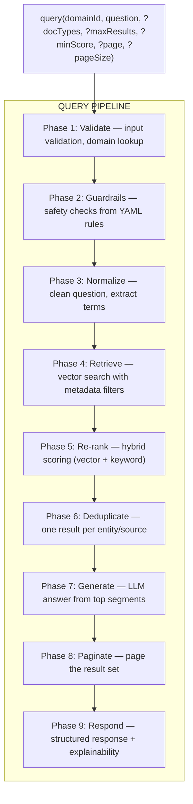

# Query Pipeline — Detailed Design

> Parent: [technical-design.md](./technical-design.md) · Related: [ingestion-pipeline.md](./ingestion-pipeline.md), [domain-configuration-guide.md](./domain-configuration-guide.md)

---

## 1. Pipeline Overview

The query pipeline receives a natural-language question scoped to a domain,
retrieves relevant segments from the vector store, re-ranks them with hybrid scoring,
generates an LLM-powered answer, and returns structured results. The platform supports **English (en)** and **Spanish (es)**; an optional `language` (or `Accept-Language`) is used for stop-word selection and answer language (see [technical-design.md § 22 Supported languages](./technical-design.md#22-supported-languages-english-and-spanish)).



---

## 2. Entry Point

```text
POST /api/v1/{domainId}/query
Content-Type: application/json
Accept-Language: es   # optional; alternative to "language" in body

{
  "question": "Find candidates with Java and Kubernetes, 5+ years experience",
  "docTypes": ["resume", "certification"],
  "maxResults": 50,
  "minScore": 0.75,
  "page": 1,
  "pageSize": 10,
  "language": "en"
}
```

All parameters except `question` are optional. **Language:** optional `language` (e.g. `"en"`, `"es"`); if omitted, `Accept-Language` header or `app.query.default-locale` is used. Supported: **English (en)** and **Spanish (es)**. Used for stop-word selection and to hint answer language to the LLM. Defaults for other parameters are read from `application.yml`.

---

## 3. Phase 1 — Validate

| # | Step | Detail |
|---|---|---|
| 1.1 | Resolve domain | `DomainRegistry.get(domainId)` — 404 if unknown or disabled |
| 1.2 | Validate question | Non-null, non-blank, trimmed |
| 1.3 | Validate docTypes | If provided, each must exist in domain's `doc-types` YAML map |
| 1.4 | Resolve language | If `language` in body or `Accept-Language` present, resolve to supported locale (`en`, `es`); otherwise use `app.query.default-locale` (default `en`). Used in Phase 3 for stop words and in Phase 7 for prompt/answer language. |
| 1.5 | Clamp parameters | `maxResults` clamped to [1, max-allowed-results]; `minScore` clamped to [0.0, 1.0]; `page` >= 1; `pageSize` clamped to [1, 100] |

---

## 4. Phase 2 — Guardrails

Guardrail rules from the domain YAML are evaluated in order. First blocking rule wins.

### Rule evaluation flow

```text
Question: "Rank female candidates with Java skills"
Domain: recruiting

  Rule 1 (term-block, require-both: true):
    trigger-terms: [female] → found "female" ✓
    intent-terms: [rank] → found "rank" ✓
    require-both: true → both present ✓
    → BLOCKED: "I can't rank or filter candidates by protected attributes."

  Rule 2, 3: (not evaluated — first block wins)
```

```text
Question: "Find candidates with Java and Kubernetes"
Domain: recruiting

  Rule 1 (term-block, require-both: true):
    trigger-terms: [female, male, age, ...] → none found ✗
    → PASS

  Rule 2 (pattern-block):
    patterns: ["\\b(ignore|disregard)..."] → no match ✗
    → PASS

  Rule 3 (pattern-block):
    patterns: ["\\b(reveal|show)...secret..."] → no match ✗
    → PASS

  Rule 4 (llm-block, model: "gpt-4o-mini"):
    Prompt: safety policy + query → LLM returns "PASS"
    → PASS

  All rules passed → proceed to Phase 3
```

```text
Question: "Find candidates who would be a good culture fit"
Domain: recruiting

  Rule 1 (term-block): no trigger terms → PASS
  Rule 2 (pattern-block): no pattern match → PASS
  Rule 3 (pattern-block): no pattern match → PASS
  Rule 4 (llm-block, model: "gpt-4o-mini"):
    Prompt: safety policy + query
    LLM response: "BLOCK|'Culture fit' is a common proxy for bias-based filtering"
    → BLOCKED: "This query may contain bias. Please rephrase using objective criteria.
                Reason: 'Culture fit' is a common proxy for bias-based filtering"
```

### Rule type comparison

| Type | Latency | Cost | Catches |
|---|---|---|---|
| `term-block` | ~0ms | Free | Explicit protected terms (gender, age, race) |
| `pattern-block` | ~0ms | Free | Structural attacks (prompt injection, exfiltration) |
| `llm-block` | 200–2000ms | Per-call | Subtle bias, coded language, context-dependent issues |

**Recommended ordering:** deterministic rules first, `llm-block` last. The LLM
rule only runs when deterministic rules pass — avoiding unnecessary LLM calls.
On LLM failure (timeout, error), the rule defaults to PASS.

### Guardrail response format

When blocked, the pipeline short-circuits and returns immediately:

```text
{
  "answer": "I can't rank or filter candidates by protected attributes...",
  "sources": [],
  "page": 1,
  "pageSize": 10,
  "totalSources": 0,
  "explainability": { "matchedTerms": [], "missingTerms": [], "confidence": 0.0 }
}
```

---

## 5. Phase 3 — Normalize & Extract Terms

| # | Step | Detail |
|---|---|---|
| 3.1 | Lowercase | `question.toLowerCase(Locale.ROOT)` |
| 3.2 | Collapse whitespace | Single spaces, trimmed |
| 3.3 | Extract query terms | Tokenize on non-alphanumeric boundaries; filter by: length >= 3, not in general stop words, not in domain stop words from YAML, not a sensitive attribute term |
| 3.4 | Cap terms | Maximum 8 query terms for explainability |

### Example

```text
Question: "Find candidates with Java and Spring Boot experience in Denver"

After normalization: "find candidates with java and spring boot experience in denver"

Stop words removed (general): find, with, and, in
Stop words removed (domain):  candidates

Extracted terms: ["java", "spring", "boot", "experience", "denver"]
```

---

## 6. Phase 4 — Retrieve

Vector similarity search against PGVector with metadata filters.

### Filter construction

```text
Base filter (always applied):
  metadataKey("domain").isEqualTo("recruiting")

Optional doc_type filter (if docTypes parameter provided):
  AND metadataKey("doc_type").isIn(["resume", "certification"])

Optional scope filter (if scopeId provided):
  AND metadataKey(dynamicFilterKey).isEqualTo(scopeId)

Combined:
  domain = "recruiting"
  AND doc_type IN ("resume", "certification")
```

### Retriever configuration

```text
EmbeddingStoreContentRetriever.builder()
  .embeddingStore(embeddingStore)
  .embeddingModel(embeddingModel)
  .maxResults(effectiveMaxResults)    // from request or config default
  .minScore(0.0)                     // retrieve broadly, filter later in re-rank
  .filter(combinedFilter)
  .build()
```

The retriever fetches with `minScore=0.0` intentionally. Actual score filtering
happens in Phase 5 (re-rank) using the hybrid score, not the raw vector score alone.

### What happens inside the retriever

```text
1. Embed the question → query vector (dim=1536)
2. Execute approximate nearest-neighbor search on PGVector (IVFFlat index)
3. Apply metadata filters (domain, doc_type) via WHERE clause on JSONB
4. Return top-N segments with their vector similarity scores
```

---

## 7. Phase 5 — Hybrid Re-rank

Each retrieved segment is re-scored using a weighted combination of vector similarity
and keyword overlap.

### Scoring formula

```text
hybrid_score = (vector_score × 0.8) + (keyword_score × 0.2)
```

### Keyword score calculation

```text
query_terms = ["java", "spring", "boot", "experience", "denver"]

Segment text (lowercased): "...java developer with spring boot framework..."

Matched terms: ["java", "spring", "boot"]   → 3 matches
Missing terms: ["experience", "denver"]      → 2 missing

keyword_score = matched / total = 3 / 5 = 0.60
```

### Combined scoring example

```text
Segment A:
  vector_score  = 0.92
  keyword_score = 0.60
  hybrid_score  = (0.92 × 0.8) + (0.60 × 0.2) = 0.736 + 0.120 = 0.856

Segment B:
  vector_score  = 0.85
  keyword_score = 1.00
  hybrid_score  = (0.85 × 0.8) + (1.00 × 0.2) = 0.680 + 0.200 = 0.880

→ Segment B ranks higher despite lower vector score (all keywords matched)
```

### Threshold filtering

After hybrid scoring, segments below `effectiveMinScore` are discarded:

```text
effectiveMinScore = 0.75 (from request or config)

Segment A: hybrid_score = 0.856 ✓ kept
Segment B: hybrid_score = 0.880 ✓ kept
Segment C: hybrid_score = 0.710 ✗ discarded
```

---

## 8. Phase 6 — Deduplicate

Multiple segments from the same document (or same entity) are collapsed to
the highest-scoring representative.

### Deduplication key resolution

```text
Priority 1: candidate_id (if present) → "candidate:c-a1b2c3d4"
Priority 2: source filename           → "source:resume-maria.pdf"
Priority 3: text content              → "text:<normalized text>"
```

### Example

```text
Before deduplication (6 segments):
  seg0: source=resume-maria.pdf, candidate_id=c-a1b, hybrid=0.88
  seg1: source=resume-maria.pdf, candidate_id=c-a1b, hybrid=0.85   ← same candidate
  seg2: source=cert-aws.pdf,     candidate_id=c-a1b, hybrid=0.82   ← same candidate
  seg3: source=resume-john.pdf,  candidate_id=c-x9y, hybrid=0.80
  seg4: source=resume-john.pdf,  candidate_id=c-x9y, hybrid=0.76   ← same candidate
  seg5: source=contract-nda.pdf, candidate_id="",    hybrid=0.75

After deduplication (3 results):
  candidate:c-a1b → seg0 (highest: 0.88) — represents Maria Lopez
  candidate:c-x9y → seg3 (highest: 0.80) — represents John Doe
  source:contract-nda.pdf → seg5 (0.75)  — no candidate, dedup by source
```

---

## 9. Phase 7 — Generate Answer

The top segments (up to 20) are assembled into a context block, combined with the
domain's prompt template from YAML, and sent to the LLM.

### Model resolution for answer generation

The query model is resolved from the domain's model configuration:

```text
1. Domain-level 'models.query'         → e.g. "gpt-4o" (user-facing, quality matters)
2. App-level 'app.models.default-model' → global fallback

Note: this is independent of the extraction model. A domain might use
"gpt-4o-mini" for extraction (high volume, low cost) but "gpt-4o"
for answer generation (user-facing, quality-sensitive).
```

### Prompt assembly

```text
Resolve model: domain.models.query = "gpt-4o"

domain.prompts.query (from YAML):
  "Answer the question based only on the following resume excerpts.
   List people or skills mentioned when relevant.
   ...
   Context: %s
   Question: %s"

Context = top 20 segments joined by "\n\n"
Question = original user question

Final prompt = String.format(template, context, question)

Call ChatModel["gpt-4o"].chat(prompt) → answer
```

### Fallback when LLM fails

If the ChatModel throws a timeout or error, the engine generates an extractive
fallback answer using the domain's `prompts.fallback` template:

```text
"Found 5 matching excerpts. Ranking is based on hybrid vector and keyword scoring.
 LLM summarization was unavailable; this is an extractive fallback answer."
```

---

## 10. Phase 8 — Paginate

The full deduplicated result set is sliced into pages:

```text
totalSources = 25 (after dedup)
page = 2, pageSize = 10

startIndex = (2 - 1) × 10 = 10
endIndex   = min(10 + 10, 25) = 20

Page 2 returns results at indices 10–19 (10 items)
```

---

## 11. Phase 9 — Respond

### Response structure

```text
{
  "answer": "ANSWER:\nFound 3 candidates with Java and Kubernetes...\n\nKEY_FINDINGS:...",
  "sources": [
    {
      "text": "...segment text excerpt...",
      "source": "resume-maria.pdf",
      "score": 0.88,
      "rank": 1,
      "candidateId": "c-a1b2c3d4",
      "vectorScore": 0.92,
      "keywordScore": 0.60,
      "matchedTerms": ["java", "spring", "boot"],
      "missingTerms": ["experience", "denver"]
    },
    ...
  ],
  "page": 1,
  "pageSize": 10,
  "totalSources": 25,
  "explainability": {
    "matchedTerms": ["java", "spring", "boot", "kubernetes"],
    "missingTerms": ["denver"],
    "confidence": 0.856
  }
}
```

### Explainability

| Field | Description |
|---|---|
| `matchedTerms` | Union of all matched query terms across top results (max 8) |
| `missingTerms` | Query terms that appeared in no result segment |
| `confidence` | Average hybrid score of the top 3 results |

---

## 12. Caching

Query results are cached in an LRU cache to avoid redundant LLM calls for repeated questions.

### Cache key

```text
QueryCacheKey:
  normalizedQuestion = "find candidates java kubernetes 5 years denver"
  maxResults         = 50
  minScoreKey        = 750    (0.75 × 1000, integer for stable hashing)
  scopeId            = ""
```

### Cache behavior

| Setting | Default | Description |
|---|---|---|
| Max entries | 256 | LRU eviction when exceeded |
| TTL | 15 seconds | Entries expire after this duration |

### In-flight deduplication

Concurrent identical queries share the same computation via `CompletableFuture` coalescing:

```text
Thread-1: query("java kubernetes") → starts computation → future in flight
Thread-2: query("java kubernetes") → sees in-flight future → waits on it
Thread-1: computation completes → both threads get the same result
```

---

## 13. Configuration Reference

```yaml
# Query-related settings in application.yml
app:
  rag:
    max-results: ${RAG_MAX_RESULTS:50}
    max-allowed-results: ${RAG_MAX_ALLOWED_RESULTS:200}
    min-score: ${RAG_MIN_SCORE:0.75}
    no-results-answer: "I couldn't find relevant information."
    retriever:
      static-filter:
        metadata-key: ${RAG_RETRIEVER_STATIC_FILTER_KEY:}
        metadata-value: ${RAG_RETRIEVER_STATIC_FILTER_VALUE:}
      dynamic-filter:
        metadata-key: ${RAG_RETRIEVER_DYNAMIC_FILTER_KEY:}
```

**Embedding and chat models:** Production = benchmark-grade; development = free/low-cost (in-process, OpenRouter free). See [model-recommendations.md](./model-recommendations.md). Query model is set per domain in `models.query`.
