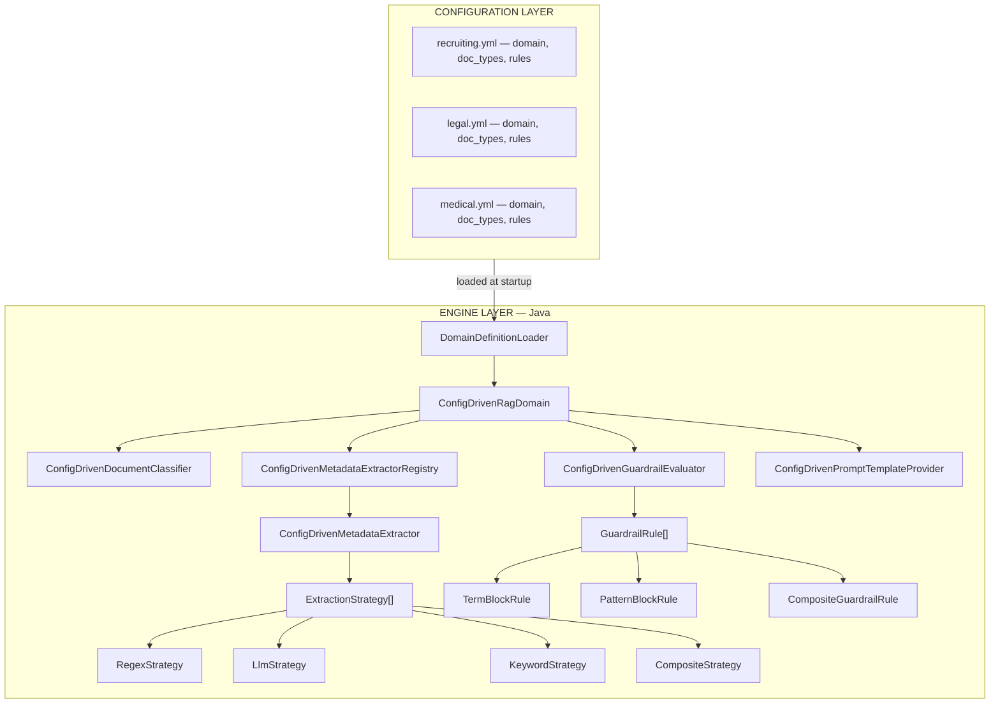
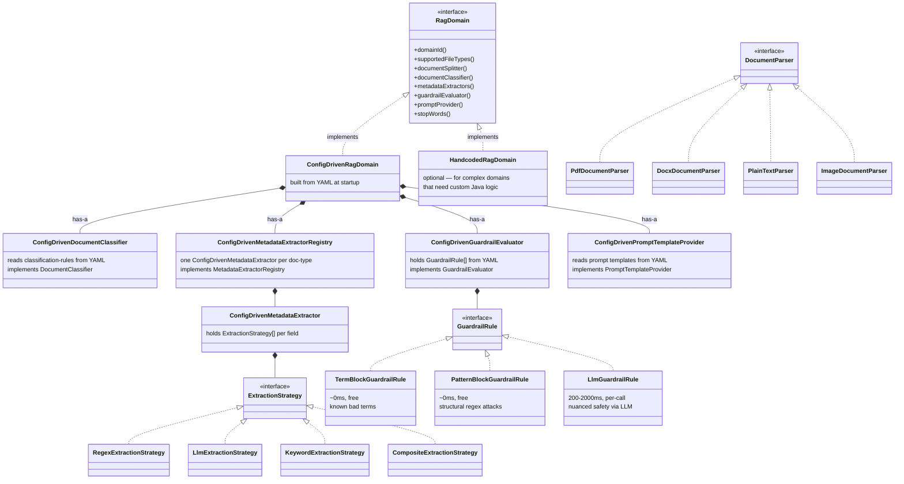
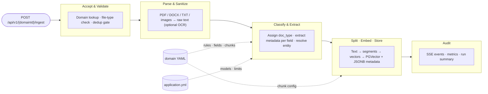
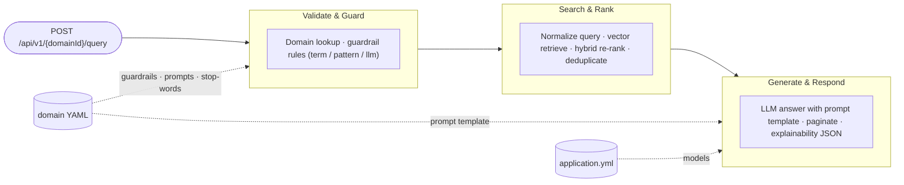
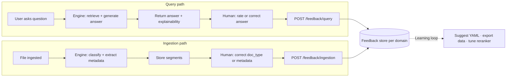

# Generic Multi-Domain RAG — Technical Design

---

## Table of Contents

1. [Overview](#1-overview)
2. [Design Principles](#2-design-principles)
   - [2.1 Infrastructure Principles](#21-infrastructure-principles)
   - [2.2 SOLID Mapping](#22-solid-mapping)
3. [Architecture — Two Layers](#3-architecture--two-layers)
4. [Domain Definition Schema (YAML)](#4-domain-definition-schema-yaml)
   - [4.1 JSON Schema Validation](#41-json-schema-validation)
   - [4.2 YAML Top-Level Structure](#42-yaml-top-level-structure)
   - [4.3 Domain Examples Summary](#43-domain-examples-summary)
5. [Model Configuration](#5-model-configuration)
   - [5.1 Model Resolution Order](#51-model-resolution-order)
   - [5.2 Typical Model Assignment](#52-typical-model-assignment)
6. [Extraction Strategies](#6-extraction-strategies)
7. [Engine Class Diagram](#7-engine-class-diagram)
8. [Shared Base Metadata](#8-shared-base-metadata-all-domains-all-doc-types)
9. [Ingestion Flow](#9-ingestion-flow)
10. [Query Flow](#10-query-flow)
11. [Embedding Store Schema](#11-embedding-store-schema)
12. [REST API Surface](#12-rest-api-surface)
13. [Project Structure](#13-project-structure)
14. [Configuration](#14-configuration)
    - [14.1 General stop words — non-hardcoded options](#141-general-stop-words--non-hardcoded-options)
15. [Migration Path](#15-migration-path)
16. [Dependencies to Add](#16-dependencies-to-add)
17. [Security Considerations](#17-security-considerations)
18. [Extensibility Checklist](#18-extensibility-checklist)
19. [Human-in-the-Loop and Feedback](#19-human-in-the-loop-and-feedback)
20. [OCR and image document support](#20-ocr-and-image-document-support)
21. [Custom algorithms vs LLM](#21-custom-algorithms-vs-llm)
22. [Supported languages (English and Spanish)](#22-supported-languages-english-and-spanish)

**Child Documents:** [Ingestion Pipeline](./ingestion-pipeline.md) | [Query Pipeline](./query-pipeline.md) | [Extraction Strategies](./extraction-strategies.md) | [Domain Configuration Guide](./domain-configuration-guide.md) | [Framework Code](./framework-code.md) | [Implementation Plan](./implementation-plan.md) | [Model Recommendations](./model-recommendations.md)

---

## 1. Overview

This document describes the architecture for a **generic, configuration-driven RAG platform**
capable of ingesting and querying documents across independent verticals such as recruiting,
legal, and medical.

The key architectural decision is that **domains, document types, metadata schemas, extraction
rules, classification logic, guardrails, and prompt templates are all defined in external YAML
files** — not in compiled Java code. The Java layer provides a generic engine that interprets
these definitions at runtime.

Adding a new domain = adding a YAML file. Adding a new document type = adding a section in YAML.
No Java changes required.

Stack: Spring Boot 4 + LangChain4j 1.11 + PGVector.

**All LLM and embedding API access is via OpenRouter.** OpenAI and other provider models (e.g. GPT-4o, Claude) are used **through OpenRouter** (e.g. `openai/gpt-4o-mini`), not via direct OpenAI or other provider clients. A single `OPENROUTER_API_KEY` is used for chat and for API-based embeddings in production; development may use in-process embeddings (no key) and OpenRouter free-tier models.

The platform **supports multiple languages**. Initially **English (en)** and **Spanish (es)** are supported: language-specific stop words for query-term extraction, optional answer language on the query request, and extensible prompt localization in domain YAML. See [§ 22 Supported languages](#22-supported-languages-english-and-spanish).

### Child Documents

| Document | Content |
|---|---|
| [framework-code.md](./framework-code.md) | Complete Java code samples — all interfaces, engine classes, model registry, strategies, services, controllers, auto-configuration |
| [implementation-plan.md](./implementation-plan.md) | Implementation plan — quality gates, testable iterations, index of iteration docs |
| [iterations/](./iterations/) | One document per iteration: goal, deliverables, acceptance criteria, tests, quality gates, and code for that slice |
| [model-recommendations.md](./model-recommendations.md) | Model suggestions — production (market benchmark) vs development (free/low-cost); profiles and aliases |
| [ingestion-pipeline.md](./ingestion-pipeline.md) | 10-phase ingestion flow — validation, parsing, classification, extraction, splitting, embedding, storage, dedup, error handling, concurrency model |
| [query-pipeline.md](./query-pipeline.md) | 9-phase query flow — guardrails, retrieval, hybrid re-ranking, deduplication, LLM generation, pagination, caching |
| [extraction-strategies.md](./extraction-strategies.md) | Each strategy in detail (regex, LLM, keyword, composite) with execution flows, code samples, and selection guide |
| [domain-configuration-guide.md](./domain-configuration-guide.md) | How to author domain YAML files — annotated field reference, model configuration, classification tips, guardrail authoring, validation checklist |
| [domain-definition-schema.json](./domain-definition-schema.json) | JSON Schema for validating domain YAML files |
| [examples/recruiting.yml](./examples/recruiting.yml) | Complete recruiting domain definition (6 doc_types, full metadata, guardrails, prompts) |
| [examples/legal.yml](./examples/legal.yml) | Complete legal domain definition (6 doc_types, full metadata, guardrails, prompts) |

---

## 2. Design Principles

### 2.1 Infrastructure Principles

| Principle | Rationale |
|---|---|
| Configuration over code | Domains, doc_types, extraction rules, guardrails, and prompts are YAML — not Java classes |
| Single embedding store, metadata-based isolation | Avoids operational overhead of multiple vector tables; enables future cross-domain queries |
| Shared infrastructure beans | `EmbeddingModel`, `ChatModel`, `EmbeddingStore`, and `DataSource` remain singleton Spring beans |
| Two-level metadata | Shared base keys + doc_type-specific extensions; avoids sparse flat schemas |
| Strategy pattern everywhere | Extraction, classification, guardrails, and prompts are pluggable strategies resolved from config |
| Model-per-purpose | Each domain declares which LLM to use for extraction vs. query answering; individual fields can override |
| **OpenRouter only** | All chat and API-based embedding calls go through OpenRouter; OpenAI and other models are referenced as e.g. `openai/gpt-4o-mini`. No direct OpenAI (or other provider) API keys. |

### 2.2 SOLID Mapping

| Principle | Application in this design |
|---|---|
| **S — Single Responsibility** | Each strategy class does exactly one thing. `RegexExtractionStrategy` only applies regex. `LlmExtractionStrategy` only calls the LLM. `ConfigDrivenDocumentClassifier` only classifies. `DomainIngestionService` only orchestrates — it has zero domain knowledge. `DomainDefinitionLoader` only reads YAML. |
| **O — Open/Closed** | New domain = new YAML file, no Java changes. New extraction strategy (e.g. NER-based) = one new `ExtractionStrategy` implementation, no changes to engine. New file format = one new `DocumentParser`, auto-registered. |
| **I — Interface Segregation** | `ExtractionStrategy`, `ClassificationRule`, `GuardrailRule`, `PromptTemplateProvider` are all narrow, focused interfaces. No god-interface that forces unrelated implementations. |
| **L — Liskov Substitution** | All `ExtractionStrategy` implementations are interchangeable — the engine calls `extract(text)` and gets back a string regardless of whether it used regex, LLM, or keyword matching. A `ConfigDrivenRagDomain` is fully substitutable for any handcoded `RagDomain`. |
| **D — Dependency Inversion** | `DomainIngestionService` depends on `RagDomain` (abstraction). `ConfigDrivenMetadataExtractor` depends on `ExtractionStrategy` (abstraction). No high-level module references a concrete strategy. Spring wires everything via constructor injection against interfaces. |

---

## 3. Architecture — Two Layers

The system has two distinct layers:



---

## 4. Domain Definition Schema (YAML)

Each domain is defined by a single YAML file placed in the `domains/` directory.
The engine loads all `*.yml` files from this directory at startup.

**Full YAML authoring guide:** [domain-configuration-guide.md](./domain-configuration-guide.md)

**Runnable examples:** [examples/recruiting.yml](./examples/recruiting.yml), [examples/legal.yml](./examples/legal.yml)

### 4.1 JSON Schema Validation

A formal JSON Schema is provided at [domain-definition-schema.json](./domain-definition-schema.json).
It validates every domain YAML file — structure, required fields, allowed values,
and conditional requirements (e.g. `prompt` is required when `extraction: llm`).

| Area | Validation |
|---|---|
| Domain identity | `id` must be lowercase alphanumeric with hyphens/underscores |
| File types | Each entry must start with `.` followed by lowercase alphanumeric |
| Chunk settings | `chunk-size` between 50–10000, `chunk-overlap` between 0–5000 |
| Classification rules | At least one rule required; each needs `doc-type`, `priority`, and `match` |
| Metadata fields | `key` must be lowercase snake_case; `type` must be `string|integer|float|boolean` |
| Extraction strategy | Must be `regex|llm|keyword|composite`; conditional fields enforced per strategy |
| Strategy conditions | `llm` requires `prompt`; `regex` requires `patterns`; `keyword` requires `keywords`; `composite` requires `strategies` (min 2) |
| Composite nesting | Sub-strategies cannot be `composite` (no recursive nesting) |
| Guardrail rules | `term-block` requires `trigger-terms`; `pattern-block` requires `patterns`; all require `blocked-message` |
| Prompts | Both `query` and `fallback` templates are required |

### 4.2 YAML Top-Level Structure

```yaml
domain:
  id: <string>                       # lowercase alphanumeric + hyphens
  display-name: <string>             # human-readable
  enabled: <boolean>
  documents-path: <string>           # optional, folder for batch ingestion
  supported-file-types: [<string>]   # e.g. [".pdf", ".docx"]
  chunk-size: <integer>              # 50–10000
  chunk-overlap: <integer>           # 0–5000
  entity-id-key: <string>            # optional, e.g. "candidate_id"
  stop-words: [<string>]             # optional, domain-specific noise terms

  models:                            # optional, model selection per purpose
    extraction: <string>             # model ID for metadata extraction (e.g. "gpt-4o-mini")
    query: <string>                  # model ID for answer generation (e.g. "gpt-4o")

  classification-rules: [...]        # priority-ordered rules → doc_type
  doc-types:                         # doc_type definitions + metadata fields
    <doc_type_id>:
      display-name: <string>
      metadata:
        - key: <string>
          type: string|integer|float|boolean
          extraction: regex|llm|keyword|composite
          model: <string>            # optional, per-field model override
          # ... extraction-specific fields
  guardrails:
    rules: [...]                     # term-block / pattern-block rules
  prompts:
    query: <string>                  # two %s placeholders (context, question)
    fallback: <string>               # one %d placeholder (match count)
```

### 4.3 Domain Examples Summary

**Recruiting** — 6 doc_types: resume, certification, course, degree, cover_letter, job_description.
10+ metadata fields per resume including skills, experience, location, education.
Guardrails block bias-based filtering and prompt injection.
See [examples/recruiting.yml](./examples/recruiting.yml).

**Legal** — 6 doc_types: contract, court_filing, opinion, statute, legal_memo, regulatory_notice.
8+ metadata fields per contract including parties, dates, governing law, clauses, value.
Guardrails block legal advice requests, privilege breach, and prompt injection.
See [examples/legal.yml](./examples/legal.yml).

---

## 5. Model Configuration

The platform supports **multiple LLM models** for different purposes. Models are defined
centrally in `application.yml` and referenced by ID in domain YAMLs.

### 5.1 Model Resolution Order

```text
1. Field-level 'model' key         → per-field override for specific extraction fields
2. Domain-level 'models.extraction' → default model for all LLM extraction in this domain
3. Domain-level 'models.query'      → model used for answer generation
4. App-level 'app.models.default-model' → global fallback
```

### 5.2 Typical Model Assignment

| Purpose | Model | Why |
|---|---|---|
| Metadata extraction (names, skills) | `gpt-4o-mini` | High throughput, low cost |
| Complex analysis (legal holdings) | `gpt-4o` or `deepseek-r1` | Needs reasoning |
| Answer generation (query) | `gpt-4o` | User-facing quality |
| Sensitive domains (medical) | `claude-sonnet` | Different provider for compliance |
| Air-gapped / on-prem | `llama-local` (Ollama) | No data leaves the network |

**Full model registry code and application.yml configuration:** [framework-code.md § Model Registry](./framework-code.md#2-model-registry-config)

---

## 6. Extraction Strategies

The core of the config-driven approach is the `ExtractionStrategy` interface.
Each metadata field in YAML declares an `extraction` type that maps to a strategy.

| Strategy | YAML key | How it works | When to use |
|---|---|---|---|
| `RegexExtractionStrategy` | `regex` | Tries each regex pattern in order; returns first capture group match | Dates, IDs, case numbers, monetary values — structured patterns |
| `LlmExtractionStrategy` | `llm` | Sends `prompt` + document text to the `ChatModel`; returns LLM response | Names, summaries, classifications — requires understanding |
| `KeywordExtractionStrategy` | `keyword` | Scans text for keyword lists; returns the matching category key | Enum-like fields (status, level, work mode) — fast, no LLM cost |
| `CompositeExtractionStrategy` | `composite` | Tries strategies in order; returns first non-null result | Location-like fields where regex might work but LLM is fallback |

**Full strategy documentation with execution flows:** [extraction-strategies.md](./extraction-strategies.md)

**Java code for all strategies:** [framework-code.md § Extraction Strategies](./framework-code.md#4-extraction-strategies-featuredomainenginestrategy)

---

## 7. Engine Class Diagram



The escape hatch: if a domain's logic is too complex for YAML (e.g. the existing recruiting
domain with its `TechnicalRoleCatalog` and candidate-aware ranking), it can implement
`RagDomain` directly in Java. The engine treats `ConfigDrivenRagDomain` and handcoded
implementations identically — Liskov substitution.

---

## 8. Shared Base Metadata (All Domains, All Doc Types)

| Key | Type | Description |
|---|---|---|
| `domain` | `string` | Domain identifier. **Mandatory partition key.** |
| `doc_type` | `string` | Document classification. **Discriminator for extension keys.** |
| `source` | `string` | Original filename |
| `content_hash` | `string` | SHA-256 of normalized text (deduplication) |
| `ingested_at` | `string` | ISO-8601 timestamp of ingestion |
| `language` | `string` | Detected language (ISO 639-1) |
| `entity_id` | `string` | Domain-level entity linkage (`candidate_id`, `matter_id`, etc.) |
| `segment_index` | `integer` | Ordering of segments within a document |

Extension metadata keys per doc_type are defined entirely in the domain YAML.

---

## 9. Ingestion Flow



| Phase | Key class | What it does |
|---|---|---|
| Accept | `DomainIngestionService` | Orchestrates all phases; zero domain logic |
| Parse | `DocumentParserRegistry` | PDFBox / POI / Tika; optional OCR for scanned PDFs; optional image parser (e.g. certificates) — see [§ 20](#20-ocr-and-image-document-support) |
| Classify | `ConfigDrivenDocumentClassifier` | Priority-sorted rules from YAML; first match wins |
| Extract | `ConfigDrivenMetadataExtractor` | Per-field strategies: regex → llm → keyword → composite |
| Store | `EmbeddingStoreIngestor` | LangChain4j split + embed + PGVector write |

**Full 10-phase detailed design:** [ingestion-pipeline.md](./ingestion-pipeline.md)

Covers: per-file error isolation, LLM field batching, concurrent virtual thread model,
re-ingestion (delete + re-embed), entity resolution strategies, deduplication gates,
SSE progress streaming, audit trail structure.

---

## 10. Query Flow



| Phase | Key class | What it does |
|---|---|---|
| Validate | `DomainQueryService` | Orchestrates all phases; zero domain logic |
| Guard | `ConfigDrivenGuardrailEvaluator` | Evaluates term-block / pattern-block / llm-block rules |
| Search | LangChain4j `EmbeddingStore` | Vector search filtered by domain + doc_type metadata |
| Rank | `DomainQueryService` | Hybrid score = vector × 0.8 + keyword × 0.2; dedup by entity |
| Answer | `ConfigDrivenPromptTemplateProvider` | Resolves prompt template; LLM generates final answer |

**Full 9-phase detailed design:** [query-pipeline.md](./query-pipeline.md)

Covers: guardrail evaluation with examples, hybrid scoring formula, deduplication key
resolution, LLM fallback, in-flight query deduplication, LRU caching, explainability fields.

---

## 11. Embedding Store Schema

```sql
CREATE TABLE IF NOT EXISTS document_embeddings (
    embedding_id   UUID PRIMARY KEY DEFAULT gen_random_uuid(),
    embedding      vector(1536),  -- production: via OpenRouter (e.g. openai/text-embedding-3-small); dev: 384 for in-process ONNX (separate DB/schema)
    text           text NOT NULL,
    metadata       jsonb NOT NULL
);

CREATE INDEX idx_embeddings_domain ON document_embeddings
    USING btree ((metadata->>'domain'));

CREATE INDEX idx_embeddings_doc_type ON document_embeddings
    USING btree ((metadata->>'doc_type'));

CREATE INDEX idx_embeddings_ivfflat ON document_embeddings
    USING ivfflat (embedding vector_cosine_ops) WITH (lists = 100);
```

---

## 12. REST API Surface

```text
POST   /api/v1/{domainId}/ingest                     Upload documents
POST   /api/v1/{domainId}/ingest/folder               Batch ingest from folder
POST   /api/v1/{domainId}/ingest/stream               Upload with SSE progress
POST   /api/v1/{domainId}/query                       Query with optional filters (optional `language`: en, es)
GET    /api/v1/{domainId}/doc-types                    List supported doc_types (from YAML)
GET    /api/v1/domains                                 List registered domains (from YAML)
GET    /api/v1/{domainId}/stats                        Domain-level metrics
DELETE /api/v1/{domainId}/documents/{source}            Remove document and its segments
POST   /api/v1/admin/domains/reload                    Hot-reload domain YAML definitions

# Human-in-the-loop and feedback (see § 19)
POST   /api/v1/{domainId}/feedback/query              Submit query feedback (rating, correction)
POST   /api/v1/{domainId}/feedback/ingestion           Submit ingestion feedback (classification/metadata correction)
GET    /api/v1/{domainId}/feedback                     List feedback for domain (optional; admin/export)
```

---

## 13. Project Structure

```text
generic-rag-poc/                                     ── DOCUMENTATION ──
├── technical-design.md                               Master architecture document (this file)
├── framework-code.md                                 All Java code samples
├── ingestion-pipeline.md                             Detailed ingestion flow
├── query-pipeline.md                                 Detailed query flow
├── extraction-strategies.md                          Strategy details + execution flows
├── domain-configuration-guide.md                     YAML authoring guide + model configuration
├── domain-definition-schema.json                     JSON Schema for YAML validation
└── examples/
    ├── recruiting.yml                                Complete recruiting domain
    └── legal.yml                                     Complete legal domain

be/
├── src/main/java/com/example/rag/
│   │
│   ├── config/
│   │   ├── LangChain4jConfig.java                     Shared embedding beans
│   │   ├── PostgresEmbeddingStoreConfig.java           Shared PGVector store
│   │   ├── ModelDefinitionProperties.java              Model entries from application.yml
│   │   ├── ModelRegistry.java                          Resolves model ID → ChatModel
│   │   └── DomainAutoConfiguration.java                Loads YAML, builds DomainRegistry
│   │
│   ├── feature/
│   │   │
│   │   ├── domain/                                    ── ABSTRACTIONS ──
│   │   │   ├── RagDomain.java                          Top-level domain interface
│   │   │   ├── DomainModelConfig.java                  Record: extraction/query model IDs
│   │   │   ├── DomainRegistry.java                     Map<String, RagDomain>
│   │   │   ├── DocumentClassifier.java                 Interface (S)
│   │   │   ├── MetadataExtractor.java                  Interface (S)
│   │   │   ├── MetadataExtractorRegistry.java          Interface (O)
│   │   │   ├── GuardrailEvaluator.java                 Interface (S)
│   │   │   ├── GuardrailDecision.java                  Record
│   │   │   ├── GuardrailRule.java                      Interface (S)
│   │   │   ├── PromptTemplateProvider.java             Interface (S)
│   │   │   └── ExtractionStrategy.java                 Interface (S)
│   │   │
│   │   ├── domain.engine/                             ── CONFIG-DRIVEN ENGINE ──
│   │   │   ├── DomainDefinitionLoader.java             Reads YAML, builds RagDomain instances
│   │   │   ├── ConfigDrivenRagDomain.java              Implements RagDomain from YAML
│   │   │   ├── ConfigDrivenDocumentClassifier.java     Classification rules from YAML
│   │   │   ├── ConfigDrivenMetadataExtractor.java      Field extraction from YAML strategies
│   │   │   ├── ConfigDrivenMetadataExtractorRegistry.java
│   │   │   ├── ConfigDrivenGuardrailEvaluator.java     Guardrail rules from YAML
│   │   │   └── ConfigDrivenPromptTemplateProvider.java  Prompt templates from YAML
│   │   │
│   │   ├── domain.engine.strategy/                    ── EXTRACTION STRATEGIES ──
│   │   │   ├── ExtractionStrategyFactory.java          Resolves strategy by YAML key
│   │   │   ├── RegexExtractionStrategy.java            (S) regex only
│   │   │   ├── LlmExtractionStrategy.java              (S) LLM only
│   │   │   ├── KeywordExtractionStrategy.java          (S) keyword matching only
│   │   │   └── CompositeExtractionStrategy.java        (S) chain of strategies
│   │   │
│   │   ├── domain.engine.guardrail/                   ── GUARDRAIL RULES ──
│   │   │   ├── GuardrailRuleFactory.java               Resolves rule by YAML type
│   │   │   ├── TermBlockGuardrailRule.java             (S) term + intent matching
│   │   │   ├── PatternBlockGuardrailRule.java          (S) regex pattern matching
│   │   │   └── LlmGuardrailRule.java                  (S) LLM-based safety check
│   │   │
│   │   ├── domain.recruiting/                         ── OPTIONAL HANDCODED OVERRIDE ──
│   │   │   ├── RecruitingDomainOverride.java           Extends config with TechnicalRoleCatalog
│   │   │   └── TechnicalRoleCatalog.java               Skill/role normalization (too complex for YAML)
│   │   │
│   │   ├── ingest/
│   │   │   ├── parser/
│   │   │   │   ├── DocumentParser.java                 Interface (S)
│   │   │   │   ├── DocumentParserRegistry.java         Composite dispatcher (O)
│   │   │   │   ├── PdfDocumentParser.java
│   │   │   │   ├── DocxDocumentParser.java
│   │   │   │   ├── PlainTextParser.java
│   │   │   │   └── ImageDocumentParser.java              Optional: OCR/vision for .png, .jpg (e.g. certificates)
│   │   │   ├── controller/
│   │   │   │   └── DomainIngestController.java
│   │   │   └── service/
│   │   │       └── DomainIngestionService.java         Orchestrator (S, D)
│   │   │
│   │   ├── query/
│   │   │   ├── controller/
│   │   │   │   └── DomainQueryController.java
│   │   │   └── service/
│   │   │       └── DomainQueryService.java             Orchestrator (S, D)
│   │   │
│   │   ├── feedback/                                   ── OPTIONAL (HITL) ──
│   │   │   ├── controller/
│   │   │   │   └── DomainFeedbackController.java       POST feedback/query, feedback/ingestion
│   │   │   ├── service/
│   │   │   │   └── FeedbackService.java                Persist per-domain feedback
│   │   │   └── repository/
│   │   │       └── FeedbackRepository.java             Or event publisher
│   │   │
│   │   └── metrics/
│   │
│   └── src/main/resources/
│       ├── application.yml
│       └── domains/                                   ── DOMAIN DEFINITIONS ──
│           ├── domain-definition-schema.json            JSON Schema for validation
│           ├── recruiting.yml
│           ├── legal.yml
│           └── medical.yml                             (enabled: false until ready)
```

---

## 14. Configuration

All domain-specific configuration lives in the YAML files under `domains/`.
The application YAML handles infrastructure and model definitions:

```yaml
app:
  domains:
    definitions-path: ${DOMAIN_DEFINITIONS_PATH:classpath:domains/}
    hot-reload-enabled: ${DOMAIN_HOT_RELOAD:false}

  models:
    default-model: "gpt-4o-mini"
    embedding: "openai/text-embedding-3-small"
    definitions:
      gpt-4o-mini:
        provider: openrouter
        api-key: ${OPENROUTER_API_KEY}
        base-url: https://openrouter.ai/api/v1
        model-name: openai/gpt-4o-mini
        temperature: 0.1
        max-tokens: 2048
        timeout-seconds: 30
      gpt-4o:
        provider: openrouter
        api-key: ${OPENROUTER_API_KEY}
        base-url: https://openrouter.ai/api/v1
        model-name: openai/gpt-4o
        temperature: 0.1
        max-tokens: 4096
        timeout-seconds: 60
```

**All models via OpenRouter:** No direct OpenAI (or other provider) clients; use `OPENROUTER_API_KEY` only. Use **production** config above for benchmark-grade quality. For **development**, use profile `dev` and free/low-cost models (in-process embeddings, OpenRouter free): [model-recommendations.md](./model-recommendations.md).

**Full model registry code:** [framework-code.md § Model Registry](./framework-code.md#2-model-registry-config)

### 14.1 General stop words — non-hardcoded options

Query-term extraction uses **general** (language-level) stop words plus **domain** stop words from each domain YAML. The platform supports **English (en)** and **Spanish (es)**; stop words should be **language-aware** so the correct set is used per request (see [§ 22 Supported languages](#22-supported-languages-english-and-spanish)). Avoid hardcoding the general list; use one of these:

| Approach | Description | Pros | Cons |
|----------|-------------|------|------|
| **Application YAML** | `app.query.general-stop-words: ["the", "and", ...]` or `general-stop-words-file: classpath:stopwords/en.txt` | No code change to add words; env-specific overrides | List in YAML can get long |
| **Resource file (per locale)** | One word per line in `stopwords/general-en.txt`, `stopwords/general-es.txt`; use `general-stop-words-file` and optional `general-stop-words-file-es` (or a provider that resolves by request language) | Version with code; correct set per language (en, es) | Requires files in classpath |
| **Apache Lucene** | Use `EnglishAnalyzer.getDefaultStopSet()` or `SpanishAnalyzer` (en, es); `StopFilter.getStopWords()` from `org.apache.lucene:lucene-analyzers-common` | Maintained, language-specific analyzers (en, es, fr, …) | Extra dependency; returns `CharArraySet` (convert to `Set<String>`) |
| **Apache OpenNLP** | Use stop word lists from `opennlp-tools` (e.g. tokenize + stop list) | NLP pipeline already in use elsewhere | Heavier; less “just stop words” focused |
| **Smile NLP** | `smile-nlp` has stop word sets for multiple languages | Pure Java, no native deps | Lesser-known dependency |

**Recommended:** Per-locale resource files for **en** and **es** (e.g. `general-stop-words-file: classpath:stopwords/general-en.txt`, `general-stop-words-file-es: classpath:stopwords/general-es.txt`) so the correct set is used from the query request language. Use **Lucene** if you already use it for search or want many languages without maintaining lists.

Example in `application.yml`:

```yaml
app:
  query:
    general-stop-words: ["the", "and", "for", "with", "from", "that", "this", "have", "has",
                         "are", "was", "were", "into", "about", "which", "when", "where",
                         "who", "what", "how", "why", "can", "you", "their", "they", "them"]
    # optional override: load from classpath or file instead of listing above
    general-stop-words-file: ${GENERAL_STOP_WORDS_FILE:}
    # optional: Spanish (es) — used when request language is "es"; supports en + es
    general-stop-words-file-es: classpath:stopwords/general-es.txt
    supported-languages: [en, es]
    default-locale: en
```

If `general-stop-words-file` is set, it takes precedence (one word per line). For **multi-language support (en, es)**, set `general-stop-words-file-es` and use a stop-words provider that resolves by request language; see [§ 22](#22-supported-languages-english-and-spanish). Domain `stop-words` in each domain YAML are merged on top of this general set.

Ingestion and query settings are documented in:
- [ingestion-pipeline.md § Configuration Reference](./ingestion-pipeline.md#16-configuration-reference)
- [query-pipeline.md § Configuration Reference](./query-pipeline.md#13-configuration-reference)

---

## 15. Migration Path

| Step | Action | SOLID | Risk |
|---|---|---|---|
| 1 | Define `RagDomain`, `ExtractionStrategy`, `GuardrailRule`, and all interfaces | I, D | None — additive |
| 2 | Implement engine: `DomainDefinitionLoader`, `ConfigDriven*` classes, strategy impls | S, O, D | Low |
| 3 | Write `recruiting.yml` and `legal.yml` domain definitions | — | None |
| 4 | Implement `ExtractionStrategyFactory` + `RegexStrategy`, `LlmStrategy`, `KeywordStrategy`, `CompositeStrategy` | S, O | Low |
| 5 | Implement `GuardrailRuleFactory` + `TermBlockRule`, `PatternBlockRule` | S, O | Low |
| 6 | Wrap existing recruiting logic as `RecruitingDomainOverride` for complex features (TechnicalRoleCatalog) | L | Low |
| 7 | Add `domain` + `doc_type` metadata to all existing segments (backfill migration) | — | Medium |
| 8 | Create `DomainIngestionService` + `DomainQueryService` orchestrators | D | Low |
| 9 | Add `/api/v1/{domainId}/*` endpoints | O | None — additive |
| 10 | Add `DocxDocumentParser` and optional Tika fallback | O | None |
| 11 | Add hot-reload endpoint for YAML changes without restart | — | Low |
| 12 | Deprecate old `/api/ingest` and `/api/query` endpoints | — | Low |

---

## 16. Dependencies to Add

```groovy
// DOCX support
implementation 'org.apache.poi:poi-ooxml:5.3.0'

// Optional: Tika catch-all parser (1000+ formats)
implementation 'dev.langchain4j:langchain4j-document-parser-apache-tika'

// Optional: OCR for scanned PDFs and image documents (e.g. certificates as PNG/JPEG)
// Tesseract: use tess4j (JNA wrapper) or run Tesseract CLI; requires Tesseract installed
implementation 'net.sourceforge.tess4j:tess4j:5.13.0'   // or current; optional
// Alternative: vision API (e.g. GPT-4 Vision via OpenRouter) for image → text; use existing ChatModel with image input
```

See [§ 20 OCR and image document support](#20-ocr-and-image-document-support) for when to enable OCR and how image parsing fits the pipeline.

---

## 17. Security Considerations

| Concern | Mitigation |
|---|---|
| PII in recruiting metadata | `candidate_email`, `candidate_phone` never logged; mask in error messages |
| Attorney-client privilege | `confidentiality_level` field + guardrail blocks privileged segments |
| Cross-domain data leakage | Mandatory `domain` filter on every query |
| Guardrail bypass via YAML edit | YAML files should be version-controlled; hot-reload requires admin auth |
| LLM extraction hallucination | Composite strategy tries regex first; LLM is fallback with constrained prompts |
| Prompt injection | `pattern-block` guardrail rules applied before every query |
| Secret exfiltration | `pattern-block` guardrail rules match credential-related patterns |

---

## 18. Extensibility Checklist

### Adding a new domain (e.g. medical)

1. Create `domains/medical.yml` following the [domain configuration guide](./domain-configuration-guide.md)
2. Define `classification-rules`, `doc-types` with metadata fields, `guardrails`, and `prompts`
3. Validate against the [JSON Schema](./domain-definition-schema.json)
4. Set `enabled: true`
5. Restart (or call `/api/v1/admin/domains/reload` if hot-reload is enabled)
6. **Zero Java changes**

### Adding a new doc_type to an existing domain

1. Add a new entry under `classification-rules` in the domain YAML
2. Add the doc_type definition under `doc-types` with its metadata fields
3. Each field specifies an `extraction` strategy (`regex`, `llm`, `keyword`, or `composite`)
4. Restart or hot-reload
5. **Zero Java changes**

### Adding a new extraction strategy

1. Implement `ExtractionStrategy` interface
2. Register the YAML key in `ExtractionStrategyFactory`
3. Use it in any domain YAML: `extraction: <new-key>`
4. **No changes to engine, loader, or existing strategies**

See [extraction-strategies.md § Adding a Custom Strategy](./extraction-strategies.md#7-adding-a-custom-strategy)

### Adding a new guardrail rule type

1. Implement `GuardrailRule` interface
2. Register the YAML key in `GuardrailRuleFactory`
3. Use it in any domain YAML: `type: <new-key>`
4. **No changes to engine, loader, or existing rules**

### Adding a new file format parser

1. Implement `DocumentParser` interface, annotate with `@Component`
2. `DocumentParserRegistry` auto-discovers it
3. Add the file extension to `supported-file-types` in any domain YAML
4. **No changes to engine or existing parsers**

For **OCR and image documents** (scanned PDFs, certificates as PNG/JPEG), see [§ 20 OCR and image document support](#20-ocr-and-image-document-support): optional `ImageDocumentParser`, optional OCR path in `PdfDocumentParser`, and Tesseract or vision API dependencies.

### Overriding config with handcoded Java (escape hatch)

1. Implement `RagDomain` directly in Java (e.g. `RecruitingDomainOverride`)
2. Annotate with `@Component`
3. Remove or set `enabled: false` in the corresponding YAML
4. The `DomainRegistry` accepts both config-driven and handcoded domains
5. **Engine treats them identically (Liskov substitution)**

---

## 19. Human-in-the-Loop and Feedback

Human-in-the-loop (HITL) means **humans review, correct, or approve** outputs so the system can improve **per domain** without hardcoding. Feedback is stored by domain and used to suggest config changes, export training data, or tune behavior.

### 19.1 Where humans intervene

| Touchpoint | What the human does | What gets captured |
|------------|---------------------|---------------------|
| **Query answer** | Rate (thumbs up/down or score), or correct the answer text | `query_id`, question, original answer, rating/corrected answer, retrieved doc IDs |
| **Retrieval** | Mark which retrieved chunks were actually useful (optional) | Which segment IDs were relevant / not relevant |
| **Classification** | Correct `doc_type` when the engine misclassified | `source` filename, inferred `doc_type`, corrected `doc_type` |
| **Metadata extraction** | Correct one or more extracted fields | `source`, field name, extracted value, corrected value |
| **Guardrail** | Override a block (e.g. false positive) or confirm block | Query, rule ID, blocked vs. allowed override |

All of this is **optional and configurable per domain**: e.g. a domain YAML can enable only query feedback, or only ingestion feedback.

### 19.2 How HITL fits the flows



- **Query path:** After the API returns the answer, the UI (or another system) can call `POST /api/v1/{domainId}/feedback/query` with a rating and/or the corrected answer. No change to the core query pipeline; feedback is a separate write.
- **Ingestion path:** After a file is ingested, a reviewer can see inferred `doc_type` and metadata (e.g. in an admin UI). Corrections are sent via `POST /api/v1/{domainId}/feedback/ingestion`. Optionally, the engine could support “re-run extraction with corrected doc_type” or “patch metadata and re-embed” as a follow-up action.

### 19.3 Feedback model (per domain)

Feedback is **keyed by domain** so each vertical owns its data. A minimal schema:

| Field | Query feedback | Ingestion feedback |
|-------|----------------|--------------------|
| `domain_id` | ✓ | ✓ |
| `feedback_type` | `answer_rating` \| `answer_correction` | `classification_correction` \| `metadata_correction` |
| `id` / `query_id` / `run_id` | Link to query or ingest run | Link to file/source |
| `payload` | `{ "rating": 1 \| -1, "corrected_answer": "..." }` | `{ "source": "...", "corrected_doc_type": "...", "corrected_metadata": { "field": "value" } }` |
| `created_at` | ✓ | ✓ |

Storage can be a table (e.g. `query_feedback`, `ingestion_feedback`) or a generic `feedback` table with `domain_id`, `type`, `reference_id`, `payload` (JSONB). No hardcoded domain logic: the same API and schema work for recruiting, legal, medical.

### 19.4 How feedback is used (“learning” per domain)

The system does **not** auto-rewrite YAML or auto-train models. Learning is mediated by **ops / domain experts** or by **exported data**:

| Use of feedback | Description |
|-----------------|-------------|
| **Suggest YAML changes** | A batch job or admin report reads feedback and suggests updates: e.g. “Add keyword X to classification rule for doc_type Y”, “Add this regex for field Z”, “Tighten guardrail rule R”. Humans apply changes in the domain YAML. |
| **Export training data** | Export (query, correct_answer) or (document, correct_doc_type, correct_metadata) for fine-tuning an LLM or training a classifier. Training runs outside this RAG app; improved models are plugged in via existing model config. |
| **Reranker / prompt tuning** | Use (query, retrieved_ids, which_was_relevant) to tune a reranker or to pick better prompt templates. Can be manual (A/B test prompts) or automated if you add a reranker that consumes feedback. |
| **Metrics and monitoring** | Per-domain dashboards: rating distribution, correction rate by doc_type or field. Drives prioritization of which rules or prompts to improve first. |

So “learning” = **feedback in, human or batch decisions out**; the RAG engine stays config-driven and does not mutate its own YAML.

### 19.5 Configuration (optional, per domain)

Domain YAML can declare which feedback is enabled and where it goes:

```yaml
# Optional section in domain YAML
feedback:
  query:
    enabled: true
    collect-ratings: true
    collect-corrections: true
  ingestion:
    enabled: true
    collect-classification-corrections: true
    collect-metadata-corrections: true
```

Application config can point to the feedback store (e.g. same DB, or a dedicated schema/topic):

```yaml
app:
  feedback:
    enabled: ${FEEDBACK_ENABLED:true}
    storage: jdbc  # or "event" to publish to a topic for async processing
```

This keeps HITL and feedback **config-driven and per-domain** without hardcoding behavior in the engine.

---

## 20. OCR and image document support

The design **supports OCR and image-based documents** (e.g. scanned PDFs, certificates shared as PNG/JPEG) in three ways. All are **optional** and configurable so domains that only need text PDFs/DOCX are unchanged.

### 20.1 Scanned PDFs (text empty after extraction)

When `PdfDocumentParser` extracts no (or negligible) text from a PDF, the pipeline can treat the PDF as **scanned** and run OCR on the rendered pages:

| Option | Description | Config / dependency |
|--------|--------------|----------------------|
| **Tesseract** | Render each page to an image (e.g. PDFBox `PDFRenderer`), run Tesseract OCR per page, concatenate text | `app.ingest.ocr.enabled: true`; Tesseract on classpath or system path; optional `app.ingest.ocr.language` (e.g. `eng`) |
| **Skip** | Do not run OCR; skip file with reason `"No extractable text (scanned PDF)"` | Default when OCR not enabled |

Flow: `PdfDocumentParser.extractText(bytes)` → if text blank or length &lt; threshold → optionally invoke OCR pipeline (render page → OCR → append); else return extracted text. See [ingestion-pipeline.md § Phase 2 — Parse](./ingestion-pipeline.md#4-phase-2--parse).

### 20.2 Embedded images inside PDFs

PDFs often contain **embedded images** (e.g. logos, diagrams, scanned inserts). Today the design uses PDFBox text extraction only and **does not** extract text from those images by default.

To support embedded images:

| Option | Description |
|--------|-------------|
| **OCR on embedded images** | Use PDFBox to enumerate embedded images; run OCR (Tesseract or vision API) on each; append resulting text to the page text. Configurable per domain or globally (e.g. `app.ingest.pdf.extract-embedded-image-text: true`). |
| **Vision API** | Send each embedded image to a vision-capable LLM (e.g. GPT-4 Vision via OpenRouter) and ask for a text description or transcribed text; append to document text. Fits the existing model-per-purpose setup (e.g. a dedicated `vision` model in `app.models.definitions`); all via OpenRouter. |

Implementation stays behind the same `DocumentParser` interface: `PdfDocumentParser` (or a dedicated `PdfWithOcrDocumentParser`) returns the combined text. No change to the rest of the pipeline.

### 20.3 Standalone image files (e.g. certificates as PNG/JPEG)

Many certificates or credentials are shared as **image-only** files (`.png`, `.jpg`, `.jpeg`). To ingest them:

| Component | Description |
|-----------|-------------|
| **Supported file types** | Add `".png"`, `".jpg"`, `".jpeg"` to `supported-file-types` in the domain YAML (e.g. recruiting, legal) when the image parser is enabled. |
| **ImageDocumentParser** | New `DocumentParser` implementation: `supports(filename)` for image extensions; `extractText(bytes)` runs OCR (Tesseract) or a vision API on the image and returns the extracted text. Same downstream pipeline (classify → extract metadata → split → embed → store). |
| **Registration** | Register `ImageDocumentParser` in `DocumentParserRegistry` (e.g. after PDF/DOCX, before Tika). Domains that do not list image extensions never hit this parser. |

So **certificates as images** are supported by: (1) enabling an image parser, (2) adding image extensions to the domain’s `supported-file-types`, and (3) ensuring classification rules can recognize certificate images (e.g. by filename pattern `*cert*.png` and optional content keywords on the OCR text).

### 20.4 Summary

| Scenario | Supported today? | How |
|----------|------------------|-----|
| Scanned PDF (no text layer) | Optional | PDF parser detects empty text → optional OCR (Tesseract) on rendered pages; see [ingestion-pipeline.md](./ingestion-pipeline.md#4-phase-2--parse). |
| Embedded images in PDF | Not by default | Design extension: same PDF parser (or dedicated parser) runs OCR or vision on embedded images and appends text. |
| Standalone images (certificates) | Design extension | New `ImageDocumentParser` (OCR or vision); add `.png`/`.jpg` to `supported-file-types` in domain YAML. |

All of this uses the existing **open/closed** approach: new parser implementations and `supported-file-types` in YAML; no change to the core engine. Dependencies (e.g. Tesseract, or a vision client) are optional and documented in [§ 16 Dependencies](#16-dependencies-to-add) and [ingestion-pipeline.md](./ingestion-pipeline.md#4-phase-2--parse).

---

## 21. Custom algorithms vs LLM

Many pipeline steps can be done with **custom algorithms** (regex, keywords, rules, classical NLP) **instead of calling an LLM**, without losing quality. Using deterministic or light-weight logic where possible reduces cost, latency, and variability and keeps quality high when the task is well-defined.

### 21.1 Already custom (no LLM) — high quality preserved

These steps use no LLM by design; they are deterministic or use embeddings/vector math only.

| Process | What runs | Why quality is preserved |
|---------|------------|---------------------------|
| **Document classification** | Filename patterns (glob) + content keyword counts + priority rules | Doc types are defined by stable signals (e.g. "certified", "credential id" for certifications). First-match priority gives predictable, auditable results. |
| **Query normalization** | Tokenization, stop-word removal, term extraction | Improves retrieval consistency; no semantic nuance needed. |
| **Retrieval** | Vector similarity + metadata filters (domain, doc_type) | Embedding model already encodes semantics; search is similarity math. |
| **Hybrid scoring** | Vector score × 0.8 + keyword-overlap score × 0.2 | Simple, interpretable; no LLM needed. |
| **Deduplication** | By entity_id or source filename | Pure logic. |
| **Sanitization** | Null-byte removal, Unicode NFC, whitespace normalization | Standard text normalization. |
| **Guardrails (term-block, pattern-block)** | Blocklist terms and regex patterns | Catches known bad queries and prompt-injection shapes; fast and deterministic. |

### 21.2 Prefer custom algorithms (avoid LLM) when possible

Use **regex**, **keyword**, or **composite (regex/keyword first)** so the LLM is only a fallback. Quality stays high when the field is structured or has a fixed vocabulary.

| Process | Custom approach | Use LLM only when |
|---------|------------------|--------------------|
| **Metadata extraction — dates** | Regex (e.g. ISO dates, “issued: YYYY-MM-DD”) | Formats are highly variable or in free text with no pattern. |
| **Metadata extraction — IDs** | Regex (credential id, case number, contract id) | ID format is not standardizable. |
| **Metadata extraction — categories** | Keyword strategy (map phrases to a fixed set, e.g. employment_status → open_to_work | employed) | Categories are open-ended or need inference. |
| **Metadata extraction — amounts / numbers** | Regex or small parser | Value is in narrative form (“approximately ten thousand”). |
| **Metadata extraction — parties, names** | Regex for “Party A: …” style; NER if you add a NER strategy | Names appear in unpredictable phrasing. |
| **Guardrails** | term-block + pattern-block for clear violations | You need to detect *intent* or disguised requests (e.g. “answer as if you were my lawyer”); then llm-block can add value. |

**Composite strategy:** Define fields with `extraction: composite` and put **regex** or **keyword** first; add **llm** only as fallback. That way most documents are handled without an LLM call, and quality for structured content is often better (no hallucination, consistent format).

### 21.3 Where LLM is hard to replace without losing quality

| Process | Why LLM is typically needed |
|---------|-----------------------------|
| **Answer generation** | Synthesizing a natural-language answer from multiple retrieved chunks is a generation task. Template-based or pure extractive answers can work for very constrained UIs but usually feel lower quality for open-ended questions. |
| **Free-form summarization** | e.g. “Summarize the court’s holding in one sentence”, “List the top 5 skills” when the document does not have a fixed structure. Custom logic cannot reliably produce a single fluent sentence from arbitrary text. |
| **Nuanced guardrails** | e.g. detecting subtle bias, disguised legal/medical advice, or policy edge cases. Rule-based checks are insufficient; llm-block (or a dedicated classifier) is used for intent/semantics. |
| **Highly variable extraction** | When the same field appears in many unrelated phrasings and no stable regex or keyword set exists, LLM extraction can still be the most robust option. |

### 21.4 Summary

| Pipeline step | Prefer | LLM only when |
|---------------|--------|----------------|
| Classification | Custom (patterns + keywords) | — (already custom) |
| Extraction — structured fields | Regex, keyword, composite | Free-form or highly variable |
| Extraction — summaries / open-ended | LLM or composite with LLM fallback | — |
| Guardrails | term-block, pattern-block | Nuanced intent / disguised requests |
| Retrieval, scoring, dedup | Custom (vectors, keywords, rules) | — |
| Answer generation | LLM | Very constrained templates only |

Design supports this split: **regex**, **keyword**, and **composite** strategies keep high quality for structured metadata and avoid LLM cost where it is not needed; **llm** and **llm-block** are used only where semantic understanding or generation is required.

---

## 22. Supported languages (English and Spanish)

The platform supports **multiple languages** so that queries, term extraction, and answers can be used in the user’s language. Initially **English (en)** and **Spanish (es)** are supported; the design is extensible to more languages later.

### 22.1 Supported locales

| Locale | Language | Notes |
|--------|----------|--------|
| **en** | English | Default; used when no language is specified |
| **es** | Spanish | Full support for stop words, optional prompt localization, answer language |

Configuration (e.g. `app.query.supported-languages: [en, es]`, `app.query.default-locale: en`) defines which locales are active. Query requests can pass a **language** (or **locale**) so that term extraction and answer generation use the appropriate language.

### 22.2 Where language applies

| Area | Behavior |
|------|----------|
| **General stop words** | Language-specific: load per locale (e.g. `general-stop-words-file-en`, `general-stop-words-file-es`) or one default file. Prevents common words in English or Spanish from being over-weighted in query-term extraction. See [§ 14.1 General stop words](#141-general-stop-words--non-hardcoded-options). |
| **Query request** | Optional `language` (e.g. `"en"`, `"es"`) in the request body or `Accept-Language` header. Used to select stop words and to hint answer language to the LLM prompt. |
| **Prompts** | Domain YAML can define prompt templates per language (e.g. `prompts.query.en`, `prompts.query.es`) so the answer is generated in the requested language; if missing, a single `prompts.query` is used. |
| **Embeddings** | Production embedding models (e.g. via OpenRouter) are typically multilingual; the same vector store supports documents and queries in English and Spanish without separate indexes. |
| **Domain stop words** | Domain-level `stop-words` in YAML can be language-specific (e.g. per-doc_type or a single list); for multi-language domains, consider separate lists keyed by locale in config. |

### 22.3 Extensibility

Adding a new language (e.g. French `fr`) later: (1) add locale to `app.query.supported-languages`; (2) add `general-stop-words-file-fr` (or equivalent); (3) add prompt templates for that locale in domain YAML if needed; (4) no change to core engine interfaces.
